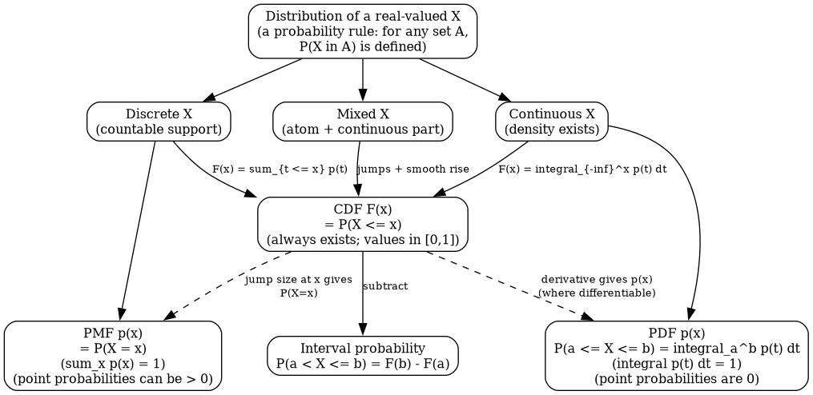

# 2.2 Continuous Random Variables

Source: ../notes/02_probability_reconstructed/source/02_probability.pdf

This section develops continuous variables, CDF/PDF distinctions, Gaussian models, and the Beta and Dirichlet families.

Sometimes we model systems with real-valued random variables $X \in \mathbb{R}$. In that setting we define a probability density function $p(x)$ with $p(x) \ge 0$ for all $x$ and

$$
\int p(x)\,dx = 1.
$$

The density defines the probability of any event $X \in A \subseteq \mathbb{R}$ by

$$
\mathbb{P}(X \in A) = \int_A p(x)\,dx.
$$

This is the first major structural difference from the discrete case. For a continuous variable, the number $p(x)$ is not the probability of the event $X=x$; in fact $\mathbb{P}(X=x)=0$ for every individual point. A density only becomes a probability after integrating it over an interval or region. That is why a density is allowed to exceed one locally, provided the total area under the curve is still one.

A concrete interval computation makes this precise. If $X$ is uniform on $[0,2]$, then $p(x)=1/2$ on that interval. The probability that $X$ falls between $0.3$ and $0.9$ is

$$
\mathbb{P}(0.3 \le X \le 0.9) = \int_{0.3}^{0.9} \frac{1}{2}\,dx = \frac{1}{2}(0.9-0.3)=0.3.
$$

The point $x=0.4$ itself still has probability zero. What matters is the width of the interval, not the existence of an individual point.

### Quick Bridge: PMF vs PDF vs CDF

If you are still carrying the discrete intuition $p(x)=\mathbb{P}(X=x)$ into the continuous setting, everything in this section will feel slippery. The key correction is:

- For discrete $X$, $p(x)$ is a probability and can be summed over states.
- For continuous $X$, $p(x)$ is a density and must be integrated over an interval to get a probability.

The CDF $F_X(x)=\mathbb{P}(X \le x)$ is the unifying object that works for discrete, continuous, and mixed variables.

  

One more bridge fact is often the missing intuition in the continuous case. When a density $p(x)$ exists, probabilities of *small* intervals are approximately density times width:

$$
\mathbb{P}(x \le X \le x+\Delta)\approx p(x)\,\Delta\qquad\text{for small }\Delta.
$$

This approximation is the precise sense in which a PDF is a "probability per unit $x$." For example, for $X\sim\mathrm{Unif}([0,2])$ we have $p(x)=1/2$ on $[0,2]$, so the probability of the short interval $[0.4,0.5]$ is

$$
\mathbb{P}(0.4 \le X \le 0.5)=\int_{0.4}^{0.5}\frac{1}{2}\,dt=\frac{1}{2}(0.1)=0.05,
$$

which matches the approximation $p(0.4)\cdot 0.1=(1/2)\cdot 0.1=0.05$.

### CDFs and Types of Distributions

The cumulative distribution function, or CDF, is the most universal way to describe a real-valued random variable:

$$
F_X(x)=\mathbb{P}(X \le x).
$$

This definition should be read operationally. You pick a threshold $x$, ask for the event "the realized value of $X$ is at most that threshold," and then assign the probability of that event. So a CDF is not a density curve and not a table of point masses. It is the running total of probability mass accumulated from the far left up to the cutoff value $x$.

That running-total viewpoint explains why the CDF is so general. Every real-valued random variable has events of the form $X \le x$, so every real-valued random variable has a CDF. By contrast, PMFs and PDFs exist only in special settings:

<table align="center">
  <thead>
    <tr><th>object</th><th>definition</th><th>when it exists</th><th>how to read it</th></tr>
  </thead>
  <tbody>
    <tr><td>$\mathrm{PMF}$</td><td>$p(X=x)=\mathbb{P}(X=x)$</td><td>discrete variables</td><td>probability assigned to one exact state</td></tr>
    <tr><td>$\mathrm{PDF}$</td><td>$\mathbb{P}(X \in A)=\int_A p(x)\,dx$</td><td>absolutely continuous variables</td><td>density height; probability comes from area, not point value</td></tr>
    <tr><td>$\mathrm{CDF}$</td><td>$F_X(x)=\mathbb{P}(X \le x)$</td><td>every real-valued variable</td><td>total probability accumulated up to threshold $x$</td></tr>
  </tbody>
</table>

The safest mental model is:

- a PMF answers "what is the probability of this exact isolated state?"
- a PDF answers "how densely is probability packed near this location?"
- a CDF answers "how much total probability lies to the left of this threshold?"

Several structural facts follow directly from the definition of a CDF.

First, $F_X(x)$ must always lie between $0$ and $1$ because it is a probability.

Second, $F_X(x)$ is nondecreasing: if $x_1 \le x_2$, then the event $\{X \le x_1\}$ is contained inside the event $\{X \le x_2\}$, so

$$
F_X(x_1)\le F_X(x_2).
$$

Third, the far-left limit is $0$ and the far-right limit is $1$:

$$
\lim_{x\to -\infty} F_X(x)=0,\qquad \lim_{x\to \infty} F_X(x)=1.
$$

Fourth, a CDF is right-continuous, meaning

$$
\lim_{h \downarrow 0} F_X(x+h)=F_X(x).
$$

This matters because CDFs can have jumps. When a variable has positive point mass at a value $x$, the CDF jumps upward at that exact location, and the value $F_X(x)$ already includes the mass sitting at $x$. So a CDF always starts near $0$, climbs as probability accumulates, and eventually levels off at $1$.

One more operational formula is worth stating early because it is how CDFs are actually used:

$$
\mathbb{P}(a < X \le b)=F_X(b)-F_X(a).
$$

This works because the event $\{X \le b\}$ contains all mass up to $b$, while $\{X \le a\}$ contains all mass up to $a$. Subtracting removes the left part and leaves only the probability in the interval $(a,b]$. This formula is valid whether the variable is discrete, continuous, or mixed.

Now examine the three main types of distributions one by one.

Discrete case. Suppose $X$ is Bernoulli with

$$
p(X=1)=0.3,\qquad p(X=0)=0.7.
$$

Then the CDF is obtained by asking what probability has accumulated by each threshold.

If $x<0$, then neither state $0$ nor state $1$ is less than or equal to $x$, so

$$
F_X(x)=0.
$$

If $0 \le x < 1$, then the state $0$ is included but the state $1$ is not, so

$$
F_X(x)=\mathbb{P}(X=0)=0.7.
$$

If $x \ge 1$, then both states are included, so

$$
F_X(x)=\mathbb{P}(X=0)+\mathbb{P}(X=1)=1.
$$

That gives the step-function description:

<table align="center">
  <thead>
    <tr><th>$F_X(x)$</th><th>condition on $x$</th></tr>
  </thead>
  <tbody>
    <tr><td>$0$</td><td>$x \lt 0$</td></tr>
    <tr><td>$0.7$</td><td>$0 \le x \lt 1$</td></tr>
    <tr><td>$1$</td><td>$x \ge 1$</td></tr>
  </tbody>
</table>

The jump at $x=0$ has size $0.7$, which is exactly the point mass at $0$. The jump at $x=1$ adds the remaining $0.3$, which is exactly the point mass at $1$. This is the general rule in the discrete case: jumps in the CDF correspond to point probabilities.

An interval example makes the subtraction rule concrete. For the Bernoulli variable above,

$$
\mathbb{P}(0 < X \le 1)=F_X(1)-F_X(0)=1-0.7=0.3,
$$

which is exactly the probability that $X=1$.

Continuous case. Now suppose $X$ is uniform on $[0,2]$, so the density is

<table align="center">
  <thead>
    <tr><th>$p(x)$</th><th>condition on $x$</th></tr>
  </thead>
  <tbody>
    <tr><td>$1/2$</td><td>$0 \le x \le 2$</td></tr>
    <tr><td>$0$</td><td>otherwise</td></tr>
  </tbody>
</table>

The CDF is found by integrating the density from the far left up to the threshold.

If $x<0$, then no support has been reached yet, so

$$
F_X(x)=0.
$$

If $0 \le x \le 2$, then we integrate only over the part of the support from $0$ to $x$:

$$
F_X(x)=\int_0^x \frac{1}{2}\,dt=\frac{x}{2}.
$$

If $x>2$, then the full support has already been accumulated, so

$$
F_X(x)=1.
$$

So

<table align="center">
  <thead>
    <tr><th>$F_X(x)$</th><th>condition on $x$</th></tr>
  </thead>
  <tbody>
    <tr><td>$0$</td><td>$x \lt 0$</td></tr>
    <tr><td>$x/2$</td><td>$0 \le x \le 2$</td></tr>
    <tr><td>$1$</td><td>$x>2$</td></tr>
  </tbody>
</table>

Unlike the discrete Bernoulli example, this CDF has no jumps. It rises smoothly because probability is spread continuously across an interval rather than concentrated at isolated points.

The interval-probability formula still works the same way:

$$
\mathbb{P}(0.3 \le X \le 0.9)=F_X(0.9)-F_X(0.3)=0.45-0.15=0.30.
$$

So the CDF is not a separate theory from the PDF. It is another way of packaging the same distribution. When a density exists and is sufficiently regular, the derivative of the CDF recovers the density:

$$
\frac{d}{dx}F_X(x)=p(x)
$$

at points where that derivative exists.

Mixed case. This distinction matters because not every distribution is purely discrete or purely continuous. A mixed distribution contains both an atom and a continuous part. For example, suppose

$$
\mathbb{P}(X=0)=0.7,
$$

and with the remaining probability $0.3$ we draw $X$ uniformly from $[0,1]$.

Now compute the CDF carefully.

If $x<0$, then no mass has been accumulated:

$$
F_X(x)=0.
$$

At the exact point $x=0$, the atom at zero is included, so

$$
F_X(0)=0.7.
$$

If $0<x<1$, then we have already collected the point mass $0.7$, and we also collect the fraction of the continuous part that lies in $[0,x]$. Since that continuous part is uniform on $[0,1]$ and has total weight $0.3$, the additional contribution is $0.3x$. Therefore

$$
F_X(x)=0.7+0.3x \qquad \text{for } 0<x<1.
$$

Finally, if $x \ge 1$, all probability has been accumulated, so

$$
F_X(x)=1.
$$

So the mixed-distribution CDF is

<table align="center">
  <thead>
    <tr><th>$F_X(x)$</th><th>condition on $x$</th></tr>
  </thead>
  <tbody>
    <tr><td>$0$</td><td>$x \lt 0$</td></tr>
    <tr><td>$0.7$</td><td>$x=0$</td></tr>
    <tr><td>$0.7 + 0.3x$</td><td>$0 \lt x \lt 1$</td></tr>
    <tr><td>$1$</td><td>$x \ge 1$</td></tr>
  </tbody>
</table>

This example is important because it shows exactly why the CDF is the most universal description. A PMF alone would miss the continuous part. A PDF alone would miss the atom at zero. The CDF captures both with one object: jumps record point masses, and smooth increases record continuous accumulation.

Two common confusions are worth ruling out explicitly.

First, $F_X(x)$ is not the same thing as $p(x)$. The CDF is a probability between $0$ and $1$, while the PDF is a density value that may exceed $1$ locally.

Second, $\mathbb{P}(X=x)=0$ for a continuous variable does not mean the value $x$ is impossible. It means only that a single point has zero width, so it contributes zero area under the density. Intervals, not isolated points, carry positive probability in the continuous case.

### Example 2-9: Uniform Distribution

The word uniform needs to be interpreted carefully in the continuous setting. It does **not** mean that each individual point has the same positive probability, because every single point has probability zero for a continuous variable. Instead, it means that the density is constant across the allowed interval, so intervals of the same length receive the same probability mass.

Suppose $X$ is known to lie somewhere between $0$ and $T$, and suppose we want a model that treats all locations inside that interval symmetrically. The natural way to express that idea is to assign one constant density value on the whole interval and zero density outside it. So we write

<table align="center">
  <thead>
    <tr><th>support condition for $x$</th><th>$p(x)$</th></tr>
  </thead>
  <tbody>
    <tr><td>$x \in [0,T]$</td><td>$c$</td></tr>
    <tr><td>otherwise</td><td>$0$</td></tr>
  </tbody>
</table>

The constant $c$ cannot be chosen arbitrarily. A density must integrate to $1$, so we impose the normalization condition

$$
\int_{-\infty}^{\infty} p(x)\,dx = 1.
$$

Because $p(x)=0$ outside $[0,T]$, this reduces to

$$
\int_0^T c\,dx = 1.
$$

Now compute the integral:

$$
c \int_0^T 1\,dx = cT = 1.
$$

Therefore

$$
c=\frac{1}{T}.
$$

So the uniform density on $[0,T]$ is

<table align="center">
  <thead>
    <tr><th>support condition for $x$</th><th>$p(x)$</th></tr>
  </thead>
  <tbody>
    <tr><td>$x \in [0,T]$</td><td>$1/T$</td></tr>
    <tr><td>otherwise</td><td>$0$</td></tr>
  </tbody>
</table>

This formula says two things at once. First, the support of the distribution is the interval $[0,T]$: values outside that interval are impossible under the model because their density is zero. Second, inside the interval the density is flat, so no region is favored over any other region of the same length.

The normalization check is now immediate:

$$
\int_0^T p(x)\,dx = T \cdot \frac{1}{T} = 1.
$$

The most important operational consequence is that probability depends only on interval length. If $0 \le a \le b \le T$, then

$$
\mathbb{P}(a \le X \le b)=\int_a^b \frac{1}{T}\,dx=\frac{b-a}{T}.
$$

So under a uniform model:

- an interval of length $0.1T$ has probability $0.1$,
- an interval of length $0.25T$ has probability $0.25$,
- and two intervals with the same length always have the same probability, no matter where they sit inside $[0,T]$.

This is the precise mathematical meaning of "uniform."

A concrete example makes the geometry clearer. Suppose $X \sim \mathrm{Unif}[0,10]$. Then

$$
p(x)=\frac{1}{10}\qquad \text{for } 0 \le x \le 10.
$$

Now compute a few interval probabilities:

$$
\mathbb{P}(2 \le X \le 5)=\int_2^5 \frac{1}{10}\,dx=\frac{5-2}{10}=0.3,
$$

$$
\mathbb{P}(7 \le X \le 8)=\int_7^8 \frac{1}{10}\,dx=\frac{8-7}{10}=0.1.
$$

The first interval is three times as long as the second, so it has three times as much probability. Location does not matter; length does.

This also clarifies why point probabilities vanish. Even though the density is positive at every point of $[0,T]$, we still have

$$
\mathbb{P}(X=4)=0,
$$

because a single point has zero width and therefore contributes zero area under the density.

Unlike discrete distributions, the density value itself may be larger than one, as long as the total area under the curve is one. The object that must equal one is the integral, not the height of the graph.

For example, if $X$ is uniform on the very short interval $[0,0.2]$, then

$$
p(x)=5
$$

on that interval. The density value exceeds one, but the total probability is still

$$
\int_0^{0.2} 5\,dx = 1.
$$

So there is no contradiction between a large density and a valid probability model. The interval is very short, so the density must be tall in order for the total area to remain one.

One structural limit should also be stated explicitly: a continuous uniform distribution must live on a **finite-length** interval if we want a constant density. There is no valid density that is "uniform over the entire real line," because no positive constant can integrate to one over an infinite interval. So the uniform model is appropriate when the possible values are bounded and all equal-length subintervals are meant to be treated symmetrically.

### Gaussian Distributions

A one-dimensional Gaussian (also called a normal distribution) is a continuous distribution on the whole real line.

**Definition-level fact (what kind of object this is).** It is specified by a density function $p(x)\ge 0$ such that the total area is one and probabilities are computed by integration. In particular:

- for any interval $[a,b]$, $\mathbb{P}(a \le X \le b)=\int_a^b p(x)\,dx$;
- for any single point $x$, $\mathbb{P}(X=x)=0$ because a point has zero width.

What makes the Gaussian family special is that its density has a smooth symmetric bell shape controlled by a center parameter and a spread parameter.

In one dimension, the density is

$$
p(x) = \mathcal{N}(x;\mu,\sigma^2) = \frac{1}{\sqrt{2\pi\sigma^2}} \exp\left(-\frac{(x-\mu)^2}{2\sigma^2}\right).
$$

Every symbol should be read explicitly:

- $x$ is the location where we evaluate the density,
- $\mu$ is the mean, which sets the center of the bell curve,
- $\sigma^2$ is the variance, which measures spread,
- $\sigma$ is the standard deviation, so $\sigma=\sqrt{\sigma^2}$,
- the prefactor $\frac{1}{\sqrt{2\pi\sigma^2}}$ is the normalization constant,
- and the exponential term controls how fast the density decays as $x$ moves away from $\mu$.

The formula becomes much easier to interpret if we read the exponent first:

$$
-\frac{(x-\mu)^2}{2\sigma^2}.
$$

The numerator $(x-\mu)^2$ is the squared distance from $x$ to the mean. So the farther $x$ is from $\mu$, the more negative the exponent becomes, and the smaller the density becomes. The denominator $2\sigma^2$ controls how quickly that decay happens. Large $\sigma^2$ means the penalty for being far from the mean is weaker, so the curve is wider. Small $\sigma^2$ means the penalty is stronger, so the curve is narrower.

Three basic facts follow immediately from the formula.

First, the density is symmetric around $\mu$, because replacing $(x-\mu)$ by $-(x-\mu)$ does not change the square:

$$
p(\mu+a)=p(\mu-a).
$$

Second, the density is largest at $x=\mu$, because that is where the squared term is smallest, namely zero:

$$
p(\mu)=\frac{1}{\sqrt{2\pi\sigma^2}}.
$$

Third, two values that are the same number of standard deviations away from the mean have the same density. This is easiest to see by standardizing the distance:

$$
z=\frac{x-\mu}{\sigma}.
$$

Then the exponent becomes $-z^2/2$, so the Gaussian really depends on distance from the mean measured in standard-deviation units.

This standardization is not just an interpretation trick. It is also how Gaussian probabilities are computed in practice. Define the standardized random variable

$$
Z=\frac{X-\mu}{\sigma}.
$$

If $X\sim\mathcal{N}(\mu,\sigma^2)$ then the standardized variable is standard normal:

$$
Z \sim \mathcal{N}(0,1).
$$

One way to see this explicitly is to substitute $x=\mu+\sigma z$ into the density and include the Jacobian factor $dx/dz=\sigma$. That produces the standard normal density

$$
\phi(z)=\frac{1}{\sqrt{2\pi}}e^{-z^2/2}.
$$

The standard normal CDF is traditionally named $\Phi$:

$$
\Phi(z)=\mathbb{P}(Z\le z)=\int_{-\infty}^{z}\phi(t)\,dt.
$$

Now every Gaussian interval probability can be reduced to $\Phi$ by standardizing the endpoints:

$$
\mathbb{P}(a \le X \le b)=\mathbb{P}\!\left(\frac{a-\mu}{\sigma} \le Z \le \frac{b-\mu}{\sigma}\right)=\Phi\!\left(\frac{b-\mu}{\sigma}\right)-\Phi\!\left(\frac{a-\mu}{\sigma}\right).
$$

The integral defining $\Phi$ does not simplify to an elementary closed form, so in practice $\Phi$ is evaluated using a standard normal table or software.

It is also important not to misread the density value. Even though $p(\mu)$ is the highest point on the curve, it is **not** the probability that $X=\mu$. For a continuous Gaussian,

$$
\mathbb{P}(X=\mu)=0.
$$

The height of the curve tells us relative density, not point probability.

A full one-dimensional example makes the probability-computation pipeline concrete. Suppose

$$
X \sim \mathcal{N}(2,9).
$$

Then $\mu=2$, $\sigma^2=9$, and $\sigma=3$.

Step 1: choose the interval of interest. "Within one standard deviation of the mean" means the event

$$
\mu-\sigma \le X \le \mu+\sigma.
$$

In this example that is

$$
2-3 \le X \le 2+3,
$$

or equivalently

$$
-1 \le X \le 5.
$$

Step 2: standardize the endpoints:

$$
z_1=\frac{-1-\mu}{\sigma}=\frac{-1-2}{3}=-1,\qquad z_2=\frac{5-\mu}{\sigma}=\frac{5-2}{3}=1.
$$

Step 3: rewrite the probability in terms of $\Phi$:

$$
\mathbb{P}(-1 \le X \le 5)=\Phi(1)-\Phi(-1).
$$

Step 4: use the symmetry identity $\Phi(-z)=1-\Phi(z)$:

$$
\Phi(1)-\Phi(-1)=\Phi(1)-(1-\Phi(1))=2\Phi(1)-1.
$$

Step 5: evaluate numerically using a standard normal table or software. A common reference value is $\Phi(1)\approx 0.8413$, so

$$
\mathbb{P}(-1 \le X \le 5)\approx 2(0.8413)-1\approx 0.6826.
$$

This is exactly where the familiar "about 68%" statement comes from.

The same computation pattern gives the other widely used rule-of-thumb numbers:

$$
\mathbb{P}(\mu-2\sigma \le X \le \mu+2\sigma)=\Phi(2)-\Phi(-2)\approx 0.9545,
$$

and

$$
\mathbb{P}(\mu-3\sigma \le X \le \mu+3\sigma)=\Phi(3)-\Phi(-3)\approx 0.9973.
$$

So the 68-95-99.7 guideline is not a separate axiom. It is a numerical summary of three $\Phi$ computations.

The normalization constant deserves an explicit derivation, because it answers the question "why is this actually a valid probability density?"

Write the Gaussian shape with an unknown front constant:

$$
p(x)=C\exp\!\left(-\frac{(x-\mu)^2}{2\sigma^2}\right).
$$

To be a valid density we must have total area one:

$$
1=\int_{-\infty}^{\infty} p(x)\,dx
=C\int_{-\infty}^{\infty}\exp\!\left(-\frac{(x-\mu)^2}{2\sigma^2}\right)dx.
$$

Now substitute $u=(x-\mu)/\sigma$, so $dx=\sigma\,du$:

$$
1=C\sigma\int_{-\infty}^{\infty} e^{-u^2/2}\,du.
$$

The remaining integral is the standard Gaussian integral, equal to $\sqrt{2\pi}$. So

$$
1=C\sigma\sqrt{2\pi},
$$

which forces

$$
C=\frac{1}{\sigma\sqrt{2\pi}}=\frac{1}{\sqrt{2\pi\sigma^2}}.
$$

So the Gaussian formula should be read as "bell-shaped decay" multiplied by "the unique constant that makes the total area equal to one."

It is also worth separating the definition from the modeling motivation. Gaussians are used constantly because they are interpretable (mean and variance have direct meaning) and tractable (many operations such as conditioning and linear transformations preserve Gaussian form). A common modeling phenomenon is that when many small, roughly independent effects contribute to a measurement, the resulting error often looks approximately Gaussian after centering and scaling. This is an approximation story, not an unconditional law, but it helps explain why Gaussian noise models appear so often.

Before moving to the multivariate case, it helps to say what actually changes.

In one dimension, the random outcome is a single number such as a height, temperature, or measurement error. In multiple dimensions, the random outcome is a list of numbers observed together. For example, one observation might be the two-dimensional vector $x=(x_1,x_2)^T$, where $x_1$ is height and $x_2$ is weight. Or it might be the three-dimensional vector $x=(x_1,x_2,x_3)^T$, where the coordinates are exam 1, exam 2, and exam 3.

So a multivariate random variable is really a random vector: one draw produces several coordinates at once.

The mean therefore becomes a mean vector

$$
\mu=\mathbb{E}[X]=(\mathbb{E}[X_1],\ldots,\mathbb{E}[X_n])^T.
$$

This means each coordinate has its own average value. In two dimensions, for example,

$$
\mu=(\mu_1,\mu_2)^T
$$

simply says the cloud of points is centered at horizontal coordinate $\mu_1$ and vertical coordinate $\mu_2$.

The next new object is the covariance matrix. Before giving its formula, it helps to say what problem it solves. In one dimension, one variance number was enough to describe spread. In several dimensions, that is no longer sufficient, because we must describe

- how much each coordinate varies on its own;
- and how pairs of coordinates move together.

The covariance matrix collects both kinds of information into one table. Its entry in row $i$ and column $j$ is

$$
\Sigma_{ij}=\mathrm{Cov}(X_i,X_j)=\mathbb{E}[(X_i-\mu_i)(X_j-\mu_j)].
$$

So the diagonal entries are variances, and the off-diagonal entries are covariances between different coordinates.

So the diagonal entries are ordinary variances:

$$
\Sigma_{11}=\mathrm{Var}(X_1), \qquad \Sigma_{22}=\mathrm{Var}(X_2), \qquad \text{and so on.}
$$

The off-diagonal entries are covariances:

$$
\Sigma_{12}=\mathrm{Cov}(X_1,X_2).
$$

Those covariances answer a new question that does not exist in one dimension: when one coordinate is above its mean, does the other coordinate also tend to be above its mean, below its mean, or unrelated?

It helps to make that concrete before introducing the multivariate Gaussian formula.

- If $\Sigma_{12}>0$, the two coordinates tend to move together. Large values of one coordinate tend to appear with large values of the other.
- If $\Sigma_{12}<0$, the two coordinates tend to move in opposite directions. Large values of one coordinate tend to appear with small values of the other.
- If $\Sigma_{12}=0$, there is no linear covariance between the coordinates.

At this point, a scope distinction matters.

- For an arbitrary joint distribution, $\Sigma_{12}=0$ does **not** imply independence. It only says there is no *linear* covariance.
- For a **jointly Gaussian** pair, $\Sigma_{12}=0$ **does** imply independence. More generally, for a multivariate Gaussian, if $\Sigma$ is block diagonal, then the corresponding blocks of coordinates are independent.

An explicit $2 \times 2$ example makes the matrix readable. Suppose

$$
\Sigma_{11}=4, \qquad \Sigma_{22}=1, \qquad \Sigma_{12}=\Sigma_{21}=0.
$$

Then

- the first coordinate has variance $4$, so its standard deviation is $2$;
- the second coordinate has variance $1$, so its standard deviation is $1$;
- and the zero off-diagonal terms say there is no linear covariance between the two coordinates.

Because we are in the Gaussian family, that last statement can be strengthened: zero covariance here implies $X_1$ and $X_2$ are actually independent.

So a cloud with this covariance matrix is spread out more in the first direction than in the second. Even before seeing the multivariate Gaussian formula, that tells us the equal-density contours should be stretched horizontally more than vertically.

Now consider

$$
\Sigma_{11}=1, \qquad \Sigma_{22}=1, \qquad \Sigma_{12}=\Sigma_{21}=0.8.
$$

The diagonal entries still say each coordinate has variance $1$, but now the positive off-diagonal entries say the coordinates tend to move together. So the cloud is no longer aligned with the coordinate axes. It is elongated along a diagonal direction. That is the geometric meaning of covariance in the Gaussian setting.

Only after those objects are clear does the multivariate formula become readable.

If $X$ is an $n$-dimensional Gaussian random vector, then its density is

$$
p(x) = \mathcal{N}(x;\mu,\Sigma) = (2\pi)^{-n/2} |\Sigma|^{-1/2} \exp\left(-\frac{1}{2}(x-\mu)^T \Sigma^{-1}(x-\mu)\right).
$$

This formula is the nonsingular multivariate Gaussian density written explicitly in terms of $\Sigma^{-1}$ and $|\Sigma|$. For it to define a proper density as written, we assume $\Sigma$ is symmetric and positive definite. Positive definite means

$$
v^T\Sigma v>0 \quad \text{for every nonzero vector } v,
$$

which guarantees $|\Sigma|>0$, guarantees the inverse $\Sigma^{-1}$ exists, and guarantees the quadratic form in the exponent is always nonnegative so the exponential term decays rather than explodes.

Every object now has a specific role:

- $x$ is now an $n$-dimensional vector,
- $\mu$ is the mean vector, which sets the center of the cloud,
- $\Sigma$ is the covariance matrix, which sets spread and dependence,
- $|\Sigma|$ is the determinant of the covariance matrix, meaning the single number that records how covariance rescales local volume,
- and the quadratic term

$$
(x-\mu)^T \Sigma^{-1}(x-\mu)
$$

is the squared Mahalanobis distance from $x$ to the mean.

Mahalanobis distance means distance measured in the geometry of the covariance structure rather than ordinary Euclidean distance. This phrase is easy to state and easy to leave opaque, so spell it out.

In ordinary Euclidean distance, moving one unit horizontally and moving one unit vertically are treated the same way. In Mahalanobis distance, the covariance matrix tells us which directions are naturally more variable. If a direction has large variance, then moving in that direction is less surprising, so the density decays more slowly there. If a direction has small variance, moving the same Euclidean amount is more surprising, so the density decays more quickly there.

So the multivariate Gaussian is still doing exactly what the one-dimensional Gaussian did: it penalizes distance from the mean. The only difference is that in several dimensions, "distance" must now respect the spread and dependence encoded by $\Sigma$.

One explicit diagonal example keeps the matrix notation grounded. If

$$
\Sigma_{11}=\sigma_1^2, \qquad \Sigma_{22}=\sigma_2^2, \qquad \Sigma_{12}=\Sigma_{21}=0,
$$

then

$$
\Sigma^{-1}_{11}=1/\sigma_1^2, \qquad \Sigma^{-1}_{22}=1/\sigma_2^2, \qquad \Sigma^{-1}_{12}=\Sigma^{-1}_{21}=0,
$$

so the quadratic term becomes

$$
(x-\mu)^T\Sigma^{-1}(x-\mu)=\frac{(x_1-\mu_1)^2}{\sigma_1^2}+\frac{(x_2-\mu_2)^2}{\sigma_2^2}.
$$

This is the direct multivariate analogue of the one-dimensional Gaussian penalty. Each coordinate contributes its own squared deviation, scaled by its own variance. Off-diagonal covariance terms are what introduce cross-terms and rotate the geometry away from this axis-aligned form.

In two dimensions, the sets of points with equal density are ellipses. In higher dimensions, they are ellipsoids. So the multivariate Gaussian is still a bell-shaped distribution, but now the bell can be stretched, compressed, and rotated. A useful sign-level mnemonic is that positive covariance tends to tilt the main elongation roughly along $x_1\approx x_2$, while negative covariance tends to tilt it roughly along $x_1\approx -x_2$.

  

The three panels show the same family viewed three ways. The one-dimensional curve emphasizes how the mean shifts location and the standard deviation changes spread. The surface plot shows the bivariate density as height over the plane. The contour plot removes the height dimension and keeps only level sets, which is often the most useful representation when reasoning about covariance structure.

The main mastery-level takeaway is that a Gaussian is not just "the bell curve formula." It is a model whose parameters have direct geometric meaning.

In one dimension, $\mu$ sets the center and $\sigma^2$ sets how quickly density decays with squared distance $(x-\mu)^2$. In multiple dimensions, the mean vector $\mu$ still sets the center, and the covariance matrix $\Sigma$ sets both scale (diagonal variances) and coupling/rotation (off-diagonal covariances). Because we are in the Gaussian family, $\Sigma$ also has an interpretation that would be false in general: a zero covariance entry implies independence between the corresponding coordinates.

What survives from 1D to $n$D is one sentence: the Gaussian assigns higher density to points that are closer to $\mu$, but "close" is measured in units of variance in 1D and in the covariance-shaped Mahalanobis distance $(x-\mu)^T\Sigma^{-1}(x-\mu)$ in $n$D.

### Example 2-10: Bernoulli Exponential Family Form

This example is not introducing a new distribution. It is taking the ordinary Bernoulli model and rewriting it in a form whose algebra will reappear throughout statistics and machine learning.

Start with a Bernoulli random variable $X \in \{0,1\}$ and parameter

$$
\rho = \mathbb{P}(X=1).
$$

Then automatically

$$
\mathbb{P}(X=0)=1-\rho.
$$

The Bernoulli PMF can be written compactly as

$$
p(X=x)=\rho^x(1-\rho)^{1-x}, \qquad x \in \{0,1\}.
$$

This notation is worth unpacking slowly because it is easy to read it too quickly. If $x=1$, then

$$
p(X=1)=\rho^1(1-\rho)^0=\rho.
$$

If $x=0$, then

$$
p(X=0)=\rho^0(1-\rho)^1=1-\rho.
$$

So the exponents do not encode new probabilities. They are indicator exponents: they switch on the factor corresponding to the realized state and switch off the other one.

Now rewrite the same expression using logarithms:

$$
p(X=x)=\exp\left(\log(\rho)x+\log(1-\rho)(1-x)\right).
$$

Expand the exponent:

$$
\log(\rho)x+\log(1-\rho)(1-x)=x\log\left(\frac{\rho}{1-\rho}\right)+\log(1-\rho).
$$

This suggests defining the natural parameter

$$
\eta=\log\left(\frac{\rho}{1-\rho}\right).
$$

That quantity is the log-odds. It is not itself a probability. It ranges over the whole real line, whereas $\rho$ is restricted to the interval $(0,1)$.

Solve this definition for $\rho$:

$$
e^{\eta}=\frac{\rho}{1-\rho}.
$$

Multiply both sides by $(1-\rho)$:

$$
e^{\eta}(1-\rho)=\rho.
$$

Collect the $\rho$ terms:

$$
e^{\eta}=\rho(1+e^{\eta}),
$$

so

$$
\rho=\frac{e^{\eta}}{1+e^{\eta}}, \qquad 1-\rho=\frac{1}{1+e^{\eta}}.
$$

Substitute these into the PMF:

$$
p(X=x)=\left(\frac{e^{\eta}}{1+e^{\eta}}\right)^x\left(\frac{1}{1+e^{\eta}}\right)^{1-x}.
$$

Collect powers of $e^{\eta}$ and $(1+e^{\eta})$:

$$
p(X=x)=\frac{e^{\eta x}}{(1+e^{\eta})^{x+(1-x)}}.
$$

The denominator exponent is

$$
x+(1-x)=1,
$$

so the denominator collapses to just one copy of $(1+e^{\eta})$. Therefore

$$
p(X=x)=\frac{e^{\eta x}}{1+e^{\eta}}=\exp(\eta x)\exp\left(-\log(1+e^{\eta})\right).
$$

So the **canonical** exponential-family form, meaning the form written directly in the natural-parameter coordinate $\eta$, is

$$
p(X=x)=\exp\left(\eta x-A(\eta)\right),
$$

where

$$
A(\eta)=\log(1+e^{\eta}).
$$

The conceptual payoff is now visible. The original probability parameter $\rho$ appears nonlinearly in the ordinary Bernoulli formula, but after the reparameterization the observation $x$ appears linearly in the exponent. That is the structural pattern the exponential-family formalism is designed to expose.

A numerical example helps. If $\rho=0.8$, then the odds are $0.8/0.2=4$, so

$$
\eta=\log 4.
$$

Then

$$
A(\eta)=\log(1+e^{\eta})=\log(1+4)=\log 5.
$$

Therefore

$$
p(X=1)=\exp(\eta-A(\eta))=\exp(\log 4-\log 5)=\frac{4}{5}=0.8,
$$

and

$$
p(X=0)=\exp(0-A(\eta))=\exp(-\log 5)=\frac{1}{5}=0.2.
$$

So nothing about the Bernoulli law changed. We only changed coordinates on the parameter. The structural limit is important: this rewrite does not create a richer model. It is still the same one-parameter Bernoulli family, now written in coordinates that are convenient for optimization and theory.

### Example 2-11: Bernoulli Two-Parameter Form

The Bernoulli family can also be written with two numbers instead of one:

$$
p(X=x;\eta_0,\eta_1)=\frac{\exp\left(\eta_1 x+\eta_0(1-x)\right)}{\exp(\eta_0)+\exp(\eta_1)}, \qquad x \in \{0,1\}.
$$

This looks like a two-parameter model, but it is not actually a larger family. It is an over-parameterized way of writing the same one-parameter Bernoulli distribution.

Read the numerator by cases. If $x=1$, then

$$
p(X=1)=\frac{e^{\eta_1}}{e^{\eta_0}+e^{\eta_1}}.
$$

If $x=0$, then

$$
p(X=0)=\frac{e^{\eta_0}}{e^{\eta_0}+e^{\eta_1}}.
$$

So $\eta_1$ is the unnormalized log-weight attached to state $1$, and $\eta_0$ is the unnormalized log-weight attached to state $0$. Exponentiating those numbers produces positive weights, and the denominator normalizes those weights into valid probabilities.

Now divide numerator and denominator by $e^{\eta_0}$:

$$
p(X=1)=\frac{e^{\eta_1-\eta_0}}{1+e^{\eta_1-\eta_0}}, \qquad p(X=0)=\frac{1}{1+e^{\eta_1-\eta_0}}.
$$

Only the difference

$$
\delta=\eta_1-\eta_0
$$

matters. Once the difference is fixed, the probabilities are fixed.

That is why this representation is redundant. The parameter pair has two coordinates, but the actual Bernoulli distribution still has only one degree of freedom. Here "degree of freedom" means "number of independent numerical choices needed to determine the distribution." For Bernoulli, one number is enough, because once $\mathbb{P}(X=1)$ is chosen, $\mathbb{P}(X=0)$ is forced to be its complement.

An explicit example makes the redundancy concrete. Compare

$$
(\eta_0,\eta_1)=(0,2) \qquad \text{and} \qquad (\eta_0,\eta_1)=(5,7).
$$

In both cases the difference is $2$. Therefore both produce

$$
p(X=1)=\frac{e^2}{1+e^2}, \qquad p(X=0)=\frac{1}{1+e^2}.
$$

Adding the same constant to both coordinates changes the raw scores by the same multiplicative factor, and normalization cancels that factor out. So this notation is useful for algebra, but it should not mislead you into thinking the Bernoulli family suddenly became two-dimensional.

### Beta and Dirichlet Distributions

The next question is different from all the examples so far. Up to this point, the random variable was usually an observed outcome such as a coin flip, a die roll, or a measurement. Now we want a distribution over a **parameter**.

For a Bernoulli model, the parameter is

$$
\rho=\mathbb{P}(X=1).
$$

This number is itself constrained:

$$
0 \le \rho \le 1.
$$

So if we want a probability distribution over possible values of $\rho$, we need a density whose support is the interval $[0,1]$. The standard family for that job is the Beta distribution.

That is the first conceptual point to keep explicit:

- Bernoulli is a distribution over outcomes $X \in \{0,1\}$.
- Beta is a distribution over possible Bernoulli parameters $\rho \in [0,1]$.

So Beta is not a new model for coin-flip outcomes themselves. It is a model for uncertainty about the coin's success probability.

The Beta density is

$$
p(\rho)=\mathrm{Beta}(\rho;a,b)=\frac{\Gamma(a+b)}{\Gamma(a)\Gamma(b)}\rho^{a-1}(1-\rho)^{b-1}.
$$

This formula applies on the interval from $0$ to $1$, and the shape parameters satisfy $a>0$ and $b>0$.

The symbol $\Gamma$ is the Gamma function. For positive integers it satisfies

$$
\Gamma(n)=(n-1)!,
$$

so it extends the factorial function to non-integer arguments. In the Beta density, the Gamma-function ratio is the constant that makes the total area equal to one:

$$
\int_0^1 p(\rho)\,d\rho=1.
$$

For understanding the shape of the distribution, the most important part is the factor

$$
\rho^{a-1}(1-\rho)^{b-1}.
$$

That factor tells us how the density behaves near $0$, near $1$, and in between.

Several vocabulary words need to be made explicit before going further.

- The **interior** of $[0,1]$ means the values strictly between $0$ and $1$.
- The **boundaries** are the endpoints $0$ and $1$.
- **Unimodal** means the density has one main peak.
- The **mode** is the point where the density is largest.

So if someone says "the Beta density is unimodal and places mass in the interior," they mean the curve has one peak somewhere between $0$ and $1$, rather than piling up at one or both endpoints.

Before the general formulas, it is best to build intuition from concrete examples.

First example: uniform uncertainty.

If $a=b=1$, then $p(\rho)=1$ for $0 \le \rho \le 1$.

So $\mathrm{Beta}(1,1)$ is the uniform distribution on $[0,1]$. This means equal-length intervals of possible parameter values receive equal probability mass under this Beta distribution. It does **not** mean that a single exact value of $\rho$ has positive probability as a point event, because continuous distributions assign probability through interval area rather than point mass.

Second example: one interior peak.

If $\rho \sim \mathrm{Beta}(5,5)$, then the density is symmetric around $0.5$ and has a single peak near the center. This is what "unimodal" means in this context: there is one bell-like high region rather than two separated spikes. In geometric terms, the distribution places more of its mass near $0.5$ than near $0$ or $1$.

Third example: favoring one side.

If $\rho \sim \mathrm{Beta}(2,5)$, then the mean is $\mathbb{E}[\rho]=\frac{2}{7}\approx 0.286$.

So this distribution leans toward smaller probabilities. In plain language, it places more mass on success probabilities below one-half than on success probabilities above one-half.

Fourth example: favoring extremes.

If $\rho \sim \mathrm{Beta}(0.3,0.3)$, then the density is high near $0$ and near $1$, and relatively low in the middle. So this distribution favors strongly biased parameter values more than nearly fair ones.

This is also the place to explain why boundary spikes are not a paradox. When either shape parameter is below $1$, the density can become very large near $0$ or $1$. That does not violate probability rules, because a density value is not itself a probability. What matters is the area under the curve over an interval, and that total area remains finite and equal to one.

Two summary formulas are useful after the intuition is in place.

The mean is

$$
\mathbb{E}[\rho]=\frac{a}{a+b}
$$

So the ratio $a:b$ controls which side of the interval is favored.

When both shape parameters are greater than $1$, the mode is

$$
\rho_{\mathrm{mode}}=\frac{a-1}{a+b-2}
$$

This is the location of the peak when the density has a genuine interior maximum. The condition matters: if one of the parameters is at most $1$, the density may peak at a boundary instead, so the interior mode formula no longer applies.

The second structural quantity is the total concentration

$$
a+b
$$

Here the two parameters play two different roles, and it is worth separating them carefully.

- The **ratio** of the two parameters controls which success probabilities are favored relative to each other. If the parameters are equal, the distribution is symmetric around $0.5$. If the first parameter is larger, values closer to $1$ receive more weight than values closer to $0$. If the second parameter is larger, the situation reverses.
- The **sum** of the two parameters controls how strongly that preference is enforced. Increasing the sum while keeping the ratio fixed makes the density more concentrated around its central region. Decreasing the sum while keeping the ratio fixed makes the density more spread out.

One way to see this is through the mean formula $\mathbb{E}[\rho]=\frac{a}{a+b}$.

If we multiply both parameters by the same constant, this mean stays fixed, because the ratio $\frac{a}{a+b}$ does not change. But the exponents in the density become larger, so the density rises more sharply around the preferred region and falls off more quickly away from it.

For example, compare $\mathrm{Beta}(2,2)$ and $\mathrm{Beta}(20,20)$. They are both centered at $0.5$, because in both cases $\frac{a}{a+b}=0.5$.

But $\mathrm{Beta}(20,20)$ is much more concentrated near $0.5$. So the first distribution is broad around the center, while the second is sharply concentrated there. In later Bayesian sections this same difference will be interpreted as weak versus strong prior information, but the mathematical point here is simply how concentration changes the shape.

The Dirichlet distribution is the multi-state version of this same idea.

Suppose a categorical variable has $d$ possible outcomes. Then its parameter is not one number but a probability vector

$$
\theta = (\theta_1,\ldots,\theta_d)
$$

where $\theta_j \ge 0$ for all $j$ and $\sum_{j=1}^d \theta_j=1$.

So for a three-outcome variable, a legal parameter might be $\theta=(0.2,0.5,0.3)$.

The set of all such probability vectors is called the simplex. In the three-state case, the simplex is a filled triangle. Each point inside that triangle represents one legal categorical probability table.

The reason the simplex has one fewer free dimension than the number of coordinates is normalization. Once two coordinates are chosen, the last one is forced. In the example above, $\theta_3=1-0.2-0.5=0.3$.

So even though the vector has three entries, only two of them are independent.

The Dirichlet density is

$$
p(\theta)=\mathrm{Dir}(\theta;\alpha)=\frac{\Gamma(\alpha_0)}{\prod_{j=1}^d \Gamma(\alpha_j)}\prod_{j=1}^d \theta_j^{\alpha_j-1}
$$

where

$$
\alpha_0=\sum_{j=1}^d \alpha_j
$$

This looks more complicated than Beta only because there are more coordinates. Conceptually it plays the same role:

- it is a distribution over possible categorical probability tables;
- the relative sizes of the $\alpha_j$ values say which categories are favored;
- the total concentration $\alpha_0$ says how tightly the mass is pulled toward or away from the center.

The coordinate-wise mean is $\mathbb{E}[\theta_j]=\frac{\alpha_j}{\alpha_0}$.

So if $\alpha=(8,2,2)$, then $\mathbb{E}[\theta]=\left(\frac{8}{12},\frac{2}{12},\frac{2}{12}\right)=\left(\frac{2}{3},\frac{1}{6},\frac{1}{6}\right)$.

That Dirichlet distribution is centered much closer to the first category than to the other two.

If instead $\alpha=(2,2,2)$, then $\mathbb{E}[\theta]=\left(\frac{1}{3},\frac{1}{3},\frac{1}{3}\right)$.

So the distribution is symmetric across categories.

Now compare concentration while keeping the same proportions. If we increase to $\alpha=(20,20,20)$, the mean stays $\left(\frac{1}{3},\frac{1}{3},\frac{1}{3}\right)$, but the distribution becomes much more concentrated near the center of the simplex. If we decrease to $\alpha=(0.2,0.2,0.2)$, the mass is pushed toward corners and edges. A **sparse probability vector** means one in which most of the total mass is concentrated in only one or a few coordinates rather than being spread evenly across all categories. So in plain language, this distribution favors tables in which one category gets most of the mass.

For $d=2$, the Dirichlet distribution reduces exactly to the Beta distribution. So Beta is not a separate disconnected topic. It is the two-category version of the same family.

<table align="center" border="0" cellpadding="0" cellspacing="12">
  <tbody>
    <tr>
      <td align="center" valign="top">
        
      </td>
      <td align="center" valign="top">
        
      </td>
    </tr>
  </tbody>
</table>

The Beta grid makes the parameter effects explicit. Curves with parameters above one usually have a single interior peak. Curves with parameters below one can pile up near the boundaries. The Dirichlet simplex panels show the same phenomenon in the multi-category setting: mass near the center means balanced proportions, while mass near an edge or corner means one or more categories dominate.

A final pair of coin examples fixes the interpretation. Suppose $\rho$ is the head probability of a coin. A Beta distribution

$$
\rho \sim \mathrm{Beta}(20,20)
$$

places most of its mass near $0.5$, so parameter values close to a fair coin receive much more weight than extreme values. By contrast,

$$
\rho \sim \mathrm{Beta}(0.3,0.3)
$$

places much more mass near $0$ and $1$, so strongly biased parameter values are favored over nearly fair ones. In the Dirichlet case, the same logic applies to a probability vector rather than a single number: large, balanced concentration parameters favor balanced interior probability tables, while small concentration parameters favor sparse near-corner tables. In later Bayesian sections these same distributions will often be used as priors, but the shape story comes first.

### The Exponential Family

The exponential family is a modeling template, not one specific distribution. Its purpose is to expose a shared algebraic structure that appears in Bernoulli, categorical, Gaussian, Poisson, Gamma, Beta, Dirichlet, and many other common models.

This is one of the chapter's more abstract sections. The right reading strategy is not "memorize one large formula." The right strategy is to keep asking three questions:

- what part of the model depends only on the observation,
- what part depends on the parameter,
- and what summary of the data the parameter actually interacts with.

The phrase "family" matters here. It means a collection of distributions indexed by parameters. The phrase "exponential family" means this collection can be written in a common exponential-shaped algebraic form. The value of that form is not aesthetic. It lets many different models share the same optimization and inference machinery.

The general form is

$$
p_{\theta}(x)=h(x)\exp\left(\theta^{\top}\phi(x)-A(\theta)\right).
$$

Before unpacking symbols, say what stays fixed and what changes.

- The observation $x$ is the realized data value.
- The model family fixes the functions $h(x)$ and $\phi(x)$ ahead of time.
- The parameter $\theta$ is what moves from one member of the family to another.

So the family is "all distributions obtained by varying $\theta$ while keeping the structural form fixed."

Every symbol in the expression has a specific role.

- $x$ is the observed value.
- $\phi(x)$ is a fixed feature vector computed from $x$. Its components are called **sufficient statistics**, meaning summary quantities that capture all the data information the parameter needs for likelihood-based inference in this family.
- $\theta$ is the **natural parameter**, meaning the coordinate system in which the log-density becomes linear in the sufficient statistics.
- $h(x)$ is the base measure, the part of the density or mass function that depends on $x$ but not on $\theta$.
- $A(\theta)$ is the log-partition function, chosen so that the distribution normalizes correctly.

The log-partition function is

$$
A(\theta)=\log \int h(x)\exp\left(\theta^{\top}\phi(x)\right)\,dx,
$$

with the integral replaced by a sum in discrete settings.

This definition is abstract, so the interpretation should be stated plainly. The log-density is linear in the fixed feature vector $\phi(x)$, while the function $A(\theta)$ is the correction term that makes the whole expression normalize properly. That is why exponential-family models are so tractable: all the nontrivial dependence on the parameter is concentrated into a relatively clean algebraic form.

Bernoulli is the simplest example. From the previous subsection,

$$
p(X=x)=\exp\left(\eta x-\log(1+e^{\eta})\right).
$$

Comparing with the template gives

$$
h(x)=1, \qquad \phi(x)=x, \qquad \theta=\eta, \qquad A(\theta)=\log(1+e^{\theta}).
$$

A second example is a one-dimensional Gaussian with known variance $\sigma^2$ and unknown mean $\mu$. Its density can also be rearranged into exponential-family form. The beginner-level point is not to memorize every algebraic coordinate. The point is to notice the same structural split again: one part of the expression depends only on the observation, one part is linear in a summary of the observation, and one part normalizes the distribution.

The term sufficient statistic becomes concrete when we look at independent and identically distributed data. Here independent means the observations do not probabilistically influence one another once the parameter is fixed, and identically distributed means each observation is governed by the same one-observation model. Suppose

$$
D=\{x^{(1)},\ldots,x^{(m)}\}
$$

are independent and identically distributed observations from an exponential-family model. Then

$$
p_{\theta}(D)=\prod_{i=1}^m h(x^{(i)})\exp\left(\theta^{\top}\phi(x^{(i)})-A(\theta)\right).
$$

Taking logarithms yields

$$
\log p_{\theta}(D)=\sum_{i=1}^m \log h(x^{(i)})+\theta^{\top}\left(\sum_{i=1}^m \phi(x^{(i)})\right)-mA(\theta).
$$

This expression shows exactly how the data enter the likelihood. The only data-dependent quantity coupled to $\theta$ is

$$
S(D)=\sum_{i=1}^m \phi(x^{(i)}).
$$

That is the operational meaning of sufficiency in this setting: once $S(D)$ is known, the likelihood as a function of $\theta$ no longer needs the full raw data sequence. The raw sample may be long, but from the parameter's point of view the relevant information has been compressed into that summary.

For Bernoulli, $\phi(x)=x$, so

$$
S(D)=\sum_{i=1}^m x^{(i)}
$$

is just the number of ones. The sequences

$$
D_1=\{1,0,1,0\} \qquad \text{and} \qquad D_2=\{0,1,0,1\}
$$

have the same sufficient statistic,

$$
S(D_1)=S(D_2)=2,
$$

so they induce the same likelihood function for the Bernoulli parameter. The order of the observations is irrelevant because the family compresses the data down to the total count of successes.

That compression is one reason exponential families appear so often in estimation theory. They let large data sets be summarized by a small set of aggregate quantities. But there is also a structural limit: not every distribution can be written with a fixed finite-dimensional feature vector $\phi(x)$. So exponential families are powerful, but they are still a special class rather than a universal description of all probability laws.

### Retain from 2.2

- Every real-valued random variable has a CDF, but not every one has a density.
- A density value is not a point probability; probabilities come from integrals over regions.
- In Gaussian models, the covariance structure controls geometry, not just scale.
- Beta and Dirichlet distributions live on constrained supports, so their formulas only make sense together with those support conditions.

### Do Not Confuse in 2.2

- Do not confuse PMFs, PDFs, and CDFs; they are related but not interchangeable objects.
- Do not conclude that $p(x)>1$ is invalid for a density; only the integral must equal one.
- Do not use a continuous density formula on a mixed distribution that has point masses.
- Do not treat exponential-family form as universal; it is a structural class, not every distribution.
