# Probability and Inference

Source: ../notes/02_probability_reconstructed/source/02_probability.pdf

This is a full note-style reconstruction of Chapter 2. It keeps the chapter's section structure, worked examples, key tables, and core derivations, while normalizing some prose and keeping the main visuals in the chapter assets directory under ../notes/02_probability_reconstructed/assets/.

## How to Use This Chapter

This main note is the readable core of the chapter. Read it first if you want definitions, intuition, worked examples, and the minimum formal structure needed to use the material correctly without turning the chapter into a proof-only reference.

- [Formal supplement](../02_probability_formal_supplement/): use this if you want theorem-style statements, tighter derivations, and the parts of the logical scaffolding that would otherwise slow down the narrative.
- [Exercises](../02_probability_exercises/): use this if you want direct computation drills, conceptual checks, and proof-style practice after reading the main note.
- [Computational appendix](../02_probability_computational_appendix/): use this if you want sampling, plotting, histogram workflows, and numerical sanity checks that support the theory.

## Scope Guide

Use this table as a reading filter. "Required" means material a student should be comfortable using for the course's core probability work. "Reach" means enrichment: useful, interesting, and connected to the course, but not first-pass material if the goal is simply to stay on pace.

| Area | Required for the course | Reach / enrichment |
|---|---|---|
| `2.1` events, Bayes, table operations, expectation, independence | all of it | the measure-theoretic framing is useful rigor, but not first-pass exam material |
| Geometric distribution | yes | none; this is directly homework-relevant |
| `2.2` continuous variables, CDF/PDF distinction, Gaussian, Beta/Dirichlet basics | yes | exponential-family parameterization details and two-parameter Bernoulli redundancy |
| `2.3` likelihood, MLE, Beta-Bernoulli updates, basic model selection | yes | hyper-priors, weakly informative priors, and some of the broader Bayesian-model-selection discussion |
| `2.4` convexity | supporting background only | full optimization interpretation and Hessian viewpoint |
| `2.5` entropy, KL, mutual information | conceptually useful and worth reading | derivation-heavy identities beyond the main examples |
| `2.6` scalar and multivariate Jacobians | useful background | copulas and normalizing flows are the clearest "beyond the course core" topics in this chapter |

If time is short, read `2.1`, the Geometric section, the core parts of `2.2`, and the likelihood / MLE / conjugacy / BIC parts of `2.3` first. Then return to `2.4`-`2.6` as second-pass material.

## Notation Policy

Throughout the note, `\mathbb{P}(A)` denotes the probability of an event $A$, while $p(x)$ denotes a PMF or PDF value when such an object exists. Random variables are written with uppercase letters, realized values with lowercase letters, $F_X(x)$ denotes a CDF, and $\Omega$ denotes the sample space. When a formula is valid only in a discrete setting, only for densities, only for invertible maps, or only away from a boundary case, that restriction is stated explicitly rather than left implicit.

## 2.1 Probability, Events, Random Variables

Probability is the language we use when a system is uncertain or too complex to model exactly. In AI, the uncertainty often comes less from true randomness than from missing information and limited modeling power. A useful probabilistic model does two things: it describes our assumptions about the world, and it gives rules for combining evidence and updating those assumptions when observations arrive.

### Formal Foundations

At a more formal level, a probabilistic model starts with a probability space

$$(\Omega,\mathcal{F},P).$$

Here $\Omega$ is the sample space of possible outcomes, $\mathcal{F}$ is the collection of events on which probabilities are defined, and $P$ is the probability measure. The measure assigns a number to each event and satisfies nonnegativity, normalization, and countable additivity.

In elementary finite examples, one usually suppresses $\mathcal{F}$ because every subset of $\Omega$ can be treated as an event. In that case the abstract measure language reduces to ordinary bookkeeping over subsets. But the more formal notation matters because later concepts such as densities, cumulative distribution functions, and random variables are induced from this underlying structure rather than being primitive objects in every setting.

A random variable is a measurable function

$$X:\Omega \to \mathbb{R}.$$

This explains an important notation point. A statement such as $X=x$ is not a mysterious new kind of object; it is shorthand for the event

$$\{\omega \in \Omega : X(\omega)=x\}.$$

Likewise, the event $X \le t$ means the subset of worlds whose assigned values are at most $t$. This distinction matters because probabilities are fundamentally attached to events, while PMFs, PDFs, and CDFs are devices derived from the way a random variable pushes that event-level probability structure onto its value space.

### Probability Axioms and First Consequences

Now fix a probability space $(\Omega,\mathcal{F},P)$. The actual axioms are:

$$0 \le \mathbb{P}(A)$$

for every event $A \in \mathcal{F}$,

$$\mathbb{P}(\Omega) = 1,$$

and countable additivity:

$$\mathbb{P}\!\left(\bigcup_{i=1}^{\infty} A_i\right) = \sum_{i=1}^{\infty} \mathbb{P}(A_i)$$

whenever the events $A_1,A_2,\dots$ are pairwise disjoint.

Several familiar rules are consequences of these axioms rather than additional axioms. For example,

$$\mathbb{P}(\varnothing)=0$$

follows because $\Omega$ and $\Omega \cup \varnothing$ are the same event, while finite additivity for disjoint sets is the finite case of countable additivity.

Inclusion-exclusion is also derived, not assumed. Write

$$A \cup B = A \cup (B \setminus A),$$

where the two pieces are disjoint. Then

$$\mathbb{P}(A \cup B) = \mathbb{P}(A) + \mathbb{P}(B \setminus A).$$

But $B$ itself decomposes as the disjoint union

$$B = (B \setminus A) \cup (A \cap B),$$

so

$$\mathbb{P}(B) = \mathbb{P}(B \setminus A) + \mathbb{P}(A \cap B).$$

Eliminating $\mathbb{P}(B \setminus A)$ yields

$$\mathbb{P}(A \cup B) = \mathbb{P}(A) + \mathbb{P}(B) - \mathbb{P}(A \cap B).$$

The logical status matters: normalization and additivity are the assumptions, while empty-set probability and inclusion-exclusion are useful consequences.

For a beginner, the safest way to use these axioms is to think in terms of bookkeeping over possible worlds. First list the worlds that belong to the event. Then check whether those worlds overlap with the worlds of another event. If they do, inclusion-exclusion is the correction term that prevents double counting. For a die roll, if $A=\{1,3,5\}$ and $B=\{4,5,6\}$, the union is not six outcomes but five, because the world $5$ sits in both sets.

### Example 2-1: Random Events

Suppose we roll a standard six-sided die. The event space is

$$\Omega = \{1,2,3,4,5,6\}.$$

Two events are:

$$A = \{\text{odd roll}\} = \{1,3,5\}$$

$$B = \{\text{roll is 4 or greater}\} = \{4,5,6\}.$$

Then $\mathbb{P}(A) = 3/6$, $\mathbb{P}(B) = 3/6$, and $\mathbb{P}(A \cap B) = 1/6$, so $\mathbb{P}(A \cup B) = 5/6$.

The step-by-step computation is worth stating explicitly. Event $A$ contains three elementary outcomes, so $\mathbb{P}(A)=3/6$. Event $B$ also contains three elementary outcomes, so $\mathbb{P}(B)=3/6$. Their intersection is the single outcome $\{5\}$, so $\mathbb{P}(A \cap B)=1/6$. If we simply added $3/6+3/6$, we would count outcome $5$ twice, so we subtract $1/6$ and obtain $5/6$.

### Random Variables

A random variable partitions the event space into disjoint and exhaustive cases and assigns each case a symbolic value. If

$$X \in \{1,\dots,d\},$$

then the events $X = 1, \dots, X = d$ are mutually exclusive and cover all outcomes, so

$$\sum_{i=1}^d \mathbb{P}(X=i) = 1.$$

The possible values are called the states of the variable, and the set of all possible values is its domain. For discrete variables, the probability mass function is often written as $p(X=x)$ or simply $p(x)$ when the variable is clear from context.

A full beginner-to-expert way to read this is the following. At the beginner level, a random variable is a label attached to each outcome. At the intermediate level, it is a partition of the event space into mutually exclusive cases. At the expert level, it is a measurable map from worlds in $\Omega$ to values in a codomain, and the induced distribution on those values is obtained by pushing probability mass through that map.

A concrete example helps. Let the world be a die roll and define

$$X=0 \text{ if the roll is even}, \qquad X=1 \text{ if the roll is odd.}$$

Then the six raw outcomes collapse into only two states. Since $\{2,4,6\}$ map to $0$ and $\{1,3,5\}$ map to $1$,

$$p(X=0)=3/6, \qquad p(X=1)=3/6.$$

The random variable therefore compresses a detailed world description into the part of the world we care about.

### Example 2-2: Bernoulli Distribution

A Bernoulli random variable is binary:

$$X \in \{0,1\}.$$

If

$$\mathbb{P}(X=1) = \rho,$$

then automatically

$$\mathbb{P}(X=0) = 1-\rho.$$

We can write the distribution as

$$p(X) = Ber(X;\rho) = \rho^X (1-\rho)^{1-X}.$$

This evaluates to $\rho$ when $X = 1$ and to $1-\rho$ when $X = 0$.

An equivalent representation is

$$p(X) = \rho \mathbf{1}[X=1] + (1-\rho)\mathbf{1}[X=0].$$

To see this mechanically, plug in the only two possible values. If $X=1$, then

$$\rho^X(1-\rho)^{1-X} = \rho^1(1-\rho)^0 = \rho.$$

If $X=0$, then

$$\rho^X(1-\rho)^{1-X} = \rho^0(1-\rho)^1 = 1-\rho.$$

So the compact formula is not magic notation; it is just a switch that selects the correct probability for the realized binary outcome.

### Example 2-3: Discrete Distribution

If $X \in \{1,\dots,d\}$, then a discrete distribution is just a probability table:

$$\mathbb{P}(X=i) = \rho_i, \qquad \rho_i \ge 0, \qquad \sum_{i=1}^d \rho_i = 1.$$

Only $d-1$ of those values are free, because the last one is determined by normalization. One compact representation is

$$p(X) = \prod_{i=1}^d \rho_i^{\mathbf{1}[X=i]}.$$

This simply selects the probability attached to the realized state and turns the others off.

A concrete three-state example makes the structure explicit. Suppose weather tomorrow is modeled as

$$X \in \{\text{sun}, \text{cloud}, \text{rain}\}$$

with

$$\rho_{\text{sun}}=0.5,\qquad \rho_{\text{cloud}}=0.3,\qquad \rho_{\text{rain}}=0.2.$$

If the realized state is rain, then the product form becomes

$$\rho_{\text{sun}}^0 \rho_{\text{cloud}}^0 \rho_{\text{rain}}^1 = 0.2.$$

The exponents are indicators, so all irrelevant states are raised to the zero power and disappear.

### Geometric Distribution

Another basic discrete family is the Geometric distribution. It models repeated independent Bernoulli trials with success probability $\rho$ until the first success occurs. One must be careful about conventions, because two closely related definitions are common in textbooks and software.

In these notes, and in the course homework workflow built around Pyro, the random variable counts the number of failures before the first success. Its support is therefore

$$X \in \{0,1,2,\dots\},$$

and its PMF is

$$p(X=x)=(1-\rho)^x\rho.$$

The formula is easy to derive once the event is stated explicitly. The event $X=x$ means the first $x$ trials fail and the next trial succeeds. Because the trials are independent, we multiply the probabilities of those pieces: $x$ failures contribute $(1-\rho)^x$ and the final success contributes $\rho$.

For example, if $\rho=0.2$, then

$$p(X=0)=0.2,\qquad p(X=1)=0.8 \cdot 0.2=0.16,\qquad p(X=2)=0.8^2 \cdot 0.2=0.128.$$

So the distribution puts its largest mass at zero and then decays geometrically to the right. That is why its histogram has a tall first bar and a long right tail.

The mean under this zero-based convention is

$$\mathbb{E}[X]=\frac{1-\rho}{\rho}.$$

If $\rho=0.2$, the expected number of failures before the first success is therefore $4$. A different but equally common convention counts the total number of trials until the first success. Under that one-based convention the support starts at $1$ instead of $0$, the PMF becomes $p(Y=y)=(1-\rho)^{y-1}\rho$, and the mean becomes $1/\rho$. When using a software library, one should always check which convention the library adopts before interpreting the samples.

### Example 2-4: Dentist Example

The chapter uses three binary variables:

- $C = 1$ means cavity
- $T = 1$ means toothache
- $D = 1$ means the probe catches on the tooth

The joint distribution over $(T,D,C)$ is:

| $TDC$ | $p(T,D,C)$ |
|---|---:|
| 000 | 0.576 |
| 001 | 0.008 |
| 010 | 0.144 |
| 011 | 0.072 |
| 100 | 0.064 |
| 101 | 0.012 |
| 110 | 0.016 |
| 111 | 0.108 |

The eight rows are mutually exclusive and exhaustive, so their probabilities sum to one.

It is useful to say exactly how to read one row. The row $111$ means toothache, probe catch, and cavity all occur together. Its probability $0.108$ is not a conditional number and not a marginal number; it is the probability of that whole conjunction. Every later marginal or conditional calculation in this section will be built by summing or renormalizing rows from this joint table.

### Marginal Probabilities

To get the probability of one variable, add up all joint entries consistent with that value.

$$p(T=0) = \sum_{d,c} p(T=0,D=d,C=c)$$

$$= 0.576 + 0.008 + 0.144 + 0.072 = 0.80.$$

Marginalization is just "add all ways the event can happen."

A second marginal shows the same procedure from another angle. To compute the chance of a cavity, sum every row with $C=1$:

$$p(C=1)=0.008+0.072+0.012+0.108=0.20.$$

This explains why a marginal is called a marginal: it is what remains after the other coordinates have been summed away.

### Conditional Probability

Conditioning means restricting attention to worlds where the condition holds:

$$p(D=d \mid T=t) = \frac{p(D=d,T=t)}{p(T=t)}.$$

The numerator is the probability that both things happen; the denominator is the total probability of the condition. The result is a normalized probability distribution over $D$ given $T=t$.

For the dentist table, conditioning on $T=1$ means we throw away every row with $T=0$ and keep only the four rows with toothache. Inside that restricted world, the total probability mass is

$$p(T=1)=0.064+0.012+0.016+0.108=0.20.$$

Now the conditional probability of a probe catch becomes

$$p(D=1 \mid T=1)=\frac{0.016+0.108}{0.20}=\frac{0.124}{0.20}=0.62.$$

The key beginner intuition is "restrict first, renormalize second."

It is also important to separate conditioning from intervention. The quantity $p(D \mid T=1)$ describes what the distribution of $D$ looks like inside the worlds where toothache already occurs. It does not say what would happen if we physically forced a toothache event to happen by intervention. Probabilistic conditioning is an informational operation, not automatically a causal one.

### Example 2-5: Bayes Rule

Bayes rule converts a forward model into a reverse one:

$$p(C=c \mid D=d) = \frac{p(D=d \mid C=c)p(C=c)}{p(D=d)}.$$

Read it as:

$$\text{posterior} = \text{likelihood} \cdot \text{prior} / \text{evidence}.$$

For two competing hypotheses $H_1$ and $H_0$, Bayes' rule also has an odds form:

$$\frac{p(H_1 \mid E)}{p(H_0 \mid E)} = \frac{p(E \mid H_1)}{p(E \mid H_0)} \cdot \frac{p(H_1)}{p(H_0)}.$$

This factorization is often more informative than the scalar formula because it separates three roles cleanly. The prior odds tell us how plausible the hypotheses were before seeing evidence. The likelihood ratio tells us how strongly the evidence favors one hypothesis over the other. The posterior odds are the updated result after those two effects are combined.

For the dentist example, suppose:

$$p(T=1 \mid C=0) = 0.1, \qquad p(T=1 \mid C=1) = 0.6$$

$$p(C=0) = 0.8, \qquad p(C=1) = 0.2.$$

Then

$$p(C=1 \mid T=1) = \frac{0.6 \cdot 0.2}{0.6 \cdot 0.2 + 0.1 \cdot 0.8} = \frac{0.12}{0.20} = 0.60.$$

Observing a toothache raises the cavity probability from $0.20$ to $0.60$.

The derivation can also be unpacked from the definition of conditional probability itself. Start with

$$p(C=1 \mid T=1)=\frac{p(C=1,T=1)}{p(T=1)}.$$

Then factor the numerator using the product rule:

$$p(C=1,T=1)=p(T=1 \mid C=1)p(C=1).$$

Substituting this into the conditional formula gives Bayes' rule. So Bayes' rule is not an extra axiom; it is the conditional-probability definition plus the product rule written in a convenient direction.

### Law of Total Probability

If $B_1,\dots,B_k$ form a partition of the sample space, then any event $A$ satisfies

$$p(A)=\sum_{i=1}^k p(A \mid B_i)p(B_i).$$

The law is simple but foundational. It says that if the worlds are first split into mutually exclusive cases, then the total probability of $A$ is the weighted average of its conditional probabilities inside those cases. In the dentist example, the denominator in Bayes' rule is exactly

The formula follows directly from disjoint decomposition. Because the sets $B_1,\dots,B_k$ form a partition, the event $A$ can be written as the disjoint union

$$A=(A \cap B_1)\cup \cdots \cup (A \cap B_k).$$

Therefore additivity gives

$$p(A)=\sum_{i=1}^k p(A \cap B_i).$$

Applying the product rule to each summand yields

$$p(A \cap B_i)=p(A \mid B_i)p(B_i),$$

and substituting those terms back into the sum gives the law of total probability. So the law is not an extra identity to memorize; it is the ordinary additivity axiom plus the product rule applied to a partition.

$$p(T=1)=p(T=1 \mid C=1)p(C=1)+p(T=1 \mid C=0)p(C=0).$$

Plugging in the numbers gives

$$p(T=1)=0.6 \cdot 0.2 + 0.1 \cdot 0.8 = 0.20.$$

So the evidence term is not mysterious. It is the ordinary total probability of the observation, computed by averaging over the hidden hypothesis cases.

### Worked Example: Base Rates and Screening

Suppose a rare disease has prevalence

$$p(D=1)=0.01.$$

A screening test has sensitivity

$$p(T=+ \mid D=1)=0.95$$

and false-positive rate

$$p(T=+ \mid D=0)=0.10.$$

If a patient tests positive, the posterior disease probability is

$$p(D=1 \mid T=+)=\frac{p(T=+ \mid D=1)p(D=1)}{p(T=+)}.$$

The denominator comes from the law of total probability:

$$p(T=+)=0.95 \cdot 0.01 + 0.10 \cdot 0.99 = 0.1085.$$

Therefore

$$p(D=1 \mid T=+)=\frac{0.95 \cdot 0.01}{0.1085}\approx 0.0876.$$

So even after a positive test, the posterior probability is only about $8.8\%$. The test is informative, because the probability rose from $1\%$ to almost $9\%$, but the disease remains unlikely because the base rate was extremely small to begin with. This is exactly the setting in which base-rate neglect causes intuitive mistakes.

### Example 2-6: Table-Based Computation

The same Bayes update can be done by manipulating tables directly. Start with the full table of $p(T,D,C)$, extract the subtable where $T=1$, sum over $D$, then normalize.

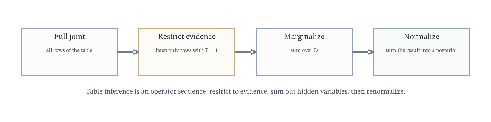

<!-- table-stack:start -->
<table border="0" cellpadding="0" cellspacing="16">
  <tbody>
    <tr>
      <td valign="top">
        
<strong>Restrict to <i>T</i> = 1</strong>

        <table>
          <thead>
            <tr>
              <th><i>DC</i></th>
              <th><i>p(T = 1, D, C)</i></th>
            </tr>
          </thead>
          <tbody>
            <tr><td>00</td><td>0.064</td></tr>
            <tr><td>01</td><td>0.012</td></tr>
            <tr><td>10</td><td>0.016</td></tr>
            <tr><td>11</td><td>0.108</td></tr>
          </tbody>
        </table>
      </td>
      <td valign="top">
        
<strong>Marginalize over <i>D</i></strong>

        <table>
          <thead>
            <tr>
              <th><i>C</i></th>
              <th><i>p(T = 1, C)</i></th>
            </tr>
          </thead>
          <tbody>
            <tr><td>0</td><td>0.064 + 0.016 = 0.080</td></tr>
            <tr><td>1</td><td>0.012 + 0.108 = 0.120</td></tr>
          </tbody>
        </table>
      </td>
      <td valign="top">
        
<strong>Normalize</strong>

        <table>
          <thead>
            <tr>
              <th><i>C</i></th>
              <th><i>p(C | T = 1)</i></th>
            </tr>
          </thead>
          <tbody>
            <tr><td>0</td><td>0.08 / 0.20 = 0.40</td></tr>
            <tr><td>1</td><td>0.12 / 0.20 = 0.60</td></tr>
          </tbody>
        </table>
      </td>
    </tr>
  </tbody>
</table>
<!-- table-stack:end -->

This is the same computation as Bayes rule, but expressed as table arithmetic.

The three tables correspond exactly to three conceptual operations. The first table performs restriction by keeping only the rows consistent with the evidence $T=1$. The second table performs marginalization by summing out the hidden variable $D$. The third table performs normalization so the remaining numbers add to one and therefore form a proper posterior distribution over $C$.

### Expectation

The expectation of a discrete variable is a weighted average:

$$\mathbb{E}[X] = \sum_x x \, p(x).$$

For a Bernoulli variable, $\mathbb{E}[X] = \rho$, which is why the Bernoulli parameter is also the mean.

A full worked example shows why expectation is called a weighted average. Suppose

$$\mathbb{P}(X=0)=0.7, \qquad \mathbb{P}(X=1)=0.3.$$

Then

$$\mathbb{E}[X]=0 \cdot 0.7 + 1 \cdot 0.3 = 0.3.$$

For a die roll with values $1$ through $6$,

$$\mathbb{E}[X] = \sum_{x=1}^6 x \cdot \frac{1}{6} = \frac{1+2+3+4+5+6}{6}=3.5.$$

So expectation is not required to be a value the variable actually takes. A fair die never lands on $3.5$, but $3.5$ is still the mean location of the distribution.

### Linearity of Expectation

Expectation is linear:

$$\mathbb{E}[aX+bY+c]=a\mathbb{E}[X]+b\mathbb{E}[Y]+c.$$

No independence assumption is required. That point is easy to miss because many later formulas do require independence, but linearity of expectation does not. The rule holds even when $X$ and $Y$ are strongly dependent.

For a concrete example, suppose three coin flips have indicator variables $H_1,H_2,H_3$, where $H_i=1$ if flip $i$ is heads and $0$ otherwise. Let

$$N=H_1+H_2+H_3$$

denote the total number of heads. Then

$$\mathbb{E}[N]=\mathbb{E}[H_1]+\mathbb{E}[H_2]+\mathbb{E}[H_3].$$

If each flip has head probability $\rho$, then $\mathbb{E}[H_i]=\rho$ for every $i$, so

$$\mathbb{E}[N]=3\rho.$$

This conclusion does not require us to enumerate all eight outcomes explicitly. Linearity lets us decompose a complicated count into simple indicator expectations and add them back together.

### Variance, Covariance, and Correlation

Expectation gives the center of a distribution, but it does not describe spread. The basic spread measure is variance:

$$\mathrm{Var}(X)=\mathbb{E}[(X-\mathbb{E}[X])^2].$$

Expanding the square gives the useful identity

$$\mathrm{Var}(X)=\mathbb{E}[X^2]-\mathbb{E}[X]^2.$$

For two variables, covariance is

$$\mathrm{Cov}(X,Y)=\mathbb{E}[(X-\mathbb{E}[X])(Y-\mathbb{E}[Y])].$$

The normalized version is correlation:

$$\mathrm{Corr}(X,Y)=\frac{\mathrm{Cov}(X,Y)}{\sqrt{\mathrm{Var}(X)\mathrm{Var}(Y)}}.$$

Variance reacts predictably to affine transformations:

$$\mathrm{Var}(aX+b)=a^2 \mathrm{Var}(X), \qquad \mathrm{Cov}(aX+b,cY+d)=ac\,\mathrm{Cov}(X,Y).$$

These formulas show what each quantity measures. Adding a constant shifts the location but does not change spread. Multiplying by $a$ rescales the spread by $a^2$. Covariance records whether large values of one variable tend to occur with large or small values of the other.

A diagnostic example shows why mean and variance are genuinely different summaries. Let $X$ be constant at $3$, and let $Y$ equal $0$ or $6$ with probabilities $1/2$ and $1/2$. Then

$$\mathbb{E}[X]=3, \qquad \mathbb{E}[Y]=0 \cdot \frac{1}{2}+6 \cdot \frac{1}{2}=3,$$

so both variables have the same mean. But

$$\mathrm{Var}(X)=0$$

because $X$ never moves, while

$$\mathrm{Var}(Y)=\mathbb{E}[Y^2]-\mathbb{E}[Y]^2 =\left(0^2 \cdot \frac{1}{2}+6^2 \cdot \frac{1}{2}\right)-3^2 =18-9=9.$$

So two distributions can agree perfectly on their center and still differ sharply in uncertainty.

Covariance also does not capture every form of dependence. Let $X$ take values $-1$, $0$, and $1$ with equal probability, and define

$$Y=X^2.$$

Then $Y$ is completely determined by $X$, so the variables are dependent. But

$$\mathbb{E}[X]=0, \qquad \mathbb{E}[XY]=\mathbb{E}[X^3]=0,$$

which gives

$$\mathrm{Cov}(X,Y)=\mathbb{E}[XY]-\mathbb{E}[X]\mathbb{E}[Y]=0.$$

So zero covariance does not imply independence. It only rules out linear dependence in the centered variables.

### Independence

Two random variables $X$ and $Y$ are independent if

$$p(X,Y) = p(X)p(Y).$$

Equivalently, observing one does not change the distribution of the other:

$$p(X \mid Y) = p(X).$$

The equivalence between these two definitions is worth writing out because it gets used constantly. If

$$p(X,Y)=p(X)p(Y),$$

then for any value of $Y$ with positive probability,

$$p(X \mid Y)=\frac{p(X,Y)}{p(Y)}=\frac{p(X)p(Y)}{p(Y)}=p(X).$$

Conversely, if

$$p(X \mid Y)=p(X)$$

for every value of $Y$ with $p(Y)>0$, then multiplying both sides by $p(Y)$ gives

$$p(X,Y)=p(X \mid Y)p(Y)=p(X)p(Y).$$

So the factorization view and the "observing $Y$ changes nothing" view are two algebraically equivalent ways to state the same independence claim. The caveat about $p(Y)>0$ is important: conditional probability is only defined when the conditioning event has nonzero probability.

Independence also simplifies the joint distribution. If $X$ and $Y$ are $d$-ary variables, the full joint has $d^2 - 1$ degrees of freedom, while independence reduces that to $2d - 2$.

That parameter-count reduction is the structural reward for independence. Without independence, every pair $(x,y)$ needs its own joint probability, subject only to one normalization constraint. With independence, the entire table is reconstructed from two marginal vectors. This is a dramatic simplification, but it is also a strong modeling claim, so it should only be used when it is substantively justified.

### Example 2-7: Independence

Let $X$ be a biased coin and $Y$ a weighted four-sided die. If they are independent, then the joint is just the product of the marginals.

| $X$ | $p(X)$ |
|---|---:|
| 0 | 0.7 |
| 1 | 0.3 |

| $Y$ | $p(Y)$ |
|---|---:|
| 1 | 0.2 |
| 2 | 0.3 |
| 3 | 0.4 |
| 4 | 0.1 |

Representative joint entries:

| $X$ | $Y$ | $p(X,Y)$ |
|---|---|---:|
| 0 | 1 | 0.14 |
| 0 | 2 | 0.21 |
| 1 | 4 | 0.03 |

To verify independence explicitly, check one conditional. Since

$$p(X=1,Y=4)=0.03$$

and

$$p(Y=4)=0.1,$$

we have

$$p(X=1 \mid Y=4)=\frac{0.03}{0.1}=0.3=p(X=1).$$

The observation of $Y$ leaves the distribution of $X$ unchanged, which is the operational meaning of independence.

### Pairwise Versus Mutual Independence

Independence among more than two variables needs careful wording. Variables $X_1,\dots,X_n$ are mutually independent if every subcollection factorizes:

$$p(X_{i_1},\dots,X_{i_k})=\prod_{j=1}^k p(X_{i_j})$$

for every subset of indices. Pairwise independence is weaker. It only requires each pair to be independent, not every triple or larger group.

A standard counterexample makes the distinction explicit. Let $U$ and $V$ be independent fair bits, and define

$$W = U \oplus V,$$

their exclusive-or. The four possible triples are

$$(U,V,W) \in \{(0,0,0),(0,1,1),(1,0,1),(1,1,0)\},$$

each with probability $1/4$. Every pair is independent: for instance, $p(U=0,V=0)=1/4=(1/2)(1/2)$, and the same factorization holds for $(U,W)$ and $(V,W)$. But the three variables are not mutually independent, because

$$p(U=0,V=0,W=0)=\frac{1}{4}$$

while the product of marginals would be

$$p(U=0)p(V=0)p(W=0)=\frac{1}{2}\cdot\frac{1}{2}\cdot\frac{1}{2}=\frac{1}{8}.$$

The failure occurs because once two of the variables are known, the third is completely determined. Pairwise checks are therefore not enough to certify full mutual independence.

### Conditional Independence

It is rare for variables to be completely independent, but they are often conditionally independent given a mediating variable $Z$:

$$p(X,Y \mid Z) = p(X \mid Z)p(Y \mid Z).$$

Once $Z$ is known, $X$ and $Y$ stop giving extra information about each other.

A good way to read this is as a statement about information flow. Before conditioning, $X$ and $Y$ may be correlated because they both respond to the hidden cause $Z$. After conditioning on $Z$, that common cause has been fixed, so the leftover association disappears. Conditional independence is therefore weaker than independence in general but often much more realistic in structured probabilistic models.

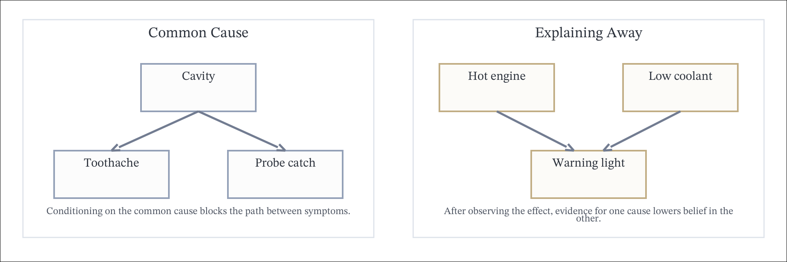

### Example 2-8: Conditional Independence, Dentist

In the dentist model, the probe catches and toothache are not independent in general. But conditioned on cavity status, they become independent. The conditional table is:

| $T$ | $D$ | $C$ | $p(D \mid C,T)$ |
|---|---|---|---:|
| 0 | 0 | 0 | 0.800 |
| 0 | 0 | 1 | 0.100 |
| 0 | 1 | 0 | 0.200 |
| 0 | 1 | 1 | 0.900 |
| 1 | 0 | 0 | 0.800 |
| 1 | 0 | 1 | 0.100 |
| 1 | 1 | 0 | 0.200 |
| 1 | 1 | 1 | 0.900 |

The key point is that $p(D \mid C,T)$ does not actually depend on $T$.

We can check that explicitly from the table. For cavity-free teeth,

$$p(D=1 \mid C=0,T=0)=0.2, \qquad p(D=1 \mid C=0,T=1)=0.2.$$

For cavity teeth,

$$p(D=1 \mid C=1,T=0)=0.9, \qquad p(D=1 \mid C=1,T=1)=0.9.$$

So once the cavity variable is fixed, knowing the toothache value adds no further information about the probe outcome. That is precisely what conditional independence means in this example.

### Worked Example: Auto Warning Light

The conditional independence machinery above is exactly what one uses in simple diagnostic models. Suppose

- $H=1$ means the engine is too hot
- $C=1$ means the coolant level is too low
- $W=1$ means the warning light is on

Assume

$$p(H=1)=0.1,\qquad p(C=1)=0.1,$$

and assume $H$ and $C$ are independent. Then

$$p(H,C)=p(H)p(C).$$

The warning light is a noisy sensor whose probability of turning on depends on the hidden causes:

| $H$ | $C$ | $p(H,C)$ | $p(W=1 \mid H,C)$ | $p(H,C,W=1)$ |
|---|---|---:|---:|---:|
| 0 | 0 | $0.9 \cdot 0.9 = 0.81$ | 0.1 | $0.81 \cdot 0.1 = 0.081$ |
| 0 | 1 | $0.9 \cdot 0.1 = 0.09$ | 0.8 | $0.09 \cdot 0.8 = 0.072$ |
| 1 | 0 | $0.1 \cdot 0.9 = 0.09$ | 0.8 | $0.09 \cdot 0.8 = 0.072$ |
| 1 | 1 | $0.1 \cdot 0.1 = 0.01$ | 0.9 | $0.01 \cdot 0.9 = 0.009$ |

The first posterior query is the probability that coolant is low after seeing the warning light:

$$p(C=1 \mid W=1)=\frac{p(C=1,W=1)}{p(W=1)}.$$

Compute the denominator by summing the last column:

$$p(W=1)=0.081+0.072+0.072+0.009=0.234.$$

Compute the numerator by summing only the rows with $C=1$:

$$p(C=1,W=1)=0.072+0.009=0.081.$$

Therefore

$$p(C=1 \mid W=1)=\frac{0.081}{0.234}=\frac{9}{26}\approx 0.346.$$

The second posterior query uses extra evidence. Once we also learn that the engine is hot,

$$p(C=1 \mid W=1,H=1)=\frac{p(C=1,W=1,H=1)}{p(W=1,H=1)}.$$

The numerator is just the row $(H,C)=(1,1)$:

$$p(C=1,W=1,H=1)=0.009.$$

The denominator sums the two rows with $H=1$:

$$p(W=1,H=1)=0.072+0.009=0.081.$$

So the updated posterior is

$$p(C=1 \mid W=1,H=1)=\frac{0.009}{0.081}=\frac{1}{9}\approx 0.111.$$

This drop is not a paradox. Before checking the engine, the warning light could have been explained by either low coolant or overheating. After verifying that overheating is already present, much of the evidence carried by the light has already been explained away, so the extra need to blame low coolant becomes smaller.

This example is also useful for structural counting. The full joint model over $(H,C,W)$ has

$$2^3=8$$

possible states. But the number of distinct real values we actually specified is much smaller. We used one shared prior number $0.1$ for both $H$ and $C$, and three distinct sensor probabilities $0.9$, $0.8$, and $0.1$ for the three qualitative parent cases "both true," "exactly one true," and "neither true." So the model was specified using only four distinct numbers. The gap between eight states and four numbers is exactly the payoff from independence plus parameter sharing.

### Worked Example: Information Sufficiency for Posterior Queries

Suppose $A$, $B$, and $C$ are binary variables and we want to compute

$$p(A=1 \mid B=1,C=1).$$

Bayes' rule exposes the information requirement immediately:

$$p(A=1 \mid B=1,C=1) = \frac{p(B=1,C=1 \mid A=1)p(A=1)}{p(B=1,C=1)}.$$

So, with no conditional independence assumptions, three ingredients are needed:

- the prior $p(A=1)$
- the likelihood term $p(B=1,C=1 \mid A=1)$
- the evidence term $p(B=1,C=1)$

That is the cleanest way to judge whether a proposed set of numbers is sufficient. We do not ask whether the numbers "feel related." We ask whether they determine the numerator and denominator in the displayed formula.

Now consider three candidate information sets.

Set 1 gives

$$p(B=1,C=1),\qquad p(A=1),\qquad p(B=1 \mid A=1),\qquad p(C=1 \mid A=1).$$

Without further assumptions, this set is not sufficient. The separate conditionals $p(B=1 \mid A=1)$ and $p(C=1 \mid A=1)$ do not determine the joint conditional probability $p(B=1,C=1 \mid A=1)$. Many different joint distributions of $(B,C)$ given $A=1$ can share the same one-variable conditionals.

Set 2 gives

$$p(B=1,C=1),\qquad p(A=1),\qquad p(B=1,C=1 \mid A=1).$$

This set is sufficient, because it contains exactly the three ingredients needed by Bayes' rule.

Set 3 gives

$$p(A=1),\qquad p(B=1 \mid A=1),\qquad p(C=1 \mid A=1).$$

This set is not sufficient. Even if one somehow recovered the numerator, the denominator $p(B=1,C=1)$ is still missing, so the posterior cannot be normalized.

Now suppose we are also told that

$$p(B \mid A,C)=p(B \mid A)$$

for all values of the variables, which is the conditional independence statement

$$B \perp C \mid A.$$

Then Set 1 becomes sufficient, because the missing joint conditional factor can now be reconstructed as

$$p(B=1,C=1 \mid A=1)=p(B=1 \mid A=1)p(C=1 \mid A=1).$$

Set 2 remains sufficient for the same reason as before: it already contained the full joint conditional term. Set 3 is still not sufficient, because the marginal evidence probability $p(B=1,C=1)$ is still absent. Conditional independence can reduce the amount of information needed to specify a numerator, but it does not make the denominator appear by magic.

### Retain from 2.1

- Probability is defined on events first; random-variable formulas are induced from that event structure.
- Bayes updates can be read either as algebra on conditional probabilities or as the operational sequence restrict, marginalize, normalize.
- Independence means factorization or, equivalently, that conditioning on one variable leaves the other unchanged.
- Conditional independence is weaker than independence and is the key structural simplification behind diagnostic models.

### Do Not Confuse in 2.1

- Do not confuse an event such as $X=x$ with the random variable $X$ itself.
- Do not confuse conditioning with intervention; $p(Y \mid X=x)$ is not automatically a causal statement.
- Do not confuse pairwise independence with mutual independence.
- Do not assume a set of conditional probabilities is sufficient for a posterior unless the required numerator and denominator are actually determined.

## 2.2 Continuous Random Variables

Sometimes we model systems with real-valued random variables $X \in \mathbb{R}$. In that setting we define a probability density function $p(x)$ with $p(x) \ge 0$ for all $x$ and

$$\int p(x)\,dx = 1.$$

The density defines the probability of any event $X \in A \subseteq \mathbb{R}$ by

$$\mathbb{P}(X \in A) = \int_A p(x)\,dx.$$

This is the first major structural difference from the discrete case. For a continuous variable, the number $p(x)$ is not the probability of the event $X=x$; in fact $\mathbb{P}(X=x)=0$ for every individual point. A density only becomes a probability after integrating it over an interval or region. That is why a density is allowed to exceed one locally, provided the total area under the curve is still one.

A concrete interval computation makes this precise. If $X$ is uniform on $[0,2]$, then $p(x)=1/2$ on that interval. The probability that $X$ falls between $0.3$ and $0.9$ is

$$\mathbb{P}(0.3 \le X \le 0.9) = \int_{0.3}^{0.9} \frac{1}{2}\,dx = \frac{1}{2}(0.9-0.3)=0.3.$$

The point $x=0.4$ itself still has probability zero. What matters is the width of the interval, not the existence of an individual point.

### CDFs and Types of Distributions

The cumulative distribution function is the most universal object for a real-valued random variable:

$$F_X(x)=\mathbb{P}(X \le x).$$

Every real-valued random variable has a CDF, whether it is discrete, continuous, or mixed. A PMF exists when probability is concentrated on isolated states. A PDF exists only when the distribution is absolutely continuous with respect to ordinary length or volume. So PMFs and PDFs are special representations, while the CDF always exists.

This distinction matters because not every distribution is purely discrete or purely continuous. A mixed distribution can contain both an atom and a continuous part. For example, suppose

$$\mathbb{P}(X=0)=0.7,$$

and with the remaining probability $0.3$ we draw $X$ uniformly from $[0,1]$. Then the CDF is

| range | $F_X(x)$ |
|---|---:|
| $x<0$ | $0$ |
| $x=0$ | $0.7$ |
| $0<x<1$ | $0.7+0.3x$ |
| $x \ge 1$ | $1$ |

This variable has a jump of size $0.7$ at zero and a continuous linear rise on $(0,1)$. It cannot be described by an ordinary density alone, because the point mass at zero would be lost. The CDF therefore gives the cleanest unified description.

### Example 2-9: Uniform Distribution

For a continuous-valued random variable $X$ defined on $[0,T]$, the uniform distribution is

| support condition | $p(x)$ |
|---|---:|
| $x \in [0,T]$ | $\frac{1}{T}$ |
| otherwise | $0$ |

Then

$$\int_0^T p(x)\,dx = T \cdot \frac{1}{T} = 1.$$

Unlike discrete distributions, the density value may be larger than one, as long as its integral over the support is one. The important normalization object is area, not height.

For example, if $X$ is uniform on the very short interval $[0,0.2]$, then

$$p(x)=5$$

on that interval. The density value exceeds one, but the total probability is still

$$\int_0^{0.2} 5\,dx = 1.$$

So there is no contradiction between a large density and a valid probability model.

### Gaussian Distributions

The Gaussian distribution is one of the most important continuous families. In one dimension,

$$p(x) = \mathcal{N}(x;\mu,\sigma^2) = \frac{1}{\sqrt{2\pi\sigma^2}} \exp\!\left(-\frac{(x-\mu)^2}{2\sigma^2}\right).$$

In multiple dimensions,

$$p(x) = \mathcal{N}(x;\mu,\Sigma) = (2\pi)^{-n/2} |\Sigma|^{-1/2} \exp\!\left(-\frac{1}{2}(x-\mu)^T \Sigma^{-1}(x-\mu)\right).$$

The mean vector $\mu$ sets the center, and the covariance matrix $\Sigma$ sets the shape and spread. The quadratic term $(x-\mu)^T \Sigma^{-1}(x-\mu)$ is the squared Mahalanobis distance from $x$ to the mean, measured in the geometry induced by $\Sigma$. In two dimensions, the level sets of constant density are ellipses; in higher dimensions, they are ellipsoids. For this formula to define a proper density, $\Sigma$ must be symmetric and positive definite, so that the quadratic form is nonnegative, the inverse exists, and the determinant term $|\Sigma|^{-1/2}$ is well-defined.

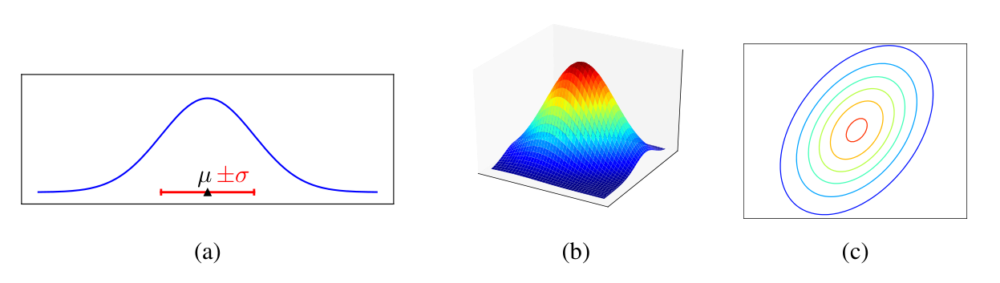

The three panels show the same family viewed three ways. The one-dimensional curve emphasizes how the mean shifts location and the standard deviation changes spread. The surface plot shows the bivariate density as height over the plane. The contour plot removes the height dimension and keeps only level sets, which is often the most useful representation when reasoning about covariance structure.

A concrete one-dimensional example is

$$X \sim \mathcal{N}(2, 9),$$

so the mean is $2$ and the standard deviation is $3$. About two-thirds of the mass lies within one standard deviation of the mean, namely in the interval $[-1,5]$, and almost all of the mass lies within a few standard deviations. In two dimensions, if

$$\mu=(0,0)^T, \qquad \Sigma_{11}=4,\qquad \Sigma_{22}=1,\qquad \Sigma_{12}=\Sigma_{21}=0,$$

then the contours are ellipses stretched more strongly along the first coordinate than along the second. Off-diagonal covariance terms rotate those ellipses and encode correlation.

### Example 2-10: Bernoulli Exponential Family Form

The Bernoulli distribution can be written in exponential-family form:

$$\rho^X (1-\rho)^{1-X} = \exp\!\Bigl(\log(\rho)X + \log(1-\rho)(1-X)\Bigr).$$

This highlights the feature $\phi(X)=X$ and the natural parameter $\eta = \log(\rho/(1-\rho))$. Writing Bernoulli in this way makes the log-odds parameter explicit and shows how a nonlinear parameter such as $\rho$ becomes a linear coefficient in the exponent.

One more step makes the canonical form fully explicit. Since

$$\log(\rho)X + \log(1-\rho)(1-X) = X \log \frac{\rho}{1-\rho} + \log(1-\rho),$$

we can write

$$p(X) = \exp\!\bigl(\eta X - A(\eta)\bigr)$$

with

$$\eta = \log \frac{\rho}{1-\rho}, \qquad A(\eta)=\log(1+e^\eta).$$

This shows exactly how the Bernoulli distribution fits the general exponential-family template.

### Example 2-11: Bernoulli Two-Parameter Form

We can also write an over-parameterized Bernoulli distribution with two parameters:

$$p(X;\eta_0,\eta_1) = \frac{\exp\bigl(\eta_1 X + \eta_0(1-X)\bigr)}{\exp(\eta_0)+\exp(\eta_1)}.$$

Only the difference $\eta_1 - \eta_0$ matters, so different parameter values can represent the same distribution. This is an explicit structural redundancy: the model has two coordinates, but the actual Bernoulli family still has only one degree of freedom.

For example, the parameter pairs $(\eta_0,\eta_1)=(0,2)$ and $(5,7)$ define the same Bernoulli law because both have difference $2$. Adding the same constant to both coordinates changes numerator and denominator by the same multiplicative factor and therefore leaves the normalized probability unchanged.

### Beta and Dirichlet Distributions

Another important continuous distribution is the Beta distribution on $[0,1]$:

$$p(x) = \mathrm{Beta}(x;a,b) = \frac{\Gamma(a+b)}{\Gamma(a)\Gamma(b)} x^{a-1}(1-x)^{b-1}.$$

The Gamma-function ratio is the normalization constant that forces the integral over $[0,1]$ to equal one. When $a=b=1$, the Beta distribution is uniform. When $a,b > 1$, it is unimodal and places most of its mass in the interior. When either parameter is less than one, the density can spike at the boundary. That does not violate probability rules, because the integral over any interval is still finite even if the pointwise density becomes very large near $0$ or $1$.

The Dirichlet distribution generalizes Beta to vectors on the simplex:

$$p(x) = \mathrm{Dir}(x;\alpha) = \frac{\Gamma(\sum_j \alpha_j)}{\prod_j \Gamma(\alpha_j)} \prod_j x_j^{\alpha_j - 1},$$

with $x_j \ge 0$ and $\sum_j x_j = 1$. The simplex constraint means the domain has one fewer free dimension than the number of coordinates: once $x_1,\dots,x_{d-1}$ are chosen, the last coordinate is fixed by normalization. When all concentration parameters are large and equal, the mass sits near the center of the simplex; when some coordinates of $\alpha$ are less than one, the density shifts toward edges or corners. For $d=2$, Dirichlet reduces exactly to Beta, so Beta is the one-dimensional simplex case.

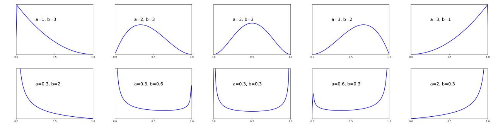

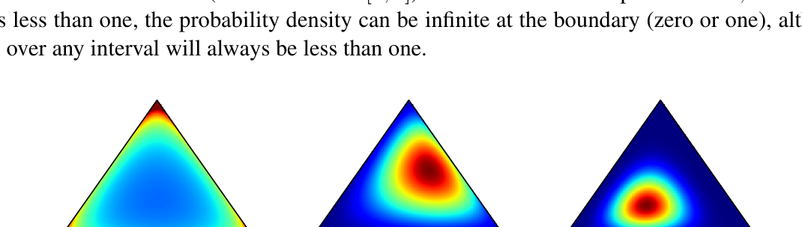

The Beta grid makes the parameter effects explicit: symmetric parameters above one create a peak in the middle, while parameters below one push mass toward the boundaries. The Dirichlet simplex panels show the same phenomenon in two free dimensions. Mass near the center means balanced proportions; mass near an edge or corner means one or more coordinates are favored strongly.

A full prior example helps fix intuition. Suppose $\rho$ is the head probability of a coin. A prior

$$\rho \sim \mathrm{Beta}(20,20)$$

encodes a strong belief that the coin is close to fair, because the mass is tightly concentrated around $0.5$. By contrast,

$$\rho \sim \mathrm{Beta}(0.3,0.3)$$

puts much more mass near $0$ and $1$, expressing the belief that the coin is likely to be strongly biased in one direction or the other. In the Dirichlet case, the same logic applies to a probability vector rather than a single number.

### The Exponential Family

The distributions discussed so far are examples of the exponential family:

$$p(x;\theta) = h(x)\exp\!\bigl(\theta^T \phi(x) - A(\theta)\bigr).$$

The vector $\phi(x)$ contains the sufficient statistics, $h(x)$ is the base measure, $\theta$ is the natural parameter, and $A(\theta)$ is the log-partition function

$$A(\theta) = \log \int h(x)\exp\!\bigl(\theta^T\phi(x)\bigr)\,dx.$$

Writing the model this way makes the structure explicit: the log-density is affine in the fixed feature vector $\phi(x)$, while all normalization is absorbed into $A(\theta)$. That structure is what gives exponential families their clean moment-matching and convexity properties. It is also a genuine limitation: only distributions whose log-density can be expressed using a fixed finite-dimensional feature map belong to a finite-dimensional exponential family.

It is helpful to see the template instantiated twice. For Bernoulli,

$$h(x)=1, \qquad \phi(x)=x, \qquad \theta=\eta, \qquad A(\eta)=\log(1+e^\eta).$$

For a Gaussian with known variance $\sigma^2$, one can write the density in exponential-family form with sufficient statistics $x$ and $x^2$. The point is not that every distribution looks identical, but that once the pieces are identified, the same structural tools apply across many families.

### Retain from 2.2

- Every real-valued random variable has a CDF, but not every one has a density.
- A density value is not a point probability; probabilities come from integrals over regions.
- In Gaussian models, the covariance structure controls geometry, not just scale.
- Beta and Dirichlet distributions live on constrained supports, so their formulas only make sense together with those support conditions.

### Do Not Confuse in 2.2

- Do not confuse PMFs, PDFs, and CDFs; they are related but not interchangeable objects.
- Do not conclude that $p(x)>1$ is invalid for a density; only the integral must equal one.
- Do not use a continuous density formula on a mixed distribution that has point masses.
- Do not treat exponential-family form as universal; it is a structural class, not every distribution.

## 2.3 Learning and Parameter Estimation

In practice, we often do not know the probabilities that govern a system. Instead, we observe data and estimate the model parameters from those observations.

### Frequentist Versus Bayesian Perspectives

From the frequentist perspective, probability is long-run frequency. The parameter is fixed but unknown, data are random, and learning means estimating the true parameter from samples.

From the Bayesian perspective, probability is degree of belief. The parameter itself is uncertain, so we place a prior distribution on it and update that prior after seeing data.

Both views use many of the same formulas, but they answer slightly different questions. A frequentist estimator asks, "if nature chose a fixed parameter, what rule should I use to estimate it?" A Bayesian posterior asks, "after observing this concrete data set, which parameter values remain plausible and how plausible are they relative to one another?" Maximum likelihood is the canonical frequentist estimator because it ignores prior beliefs and keeps only the data-fit term.

The same coin-toss example makes the contrast concrete. Suppose we observe five flips with outcomes

$$D=\{1,1,0,1,0\}.$$

A frequentist summary is the single estimate $\hat\rho=3/5=0.6$. A Bayesian summary with prior $\mathrm{Beta}(2,2)$ produces the full posterior

$$\rho \mid D \sim \mathrm{Beta}(5,4),$$

which still centers near $0.56$ but also quantifies uncertainty around that value.

### Likelihood

For i.i.d. data $D = {x^{(1)}, \dots, x^{(m)}}$, the likelihood is

$$p(D;\theta) = \prod_i p(x^{(i)};\theta)$$

and the log-likelihood is

$$L(\theta) = \sum_i \log p(x^{(i)};\theta).$$

The principle of maximum likelihood says to choose the parameter value that makes the observed data look most probable. It is important to state explicitly what varies and what stays fixed: after we have observed $D$, the data are treated as fixed, and the likelihood is a function of $\theta$. It is not a probability distribution over $\theta$, and it does not have to integrate to one over parameter space.

For the small Bernoulli sample

$$D=\{1,0,1\},$$

the likelihood is

$$p(D \mid \rho)=\rho(1-\rho)\rho=\rho^2(1-\rho).$$

If we try three candidate parameters, we get

$$p(D \mid 0.2)=0.032,\qquad p(D \mid 0.5)=0.125,\qquad p(D \mid 0.8)=0.128.$$

So among those candidates, $\rho=0.8$ explains the observed data slightly better than $\rho=0.5$, while $\rho=0.2$ fits badly.

### Probability Versus Likelihood

The same algebraic expression can play two different roles depending on what is held fixed. When $\theta$ is fixed and $x$ varies, the quantity $p(x \mid \theta)$ is a probability model over possible observations. When the observation $x$ has already been fixed and $\theta$ varies, the same expression is treated as a likelihood function of the parameter.

For Bernoulli data, if we observe a single success $x=1$, then

$$p(x=1 \mid \rho)=\rho.$$

Viewed as a function of the data, this is a perfectly ordinary probability rule: for fixed $\rho$, the probabilities of $x=0$ and $x=1$ add to one. But viewed as a function of $\rho$ after observing $x=1$, the same expression becomes the likelihood $L(\rho)=\rho$. That likelihood does not integrate to one over $\rho \in [0,1]$, nor is it supposed to. Its job is only to rank parameter values by how well they explain the observation.

### Example 2-12: Bernoulli Likelihood

Suppose we observe $m$ Bernoulli samples, with $m_1$ ones and $m_0$ zeros. Then

$$L(\rho) = m_1 \log \rho + m_0 \log(1-\rho).$$

The likelihood is maximized at the empirical frequency of ones. If the observed sample is all zeros or all ones, the maximizer lies on the boundary $\rho=0$ or $\rho=1$. Otherwise the unique optimum lies in the interior of the interval.

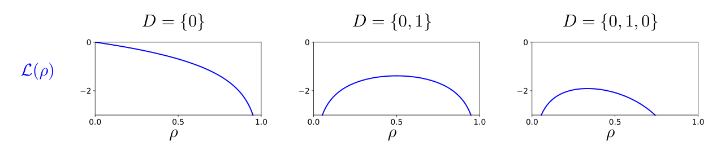

Each panel holds the observed data fixed and varies only the parameter $\rho$. The curve peaks where the model's predicted head probability best matches the observed proportion of heads. When the data rule out part of parameter space completely, the log-likelihood drops toward negative infinity at the incompatible boundary.

For the data set $D=\{0,1\}$, the likelihood is

$$p(D \mid \rho)=\rho(1-\rho),$$

which is zero at $\rho=0$ and $\rho=1$ because either extreme makes one of the two observations impossible. The peak therefore occurs in the interior, specifically at $\rho=1/2$.

### Example 2-13: Gaussian Likelihood

For a one-dimensional Gaussian with variance fixed at one, the likelihood as a function of $\mu$ becomes more sharply peaked as the number of samples grows. That sharpening is the visual signature that more data reduce parameter uncertainty: many values of $\mu$ may explain three observations reasonably well, but far fewer values remain plausible once twenty observations cluster around the same region.

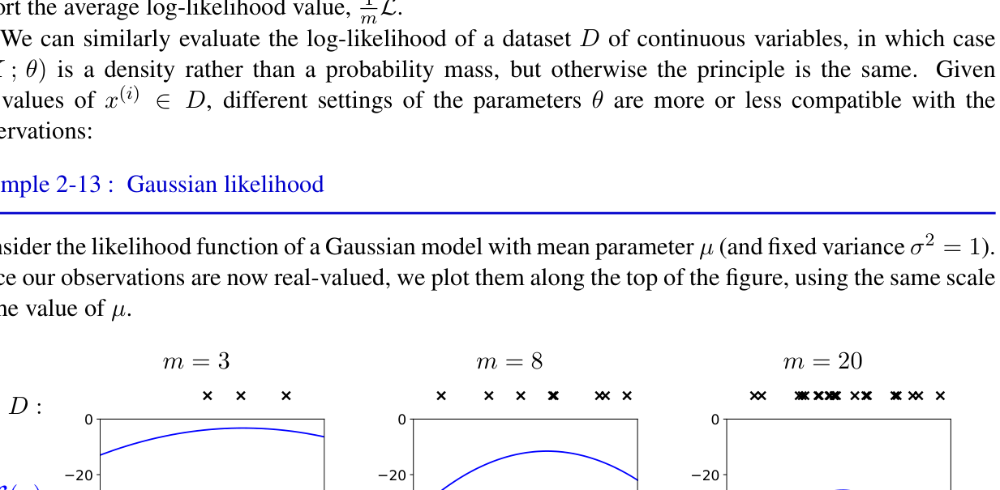

The dots along the top of each panel are the observed samples. The curve below them is the log-likelihood as a function of the Gaussian mean. As $m$ increases, the curve narrows and the maximizing value moves toward the visual center of the observed data cloud.

If the observed values are $-0.5$, $0.4$, and $1.3$, then the Gaussian likelihood in $\mu$ is largest near the arithmetic average

$$\bar x = \frac{-0.5+0.4+1.3}{3}=0.4.$$

The entire curve is simply another way of visualizing how much squared-error penalty is paid for choosing a mean away from that center.

### Maximum Likelihood Estimation

For a Bernoulli distribution,

$$L(\rho) = m_1 \log \rho + m_0 \log(1-\rho).$$

Differentiating gives

$$\frac{\partial L}{\partial \rho} = \frac{m_1}{\rho} - \frac{m_0}{1-\rho}.$$

Setting this to zero yields

$$\hat\rho_{\text{MLE}} = \frac{m_1}{m}.$$

The algebra is worth writing out explicitly:

$$\frac{m_1}{\rho} - \frac{m_0}{1-\rho} = 0 \quad \Longrightarrow \quad m_1(1-\rho) = m_0\rho \quad \Longrightarrow \quad m_1 = (m_0+m_1)\rho.$$

Since $m_0+m_1 = m$, we obtain $\hat\rho_{\text{MLE}} = m_1/m$. The second derivative is

$$\frac{\partial^2 L}{\partial \rho^2} = -\frac{m_1}{\rho^2} - \frac{m_0}{(1-\rho)^2} < 0,$$

so the stationary point is a strict global maximum whenever it lies in the interior.

For a Gaussian with mean $\mu$ and variance $\nu = \sigma^2$,

$$\hat\mu_{\text{MLE}} = \frac{1}{m}\sum_i x^{(i)}$$

$$\hat\nu_{\text{MLE}} = \frac{1}{m}\sum_i (x^{(i)} - \hat\mu)^2.$$

For the mean parameter, the derivation comes from expanding the log-likelihood into a constant minus a squared-error term:

$$L(\mu) = \text{const} - \frac{1}{2\nu}\sum_i (x^{(i)}-\mu)^2.$$

Differentiating with respect to $\mu$ gives

$$\frac{\partial L}{\partial \mu} = \frac{1}{\nu}\sum_i (x^{(i)}-\mu),$$

so setting the derivative to zero forces $\mu$ to equal the arithmetic average of the observations. The variance estimate is then the average squared deviation around that fitted mean. For a discrete distribution with probabilities $\rho_x$, the MLE is the empirical frequency of each state.

An explicit discrete example makes the frequency rule concrete. Suppose the data over states $\{a,b,c\}$ are

$$D=\{a,c,a,b,a,c\}.$$

Then the counts are $m_a=3$, $m_b=1$, and $m_c=2$, so the MLE is

$$\hat\rho_a=3/6,\qquad \hat\rho_b=1/6,\qquad \hat\rho_c=2/6.$$

The estimate simply copies empirical proportions into the model.

### Example 2-14: Bernoulli MLE

If $m_1$ of the $m$ observations are ones, then

$$\hat\rho = \frac{m_1}{m}.$$

### Example 2-15: Gaussian MLE

The Gaussian MLE is the sample mean and sample variance:

$$\hat\mu = \frac{1}{m}\sum_i x^{(i)},$$

$$\hat\nu = \frac{1}{m}\sum_i (x^{(i)}-\hat\mu)^2.$$

### Example 2-16: Discrete MLE

For a discrete distribution over states $x$, the MLE is

$$\hat\rho_x = \frac{m_x}{m},$$

where $m_x$ is the count of state $x$ in the data.

### Maximum Likelihood and Exponential Families

For a canonical exponential-family model

$$p(x;\theta) = h(x)\exp\!\bigl(\theta^T \phi(x) - A(\theta)\bigr),$$

the log-likelihood of i.i.d. data is

$$L(\theta) = \sum_i \log h(x^{(i)}) + \theta^T \sum_i \phi(x^{(i)}) - m A(\theta).$$

Differentiating with respect to $\theta$ gives

$$\nabla_\theta L(\theta) = \sum_i \phi(x^{(i)}) - m \nabla_\theta A(\theta).$$

For exponential families,

$$\nabla_\theta A(\theta) = \mathbb{E}_\theta[\phi(X)],$$

so the first-order optimality condition becomes

$$\frac{1}{m}\sum_i \phi(x^{(i)}) = \mathbb{E}_\theta[\phi(X)].$$

This is the explicit moment-matching statement: the fitted model reproduces the empirical averages of the sufficient statistics. That identity is one of the main reasons exponential families are so useful.

For Bernoulli, the sufficient statistic is just $X$, so moment matching says

$$\mathbb{E}_\theta[X] = \frac{1}{m}\sum_i x^{(i)}.$$

But the model expectation of $X$ is exactly $\rho$, so the condition reduces to

$$\rho = \text{sample mean},$$

which reproduces the familiar Bernoulli MLE immediately.

### Overfitting

Likelihood alone can overfit. If a model is too flexible and the data set is too small, the MLE may explain the training data perfectly while generalizing poorly. Histogram models make this especially clear: as the number of bins grows, the likelihood on the training data can keep increasing even when the estimate becomes a bad predictor. In the extreme limit where each observation gets its own tiny bin, the model can memorize the sample rather than discover a stable distributional pattern.

A toy example is enough to show the mechanism. If eight data points occupy eight distinct locations and we fit a histogram with sixty-four bins, most bins are empty and a few bins receive all the mass. The training likelihood becomes large because each observed sample falls into a narrow high-density bin, but a new sample landing between those bins receives nearly zero support. The model has learned the sample, not the underlying distribution.

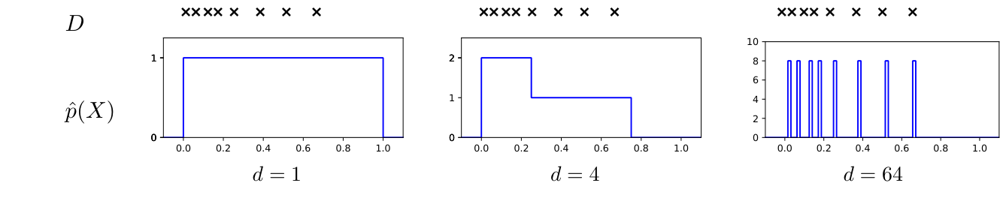

The three histograms make the overfitting mechanism visible. With one bin the model is too coarse to capture any structure. With a moderate number of bins it starts to reflect the sample without becoming too brittle. With too many bins it effectively memorizes the observations, assigning high density exactly where data occurred and poor predictions everywhere else.

### Posterior Distributions

In the Bayesian view, we keep a distribution over parameters:

$$p(\theta \mid D) \propto p(D \mid \theta)p(\theta).$$

The missing normalization constant is the evidence

$$p(D) = \int p(D \mid \theta)p(\theta)\,d\theta.$$

So Bayes' rule in full form is

$$p(\theta \mid D) = \frac{p(D \mid \theta)p(\theta)}{p(D)}.$$

The posterior trades a point estimate for uncertainty about plausible parameter values. This is conceptually important and computationally consequential: exact inference is easy only when the evidence integral can be computed analytically or when the prior-likelihood pair has a conjugate form.

For a concrete update, start with

$$\rho \sim \mathrm{Beta}(2,2)$$

and observe $D=\{1,0,1\}$. The posterior becomes

$$\rho \mid D \sim \mathrm{Beta}(4,3).$$

The prior contributes two pseudo-observations toward heads and two toward tails, while the real data contribute two heads and one tail. The posterior therefore behaves like a total of seven weighted observations.

### Example 2-18: Beta-Bernoulli Conjugacy

If the likelihood is Bernoulli and the prior is $Beta(a,b)$, then the posterior is still Beta:

$$\rho \mid D \sim Beta(a+m_1, b+m_0).$$

The derivation is short enough to write explicitly. The prior contributes

$$p(\rho) \propto \rho^{a-1}(1-\rho)^{b-1},$$

and the Bernoulli likelihood contributes

$$p(D \mid \rho) \propto \rho^{m_1}(1-\rho)^{m_0}.$$

Multiplying them gives

$$p(\rho \mid D) \propto \rho^{a+m_1-1}(1-\rho)^{b+m_0-1},$$

which is exactly the kernel of another Beta density. This is the simplest example of conjugacy.

If we plug in $a=b=2$ and observe $m_1=3$, $m_0=1$, then

$$\rho \mid D \sim \mathrm{Beta}(5,3).$$

The posterior is more concentrated than the prior because more information has been accumulated, and it is shifted toward heads because the data contain more ones than zeros.

### Worked Example: Dirichlet-Categorical Pseudo-Counts

The categorical analogue of Beta-Bernoulli conjugacy is Dirichlet-Categorical conjugacy. Let a three-class probability vector satisfy

$$\theta=(\theta_1,\theta_2,\theta_3) \sim \mathrm{Dir}(2,2,2).$$

Now observe four class labels with counts

$$m=(3,1,0).$$

The posterior is obtained by adding counts coordinatewise:

$$\theta \mid D \sim \mathrm{Dir}(5,3,2).$$

This is the multi-class pseudo-count interpretation in explicit form. The prior behaves like two virtual observations in each class. The data then add three more observations to class $1$, one to class $2$, and none to class $3$.

The posterior mean is

$$\mathbb{E}[\theta \mid D] = ( \frac{5}{10}, \frac{3}{10}, \frac{2}{10} ) =(0.5,0.3,0.2).$$

The posterior therefore still leaves positive mass on the unobserved third class, because the prior did not allow its probability to collapse to zero after only four observations. That is exactly the smoothing effect one usually wants from a Bayesian categorical model.

### Posterior Estimators

Two common point estimates derived from the posterior are the posterior mean and the MAP estimate:

$$\hat\theta_{\text{PM}} = \mathbb{E}_{p(\theta \mid D)}[\theta],$$

$$\hat\theta_{\text{MAP}} = \arg\max_\theta \log p(\theta \mid D).$$

For Bernoulli/Beta,

$$\hat\rho_{\text{PM}} = \frac{a+m_1}{a+b+m_1+m_0}$$

and

$$\hat\rho_{\text{MAP}} = \frac{a-1+m_1}{a+b-2+m_1+m_0}.$$

The posterior mean averages with respect to the full posterior and therefore always exists for $a,b>0$. The MAP estimator is different: it looks for the mode of the posterior density, and if either updated shape parameter is at most one, the mode moves to the boundary rather than the interior. That boundary behavior is another structural feature that is easy to miss if one only memorizes the closed form.

With the posterior $\mathrm{Beta}(5,3)$, the two estimators are

$$\hat\rho_{\text{PM}}=\frac{5}{8}=0.625, \qquad \hat\rho_{\text{MAP}}=\frac{4}{6}\approx 0.667.$$

The MAP estimate is slightly more aggressive because it chooses the mode, while the posterior mean averages over the whole posterior mass.

### Example 2-19: Bernoulli Posterior Estimates

The posterior mean smooths the empirical frequency by the prior. The MAP estimate is a regularized version of MLE and matches MLE when $a=b=1$. In effect, the prior acts like pseudo-counts: $a-1$ prior successes and $b-1$ prior failures for the MAP formula, or $a$ and $b$ for the posterior mean formula.

For the sample $D=\{1,1,0\}$, the MLE is $2/3 \approx 0.667$. With prior $\mathrm{Beta}(2,2)$, the posterior mean becomes

$$\frac{2+2}{2+2+2+1}=\frac{4}{7}\approx 0.571.$$

So the prior pulls the estimate back toward $0.5$, which is exactly what regularization is supposed to do.

### Sequential Belief Updating

Bayesian updating naturally supports sequential learning: after observing one batch of data, the posterior becomes the prior for the next batch.

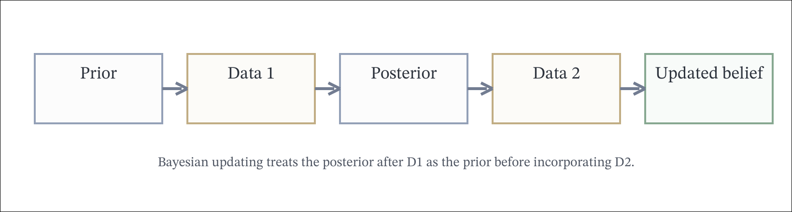

The figure is deliberately procedural: first combine the prior with the first data batch, then treat the resulting posterior as the next prior before incorporating the second batch. Nothing conceptually new happens in the second step; Bayesian learning is the repeated application of the same update rule.

For example, begin with $\mathrm{Beta}(2,2)$. After the first batch $D_1=\{1,0,1\}$, the posterior is $\mathrm{Beta}(4,3)$. If a second batch $D_2=\{1,1\}$ arrives later, the new posterior is

$$\mathrm{Beta}(6,3).$$

If we had processed all five observations at once, we would obtain exactly the same answer. Sequential updating is therefore not an approximation; it is algebraically equivalent to batch updating when the model assumptions are unchanged.

### Example 2-20: Coin Toss Hyper-Prior

Sometimes we are uncertain even about the prior. A mixture of a fair-coin prior and a trick-coin prior can be written as a hyper-prior over the Beta parameters. This adds one more layer to the model hierarchy: first choose which prior family is active, then draw the Bernoulli parameter from that prior, and only then generate the data.

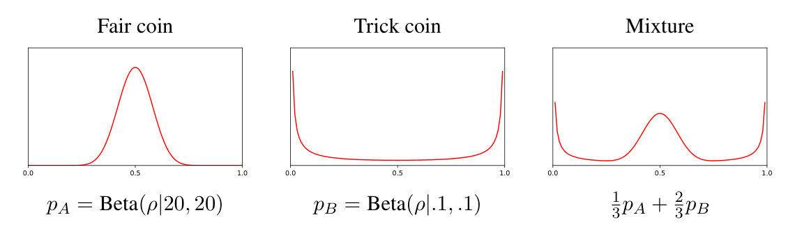

The left and middle components encode two qualitatively different prior stories: one centered near a fair coin and one concentrated near the extremes. The mixture panel makes the uncertainty over priors visible by averaging those stories before any data are observed.

This is a full hierarchical example. First sample a latent indicator $H$ that chooses between the "fair coin" story and the "trick coin" story. Then sample $\rho$ from the Beta prior associated with that choice. Finally sample the observed tosses from Bernoulli$(\rho)$. The hyper-prior therefore models uncertainty not just about a parameter value, but about which prior regime the experiment belongs to.

### Weakly Informative Priors

A prior is never literally uninformative, because any prior expresses some preference over parameter values. The choice of parameterization matters: a prior that is uniform in $\rho$ is not uniform in the natural parameter $\eta = \log(\rho/(1-\rho))$. So "uninformative" is not an intrinsic property of a density alone; it is a statement about a density together with the coordinate system in which it is declared flat.

### Example 2-21: Priors for the Bernoulli Likelihood

The uniform prior on $\rho$ is $Beta(\rho;1,1)$. Under a log-odds parameterization, the induced prior on $\eta$ is not uniform. This is one reason the notion of "uninformative prior" is parameterization-dependent.

### Bayesian Model Selection

The Bayesian marginal likelihood is

$$\log p(D) = \log \int p(D \mid \theta)p(\theta)\,d\theta.$$

It automatically penalizes overly flexible models that spread prior mass too thinly. This happens because the marginal likelihood averages $p(D \mid \theta)$ over the prior rather than looking only at the single best parameter value. A highly flexible model can fit some parameter settings extremely well, but if most of its prior mass corresponds to poor fits, the average score can still be small.

That difference is easiest to see by contrasting two models. Model A may have a very sharp peak at one parameter value and terrible fit almost everywhere else. Model B may never fit quite as perfectly at its best point, but may devote much more prior mass to reasonably good fits. Maximum likelihood prefers Model A because it only cares about the peak. Marginal likelihood can prefer Model B because it averages over the whole parameter space.

The BIC approximation is

$$L_{\text{BIC}} = \max_\theta \log p(D \mid \theta) - \frac{d}{2}\log m,$$

where $d$ is the number of parameters and $m$ is the number of observations.

### Example 2-22: Bayesian Histogram Estimator

For a histogram model with Dirichlet prior, the marginal likelihood and BIC penalized score can be compared across numbers of bins. Both typically favor a moderate number of bins rather than the most complex possible histogram. The explicit structural tradeoff is between approximation error and variance: too few bins smear away genuine structure, while too many bins spend parameters modeling sampling noise.

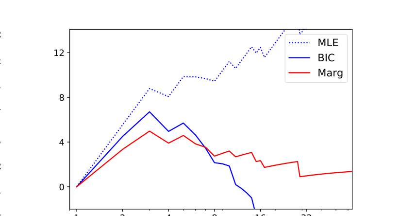

The plotted curves separate three notions of fit. Raw maximum likelihood keeps rewarding additional flexibility. BIC and the marginal score include an explicit complexity penalty, so they flatten or decline once the extra bins stop being justified by the amount of data.

Read the graph from left to right as a complexity sweep. Moving right means adding more histogram bins and therefore more parameters. The dotted maximum-likelihood curve keeps climbing because the model can carve the training set into finer and finer pieces. The penalized curves eventually turn over, indicating the point where extra flexibility stops helping enough to justify its complexity cost.

### Worked Example: One Coin Versus Two Coin Model Selection

Suppose a first batch of flips is

$$D_A=\{H,T,T\},$$

and a second batch is

$$D_B=\{T,H,H\}.$$

If there is only one coin, all six flips share a common head probability $\rho$. Since there are three heads out of six observations,

$$\hat{\rho}=\frac{3}{6}=0.5.$$

If there are two different coins, the first coin gets its own parameter $\rho_A$ and the second gets $\rho_B$. Their MLEs are just the within-batch head frequencies:

$$\hat{\rho}_A=\frac{1}{3},\qquad \hat{\rho}_B=\frac{2}{3}.$$

The maximized average log-likelihood under the one-coin model is

$$\text{one-coin average log-likelihood} = (3 \log 0.5 + 3 \log 0.5)/6 = \log 0.5 \approx -0.693.$$

For the two-coin model it is

$$\text{two-coin average log-likelihood} = \bigl(2 \log(1/3)+4 \log(2/3)\bigr)/6 \approx -0.637.$$

So raw fit prefers the two-coin model, because extra parameters always help match the data more closely.

BIC adds a complexity penalty. The one-coin model has $d=1$ parameter and the two-coin model has $d=2$ parameters, so with $m=6$ observations the penalized average scores are

$$\text{one-coin BIC average} = -0.693-(\log 6)/12 \approx -0.842,$$

$$\text{two-coin BIC average} = -0.637-(\log 6)/6 \approx -0.935.$$

After penalization, the one-coin model wins. The extra flexibility of the two-coin model is not justified by only six flips.

Now increase the data while keeping the same qualitative split:

$$D_A=\{H,T,T,T,T\},\qquad D_B=\{T,H,H,H,H\}.$$

The one-coin MLE is still

$$\hat{\rho}=0.5,$$

while the two-coin MLEs become

$$\hat{\rho}_A=0.2,\qquad \hat{\rho}_B=0.8.$$

The one-coin penalized average score is now

$$\text{one-coin BIC average} \approx -0.808,$$

while the two-coin penalized average score is

$$\text{two-coin BIC average} \approx -0.731.$$

Now the two-coin model wins even after the penalty. The lesson is structural: with small data, the simpler model is often preferred because complexity costs dominate. With more data, a genuine difference between the two batches can become strong enough that the richer model earns back its penalty.

### Retain from 2.3

- Likelihood is a function of parameters with the data held fixed; it is not itself a probability distribution over parameters.
- MLE fits the data as well as possible inside the chosen model class but does not by itself control overfitting.
- Conjugate Bayesian updates preserve uncertainty and make pseudo-count interpretations explicit.
- Model selection is not just about best fit; it is about fit relative to complexity.

### Do Not Confuse in 2.3

- Do not confuse probability with likelihood; they are the same algebraic expression used in different roles.
- Do not confuse posterior mean, MAP, and MLE; they agree only in special cases.
- Do not treat a prior declared "flat" in one parameterization as uninformative in every parameterization.
- Do not assume a richer model is better just because its training likelihood is higher.

## 2.4 Convexity

This section is supporting background rather than core probability machinery. For the course, the main reason to read it is to understand why some likelihood objectives are well behaved and why exponential-family optimization often has a clean global structure.

A convex function satisfies

$$f(\alpha x + (1-\alpha)x') \le \alpha f(x) + (1-\alpha)f(x')$$

for all $\alpha \in [0,1]$. Strict convexity makes the inequality strict for distinct points.

Equivalent characterizations are:

$$f(x') \ge f(x) + \nabla f(x)\cdot(x'-x)$$

and, when second derivatives exist,

$$\nabla^2 f(x) \succeq 0.$$

Convex functions are useful because every local minimum is global, and a strictly convex function has a unique minimum. Positive semidefinite curvature allows flat directions, so multiple minimizers can still exist. Positive definite curvature removes those flat directions and forces uniqueness.

A full worked example is $f(x)=x^2$. For any $x$ and $x'$ and any $\alpha \in [0,1]$,

$$f(\alpha x + (1-\alpha)x') = (\alpha x + (1-\alpha)x')^2$$

expands to

$$\alpha x^2 + (1-\alpha)x'^2 - \alpha(1-\alpha)(x-x')^2.$$

Since the last term is nonpositive, we obtain

$$(\alpha x + (1-\alpha)x')^2 \le \alpha x^2 + (1-\alpha)x'^2.$$

That is the convexity inequality in explicit algebraic form. Geometrically, it says the parabola lies below every secant line connecting two points on its graph.

Jensen's inequality is the probability version of convexity:

$$\mathbb{E}[f(X)] \ge f(\mathbb{E}[X])$$

for convex $f$.

### Example 2-23: Convexity and the Exponential Family

The negative log-likelihood of a canonical exponential-family model is convex in its natural parameters. The reason is explicit:

$$\frac{\partial A(\theta)}{\partial \theta_j} = \mathbb{E}_\theta[\phi_j(X)], \qquad \frac{\partial^2 A(\theta)}{\partial \theta_j \partial \theta_k} = \mathrm{Cov}_\theta(\phi_j(X), \phi_k(X)).$$

The Hessian of the log-partition function is therefore a covariance matrix of the sufficient statistics, hence positive semidefinite. Once the terms that are constant or linear in $\theta$ are separated out, the remaining negative log-likelihood inherits that convexity.

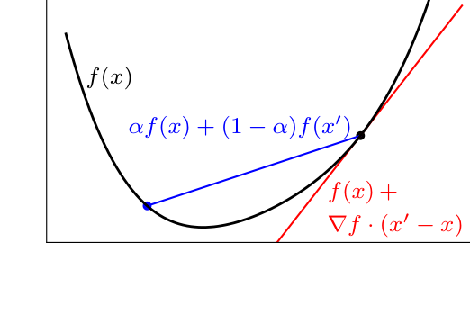

The blue secant line lies above the black graph, which is the geometric definition of convexity. The red tangent line lies below the graph, which is the first-order equivalent statement. These are not separate ideas; they are two views of the same structural property.

For exponential families, the most concrete beginner-to-expert takeaway is that optimization is well behaved in natural-parameter space because the curvature comes from a covariance matrix. Covariances cannot be negative in the matrix sense, so the Hessian cannot create spurious local minima.

### Retain from 2.4

- Convexity is the structural reason some estimation problems avoid bad local minima.
- First-order and second-order convexity tests are equivalent viewpoints on the same property.
- In exponential families, covariance structure is what drives the positive-semidefinite Hessian.

### Do Not Confuse in 2.4

- Do not confuse convexity of a function with convexity of a set.
- Do not assume every likelihood problem is convex just because some exponential-family examples are.
- Do not read positive semidefinite Hessian as meaning "strictly" convex; flat directions can remain.

## 2.5 Information Theory

This section is worth reading for conceptual maturity, but it is partly second-pass material if your immediate goal is to stay on top of the course core. The required ideas are what entropy, KL divergence, and mutual information mean and how they differ from one another.

Entropy measures uncertainty:

$$H[X] = -\sum_x p(x)\log p(x).$$

If the logarithm is base 2, entropy is measured in bits. A deterministic variable has entropy zero, and a uniform distribution maximizes entropy for a fixed finite support. Entropy is therefore not just "randomness" in an informal sense; it is the expected code length of the optimal lossless code and the expected information revealed by one observation.

A useful comparison is between a fair coin and a biased coin with probabilities $(0.9,0.1)$. The fair coin has entropy $1$ bit, while the biased coin has

$$H[X] = -0.9\log_2 0.9 - 0.1\log_2 0.1 \approx 0.47 \text{ bits}.$$

The biased coin is more predictable, so it carries less uncertainty and requires fewer average bits to encode.

### Example 2-24: Entropy

For a fair coin,

$$H[X] = -0.5\log_2 0.5 - 0.5\log_2 0.5 = 1 \text{ bit}.$$

For a fair die,

$$H[X] = -6 \cdot \frac{1}{6}\log_2 \frac{1}{6} \approx 2.58 \text{ bits}.$$

### Example 2-25: Lottery

Entropy also explains compression. If a yearly sequence is mostly zeros, we can encode it with far fewer bits than a naive one-bit-per-day representation, because the sequence is highly non-random.

To make that explicit, imagine a lottery-notification variable that is $1$ only on a winning day and $0$ otherwise. If the event occurs once in a thousand days, then almost every symbol is zero. A code that assigns a very short description to $0$ and a longer one to $1$ achieves far better compression than a fixed one-bit code, precisely because the entropy is low.

### Kullback-Leibler Divergence

The KL divergence is

$$D(p \,\|\, q) = \sum_x p(x)\log\frac{p(x)}{q(x)}.$$

It is always nonnegative and zero only when $p=q$, but it is not symmetric. There is also an important support condition: if $q(x)=0$ for some $x$ with $p(x)>0$, then the divergence is infinite, because $q$ assigns impossible status to an outcome that actually occurs under $p$.

In learning, maximum likelihood can be viewed as minimizing the KL divergence from the empirical distribution to the model family.

A concrete Bernoulli example makes the asymmetry visible. Let

$$p=(0.8,0.2), \qquad q=(0.5,0.5).$$

Then

$$D(p \,\|\, q)=0.8\log \frac{0.8}{0.5} + 0.2\log \frac{0.2}{0.5}.$$

If we reverse the arguments, we compute a different number:

$$D(q \,\|\, p)=0.5\log \frac{0.5}{0.8} + 0.5\log \frac{0.5}{0.2}.$$

So KL divergence is a directed discrepancy, not an ordinary symmetric distance.

### Mutual Information

Mutual information measures how much observing one variable tells us about another:

$$I[X,Y] = D(p(X,Y) \,\|\, p(X)p(Y)) = H[X] + H[Y] - H[X,Y].$$

That identity is important enough to derive once in full. Start from the KL form:

$$I[X,Y]=\sum_{x,y} p(x,y)\log \frac{p(x,y)}{p(x)p(y)}.$$

Split the logarithm into three pieces:

$$I[X,Y]=\sum_{x,y} p(x,y)\log p(x,y)-\sum_{x,y} p(x,y)\log p(x)-\sum_{x,y} p(x,y)\log p(y).$$

Now simplify the second and third sums by marginalizing:

$$\sum_{x,y} p(x,y)\log p(x)=\sum_x p(x)\log p(x),$$

$$\sum_{x,y} p(x,y)\log p(y)=\sum_y p(y)\log p(y).$$

Substituting those back in gives

$$I[X,Y]=-H[X,Y]+H[X]+H[Y].$$

Since conditional entropy satisfies

$$H[X \mid Y]=H[X,Y]-H[Y],$$

we immediately obtain the second common identity

$$I[X,Y]=H[X]-H[X \mid Y].$$

So mutual information can be read either as a divergence from independence or as the drop in uncertainty after observation.

If $X$ and $Y$ are independent, mutual information is zero.

At the opposite extreme, if $Y=X$ exactly, then learning $Y$ reveals $X$ completely, so

$$H[X \mid Y]=0$$

and therefore

$$I[X,Y]=H[X].$$

So mutual information ranges from zero for complete independence up to the full entropy of one variable when the other variable determines it exactly.

### Conditional Entropy

Conditional entropy is

$$H[X \mid Y] = H[X,Y] - H[Y].$$

Equivalently,

$$H[X \mid Y] = \sum_y p(y) H[X \mid Y=y],$$

so it is the average remaining uncertainty in $X$ after the value of $Y$ is revealed. It satisfies

$$I[X,Y] = H[X] - H[X \mid Y] \ge 0,$$

so conditioning reduces uncertainty on average.

### Example 2-26: Information and Conditional Entropy

Suppose we model commuting behavior $C \in \{\text{walk}, \text{bike}, \text{drive}\}$ and weather $R \in \{\text{clear}, \text{rain}\}$. On rainy days we drive more often, so weather conveys information about commute choice.

| $R$ | $C$ | $p(C \mid R)$ |
|---|---|---:|
| clear | walk | 0.9 |
| clear | bike | 0.1 |
| clear | drive | 0.0 |
| rain | walk | 0.5 |
| rain | bike | 0.0 |
| rain | drive | 0.5 |

With $p(R=\text{rain}) = 0.1$, the marginals are

$$p(C=\text{walk}) = 0.86, \quad p(C=\text{bike}) = 0.09, \quad p(C=\text{drive}) = 0.05.$$

The entropy of the commute alone is about $0.72$ bits. Conditioning on weather gives a lower average entropy, around $0.52$ bits, so the mutual information is about $0.2$ bits. Writing the quantities this way makes the interpretation explicit: knowing the weather removes about two-tenths of a bit of uncertainty about how the commute will happen.

The full step-by-step calculation is:

$$H[C \mid R=\text{clear}] = -0.9\log_2 0.9 - 0.1\log_2 0.1 \approx 0.47,$$

$$H[C \mid R=\text{rain}] = -0.5\log_2 0.5 - 0.5\log_2 0.5 = 1.$$

Averaging over weather gives

$$H[C \mid R] = 0.9 \cdot 0.47 + 0.1 \cdot 1 \approx 0.52.$$

The unconditional commute entropy is larger, so the difference between them is exactly the information weather provides.

### Retain from 2.5

- Entropy measures uncertainty, KL divergence measures directed discrepancy, and mutual information measures departure from independence.
- Mutual information can be read either as a KL divergence or as reduction in uncertainty after observation.
- Conditional entropy is an average over the conditioning variable, not a single conditional calculation at one value.

### Do Not Confuse in 2.5

- Do not confuse entropy with variance or spread; it is a distributional uncertainty measure, not a geometric one.
- Do not confuse KL divergence with a symmetric distance.
- Do not forget the support condition in KL; assigning zero probability where the data distribution has mass makes the divergence infinite.

## 2.6 Change-of-Variable Models

The classical probability distributions above are useful, but many real data sets do not fit those forms directly. A common technique is to define a new variable as an invertible transformation of a simpler base variable.

For the course core, the main required idea is the Jacobian correction in scalar and multivariate change of variables. The copula and normalizing-flow subsections are explicit reach material: they show how the same principle scales into more modern modeling constructions.

### Scalar Change of Variables

If $X = f(Z)$ is invertible and $g = f^{-1}$, then

$$p_X(x) = p_Z(g(x)) \lvert g'(x) \rvert.$$

The derivative corrects for stretching or compression under the transformation. A small interval around $x$ corresponds to an interval around $z=g(x)$ of width approximately $|g'(x)|dx$, so probability conservation forces the density to scale by that same factor. This formula requires invertibility on the region of interest; if the map has multiple inverse branches, the correct density is a sum over branches rather than a single Jacobian term.

The derivation is short and worth seeing explicitly. Probability conservation says that for a very small interval,

$$p_X(x)\,dx \approx p_Z(z)\,dz.$$

Because $z=g(x)$, the interval widths are related by

$$dz = g'(x)\,dx.$$

Taking absolute values to account for orientation reversal gives

$$\lvert dz \rvert = \lvert g'(x) \rvert\,dx.$$

Substituting into the probability-conservation identity yields

$$p_X(x)\,dx = p_Z(g(x)) \lvert g'(x) \rvert\,dx,$$

and dividing by $dx$ gives

$$p_X(x)=p_Z(g(x)) \lvert g'(x) \rvert.$$

The absolute value is not optional. If the inverse map decreases rather than increases, the raw derivative is negative, but a density must remain nonnegative. The Jacobian magnitude is therefore the correct local scaling factor.

A minimal worked example is $X=2Z$ with $Z$ uniform on $[0,1]$. Then $g(x)=x/2$ and $g'(x)=1/2$, so

$$p_X(x)=p_Z(x/2)\cdot \frac{1}{2}.$$

Since $p_Z(z)=1$ on $[0,1]$, we get

$$p_X(x)=\frac{1}{2}$$

on $[0,2]$. Stretching the variable by a factor of $2$ cuts the density height by a factor of $2$.

### Example: Lognormal Distribution

If $Z = \log X$ is Gaussian, then $X$ is lognormal. The density of $X$ is obtained from the Gaussian density of $Z$ plus the Jacobian factor $1/x$, because $z=\log x$ implies $dz/dx = 1/x$. This is a concrete example of the general rule that multiplicative stretching in variable space becomes additive correction in log-density space.

Writing the full expression gives

$$p_X(x)=\frac{1}{x \sqrt{2\pi\sigma^2}} \exp\!\left(-\frac{(\log x-\mu)^2}{2\sigma^2}\right), \qquad x>0.$$

The extra factor $1/x$ is exactly the Jacobian term. Without it, the transformed density would no longer integrate to one.

### Multivariate Change of Variables

In multiple dimensions,

$$p_X(x) = p_Z(g(x)) \lvert \det J_g(x) \rvert,$$

where $J_g$ is the Jacobian matrix of the inverse transformation. The determinant plays the same role as $|g'(x)|$ in one dimension: it is the local volume scaling factor. If the transformation doubles area near one point, the density there must be cut in half to preserve total probability.

An explicit two-dimensional example is

$$X_1=2Z_1, \qquad X_2=3Z_2.$$

The inverse map scales coordinates by $(1/2,1/3)$, so the determinant of the inverse Jacobian is $1/6$. Every small area element is expanded by a factor of $6$ in data space, so the density must shrink by the same factor.

### Copula Models

Copulas separate marginal distributions from dependence structure. For two variables,

$$\mathbb{P}(X_1 \le x_1, X_2 \le x_2) = C(P_1(x_1), P_2(x_2)),$$

where $P_1$ and $P_2$ are the marginal CDFs. This is the content of Sklar's theorem in the two-variable case: once the marginals are pushed into the uniform scale, the remaining object $C$ captures only dependence.

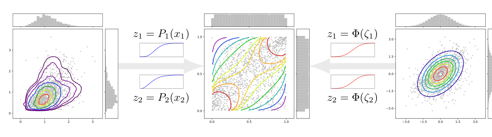

The Gaussian copula is a special case in which the transformed variables are Gaussian. The visual sequence shows the separation explicitly: start with the original marginals, map each one to a uniform scale, then map those uniform variables to a Gaussian scale where the dependence is easy to model.

This gives a clean division of labor. The marginal CDFs control one-dimensional shape, skewness, and heavy tails. The copula controls only how coordinates move together after those marginal effects have been removed.

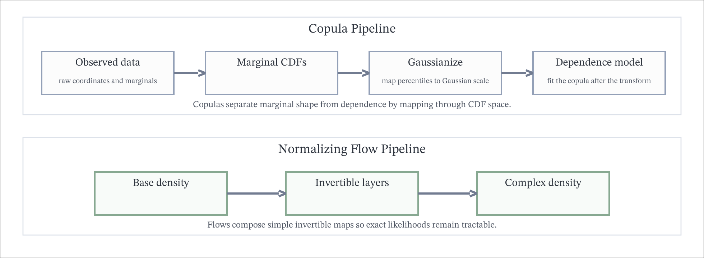

### Example 2-27: Copula Transforms

The chapter uses a KDD Cup data set to show the pipeline. First estimate the marginal CDFs $P_1$ and $P_2$. Then transform each coordinate into a uniform variable by applying its own CDF. Then apply $\Phi^{-1}$ to map those uniform variables into Gaussian marginals. Finally fit a Gaussian dependence model in that transformed space. The resulting model can express complicated non-Gaussian marginals while keeping the dependence structure manageable.

The step-by-step reason this works is that CDF transforms preserve order. If an observation is at the $80$th percentile of its own marginal distribution, its transformed value is $0.8$ regardless of the original physical units. After both coordinates are mapped into percentile space, the dependence structure can be modeled in a unit-free way.

### Normalizing Flows

Normalizing flows define an invertible transform $X = f(Z)$ and use the change-of-variables formula to evaluate likelihoods. The transformation is often built as a composition of simple steps:

$$f(Z) = f_T(f_{T-1}(\cdots f_1(Z)))$$

with

$$\log p_X(X) = \log p_Z(f^{-1}(X)) - \sum_t \log |\det J_{f_t}|.$$

The computational reason this works is that the Jacobian determinant of a composition decomposes into a sum in log-space. A flow is therefore practical only when each layer is invertible and has a determinant that can be evaluated cheaply.

A one-layer sanity check is the scaling flow

$$X = aZ + b$$

with $a \neq 0$. Then the inverse is $(X-b)/a$ and

$$\log p_X(X)=\log p_Z\!\left(\frac{X-b}{a}\right)-\log |a|.$$

Normalizing flows are just more elaborate versions of this same accounting rule, composed many times.

### Example 2-28: Copula-Like Normalizing Flow

One useful construction is to start with a Gaussian base distribution and parameterize one-dimensional monotone transforms for each feature. This is a flexible stand-in for explicit CDF modeling. The monotonicity constraint is not optional: without it, the map would stop being invertible and the simple change-of-variables formula would break.

At the beginner level, this means "bend each axis without folding it over itself." At the expert level, it means each scalar transform must remain strictly monotone so that the inverse exists and the Jacobian diagonal stays nonzero everywhere.

### Example 2-29: Conditional Affine Normalizing Flows

A particularly convenient flow layer is conditional affine:

$$Z_1' = Z_1, \qquad Z_2' = \alpha_1(Z_1)Z_2 + \beta_1(Z_1).$$

Because the Jacobian is triangular, the determinant is easy to compute: for the first layer it is simply $\alpha_1(Z_1)$, so the log-determinant is $\log |\alpha_1(Z_1)|$. A second layer can then swap roles and transform the other coordinate:

$$Z_1'' = \alpha_2(Z_2')Z_1' + \beta_2(Z_2'), \qquad Z_2'' = Z_2'.$$

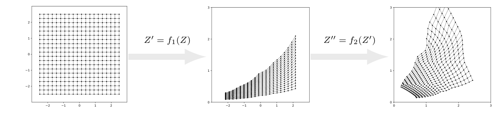

The deformation panels show what the algebra means geometrically. A rectangular grid in latent space is progressively bent and stretched into a curved mesh in data space. The main idea is that a sequence of simple invertible layers can produce a complex density while keeping likelihood evaluation tractable. The structural limit is equally important: each layer must preserve invertibility, and in practice the scale functions are parameterized so they never cross zero.

A full worked determinant calculation makes the affine layer concrete. For

$$Z_1' = Z_1, \qquad Z_2' = \alpha_1(Z_1)Z_2 + \beta_1(Z_1),$$

the Jacobian matrix is

$$J_{11}=1,\qquad J_{12}=0,\qquad J_{21}=\frac{\partial Z_2'}{\partial Z_1},\qquad J_{22}=\alpha_1(Z_1),$$

so

$$\det J = \alpha_1(Z_1).$$

The lower-left derivative can be complicated, but the determinant ignores it because the matrix is triangular. That is the key design principle: choose transformations that are expressive enough to bend the density, yet structured enough that the determinant remains cheap to evaluate exactly.

### Retain from 2.6

- Change of variables is probability conservation plus a local stretching factor.
- Invertibility is the structural condition that makes the simple Jacobian formula valid.
- Copulas separate marginals from dependence, while flows compose simple invertible maps into flexible densities.

### Do Not Confuse in 2.6

- Do not forget the absolute value on the Jacobian determinant.
- Do not use the one-branch formula when the transformation has multiple inverse branches; then contributions must be summed.
- Do not treat copulas or normalizing flows as core required course material unless your instructor says so; they are here as enrichment built from the same change-of-variables principle.
