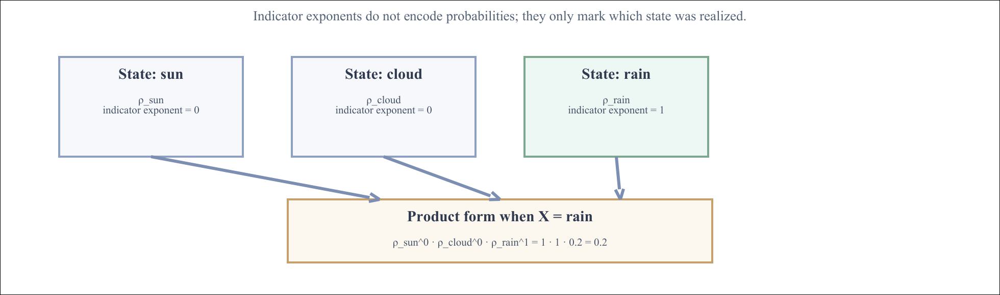

# Probability and Inference

Source: ../notes/02_probability_reconstructed/source/02_probability.pdf

This is a full note-style reconstruction of Chapter 2. It keeps the chapter's section structure, worked examples, key tables, and core derivations, while normalizing some prose and keeping the main visuals in the chapter assets directory under ../notes/02_probability_reconstructed/assets/.

## How to Use This Chapter

This main note is the readable core of the chapter. Read it first if you want definitions, intuition, worked examples, and the minimum formal structure needed to use the material correctly without turning the chapter into a proof-only reference.

- [Formal supplement](../02_probability_formal_supplement/): use this if you want theorem-style statements, tighter derivations, and the parts of the logical scaffolding that would otherwise slow down the narrative.
- [Exercises](../02_probability_exercises/): use this if you want direct computation drills, conceptual checks, and proof-style practice after reading the main note.
- [Computational appendix](../02_probability_computational_appendix/): use this if you want sampling, plotting, histogram workflows, and numerical sanity checks that support the theory.

## Scope Guide

Use this table as a reading filter. "Required" means material a student should be comfortable using for the course's core probability work. "Reach" means enrichment: useful, interesting, and connected to the course, but not first-pass material if the goal is simply to stay on pace.

| Area | Required for the course | Reach / enrichment |
|---|---|---|
| `2.1` events, Bayes, table operations, expectation, independence | all of it | the measure-theoretic framing is useful rigor, but not first-pass exam material |
| Geometric distribution | yes | none; this is directly homework-relevant |
| `2.2` continuous variables, CDF/PDF distinction, Gaussian, Beta/Dirichlet basics | yes | exponential-family parameterization details and two-parameter Bernoulli redundancy |
| `2.3` likelihood, MLE, Beta-Bernoulli updates, basic model selection | yes | hyper-priors, weakly informative priors, and some of the broader Bayesian-model-selection discussion |
| `2.4` convexity | supporting background only | full optimization interpretation and Hessian viewpoint |
| `2.5` entropy, KL, mutual information | conceptually useful and worth reading | derivation-heavy identities beyond the main examples |
| `2.6` scalar and multivariate Jacobians | useful background | copulas and normalizing flows are the clearest "beyond the course core" topics in this chapter |

If time is short, read `2.1`, the Geometric section, the core parts of `2.2`, and the likelihood / MLE / conjugacy / BIC parts of `2.3` first. Then return to `2.4`-`2.6` as second-pass material.

## Notation Policy

Throughout the note, $\mathbb{P}(A)$ denotes the probability of an event $A$, while $p(x)$ denotes a PMF or PDF value when such an object exists. Random variables are written with uppercase letters, realized values with lowercase letters, $F_X(x)$ denotes a CDF, and $\Omega$ denotes the sample space. When a formula is valid only in a discrete setting, only for densities, only for invertible maps, or only away from a boundary case, that restriction is stated explicitly rather than left implicit.

## 2.1 Probability, Events, Random Variables

Probability is the language we use when a system is uncertain or too complex to model exactly. In AI, the uncertainty often comes less from true randomness than from missing information and limited modeling power. A useful probabilistic model does two things: it describes our assumptions about the world, and it gives rules for combining evidence and updating those assumptions when observations arrive.

### Formal Foundations

At a more formal level, a probabilistic model starts with a probability space

$$(\Omega,\mathcal{F},P).$$

Here $\Omega$ is the sample space of possible outcomes, $\mathcal{F}$ is the collection of events on which probabilities are defined, and $P$ is the probability measure. The measure assigns a number to each event and satisfies nonnegativity, normalization, and countable additivity.

In elementary finite examples, one usually suppresses $\mathcal{F}$ because every subset of $\Omega$ can be treated as an event. In that case the abstract measure language reduces to ordinary bookkeeping over subsets. But the more formal notation matters because later concepts such as densities, cumulative distribution functions, and random variables are induced from this underlying structure rather than being primitive objects in every setting.

A random variable is a measurable function

$$X:\Omega \to \mathbb{R}.$$

This explains an important notation point. A statement such as $X=x$ is not a mysterious new kind of object; it is shorthand for the event

$$\{\omega \in \Omega : X(\omega)=x\}.$$

Likewise, the statement $X \le t$ is shorthand for the event

$$\{\omega \in \Omega : X(\omega)\le t\}.$$

In words: it is the set of all worlds whose value under $X$ is at most $t$. For example, if $X$ is the outcome of a die roll and $t=3$, then the event $X \le 3$ is the subset of worlds $\{1,2,3\}$. The notation looks like an ordinary numerical inequality, but probabilistically it is still an event in the sample space. Probabilities are attached to events first; PMFs, PDFs, and CDFs are derived descriptions of how that event-level probability structure appears after the random variable has mapped worlds into numerical values.

### Probability Axioms and First Consequences

Now fix a probability space $(\Omega,\mathcal{F},P)$. The actual axioms are:

$$0 \le \mathbb{P}(A)$$

for every event $A \in \mathcal{F}$,

$$\mathbb{P}(\Omega) = 1,$$

and countable additivity:

$$\mathbb{P}\left(\bigcup_{i=1}^{\infty} A_i\right) = \sum_{i=1}^{\infty} \mathbb{P}(A_i)$$

whenever the events $A_1,A_2,\dots$ are pairwise disjoint.

Pairwise disjoint means that every pair of distinct events in the collection is disjoint. In other words, if you choose any two different indices $i$ and $j$, the corresponding events do not share any worlds. Formally,

$$A_i \cap A_j = \varnothing \qquad \text{whenever } i \ne j.$$

So countable additivity applies only when the events do not overlap. In that case there is no double counting, so the probability of the union is exactly the sum of the individual probabilities. The phrase pairwise disjoint is stronger than saying only that the whole collection has empty total intersection. It requires every two-event overlap to be empty, because any such overlap would otherwise be counted twice in the sum.

An inline finite example confirms the meaning. For a fair die, let

$$A_1=\{1\},\qquad A_2=\{2\},\qquad A_3=\{3\}.$$

These events are pairwise disjoint because no die outcome can be both $1$ and $2$, etc. Their union is the event "roll at most $3$":

$$A_1 \cup A_2 \cup A_3 = \{1,2,3\}.$$

So

$$\mathbb{P}(A_1 \cup A_2 \cup A_3)=3/6=0.5,$$

while the sum of individual probabilities is

$$\mathbb{P}(A_1)+\mathbb{P}(A_2)+\mathbb{P}(A_3)=1/6+1/6+1/6=3/6=0.5.$$

The equality holds because the three events do not overlap.

Several familiar rules are consequences of these axioms rather than additional axioms. For example,

$$\mathbb{P}(\varnothing)=0$$

follows because $\Omega$ and $\Omega \cup \varnothing$ are the same event, while finite additivity for disjoint sets is the finite case of countable additivity.

Inclusion-exclusion is also derived, not assumed. The clean way to derive it is to decompose the union into pieces that do not overlap. Write

$$A \cup B = A \cup (B \setminus A),$$

where the two pieces are disjoint. The reason is simple: every world in $A$ is, by definition, in $A$, while every world in $B \setminus A$ is in $B$ but explicitly not in $A$. So no world can belong to both pieces at once. Then

$$\mathbb{P}(A \cup B) = \mathbb{P}(A) + \mathbb{P}(B \setminus A).$$

But $B$ itself decomposes as the disjoint union

$$B = (B \setminus A) \cup (A \cap B),$$

because every world in $B$ falls into exactly one of two cases. Either it is not in $A$, in which case it lies in $B \setminus A$, or it is also in $A$, in which case it lies in $A \cap B$. These two cases cannot happen simultaneously, so they are disjoint. Therefore

$$\mathbb{P}(B) = \mathbb{P}(B \setminus A) + \mathbb{P}(A \cap B).$$

Now solve the second equation for $\mathbb{P}(B \setminus A)$ and substitute the result into the first equation. That removes the intermediate term and leaves the familiar correction formula

$$\mathbb{P}(A \cup B) = \mathbb{P}(A) + \mathbb{P}(B) - \mathbb{P}(A \cap B).$$

The logical status matters: normalization and additivity are the assumptions, while empty-set probability and inclusion-exclusion are useful consequences.

For a beginner, the safest way to use these axioms is to think in terms of bookkeeping over possible worlds. First list the worlds that belong to the event. Then check whether those worlds overlap with the worlds of another event. If they do, inclusion-exclusion is the correction term that prevents double counting. For a die roll, if $A=\{1,3,5\}$ and $B=\{4,5,6\}$, the union is not six outcomes but five, because the world $5$ sits in both sets.

### Example 2-1: Random Events

Suppose we roll a standard six-sided die. The event space is

$$\Omega = \{1,2,3,4,5,6\}.$$

Two events are:

$$A = \{\text{odd roll}\} = \{1,3,5\}$$

$$B = \{\text{roll is 4 or greater}\} = \{4,5,6\}.$$

Then $\mathbb{P}(A) = 3/6$, $\mathbb{P}(B) = 3/6$, and $\mathbb{P}(A \cap B) = 1/6$, so $\mathbb{P}(A \cup B) = 5/6$.

The step-by-step computation is worth stating explicitly. Event $A$ contains three elementary outcomes, so $\mathbb{P}(A)=3/6$. Event $B$ also contains three elementary outcomes, so $\mathbb{P}(B)=3/6$. Their intersection is the single outcome $\{5\}$, so $\mathbb{P}(A \cap B)=1/6$. If we simply added $3/6+3/6$, we would count outcome $5$ twice, so we subtract $1/6$ and obtain $5/6$.

### Random Variables

A random variable partitions the event space into disjoint and exhaustive cases and assigns each case a symbolic value. If

$$X \in \{1,\dots,d\},$$

then the events $X = 1, \dots, X = d$ are mutually exclusive and cover all outcomes, so

$$\sum_{i=1}^d \mathbb{P}(X=i) = 1.$$

The possible values are called the states of the variable, and the set of all possible values is its domain. For discrete variables, the probability mass function is often written as $p(X=x)$ or simply $p(x)$ when the variable is clear from context.

A full beginner-to-expert way to read this is the following. At the beginner level, a random variable is a label attached to each outcome. At the intermediate level, it is a partition of the event space into mutually exclusive cases. At the expert level, it is a measurable map from worlds in $\Omega$ to values in a codomain, and the induced distribution on those values is obtained by pushing probability mass through that map.

A concrete example helps. Let the world be a die roll and define

$$X=0 \text{ if the roll is even}, \qquad X=1 \text{ if the roll is odd.}$$

Then the six raw outcomes collapse into only two states. Since $\{2,4,6\}$ map to $0$ and $\{1,3,5\}$ map to $1$,

$$p(X=0)=3/6, \qquad p(X=1)=3/6.$$

The random variable therefore compresses a detailed world description into the part of the world we care about.

### PMFs and Indicator Notation

Before writing down specific discrete distributions, it helps to define two pieces of notation that will be used repeatedly.

For a discrete random variable, the probability mass function, or PMF, is the function that assigns a probability to each possible state:

$$p(X=x)=\mathbb{P}(X=x).$$

So a PMF is not a new kind of probability. It is simply the probability of the event $X=x$, viewed as a function of the value $x$.

The second piece of notation is the indicator function

$$\mathbf{1}[X=x],$$

which equals $1$ when the statement inside the brackets is true and equals $0$ when it is false. Indicator notation is useful because it turns a logical statement such as "the realized state is rain" into a numerical exponent or coefficient. That is exactly what happens in the Bernoulli and categorical product forms below.

### Example 2-2: Bernoulli Distribution

A Bernoulli random variable is binary:

$$X \in \{0,1\}.$$

If

$$\mathbb{P}(X=1) = \rho,$$

then automatically

$$\mathbb{P}(X=0) = 1-\rho.$$

We can write the distribution as

$$p(X) = \mathrm{Ber}(X;\rho) = \rho^X (1-\rho)^{1-X}.$$

This evaluates to $\rho$ when $X = 1$ and to $1-\rho$ when $X = 0$.

An equivalent representation is

$$p(X) = \rho \mathbf{1}[X=1] + (1-\rho)\mathbf{1}[X=0].$$

To see this mechanically, plug in the only two possible values. If $X=1$, then

$$\rho^X(1-\rho)^{1-X} = \rho^1(1-\rho)^0 = \rho.$$

If $X=0$, then

$$\rho^X(1-\rho)^{1-X} = \rho^0(1-\rho)^1 = 1-\rho.$$

So the compact formula is not magic notation; it is just a switch that selects the correct probability for the realized binary outcome.

### Example 2-3: Discrete Distribution

If $X \in \{1,\dots,d\}$, then a discrete distribution is just a probability table:

$$\mathbb{P}(X=i) = \rho_i, \qquad \rho_i \ge 0, \qquad \sum_{i=1}^d \rho_i = 1.$$

This table is the PMF of the variable. For each possible state $i$, the number $\rho_i$ is the probability that $X$ takes that state. Only $d-1$ of those values are free, because the last one is determined by normalization. If the first $d-1$ probabilities are already fixed, the final one must be whatever value makes the whole table sum to one.

Two vocabulary items make that sentence precise. First, a discrete variable with exactly $d$ possible states is sometimes called $d$-ary. For example, a die-outcome variable with support $\{1,2,3,4,5,6\}$ is $6$-ary, while the weather variable with states $\{\text{sun},\text{cloud},\text{rain}\}$ is $3$-ary.

Second, degrees of freedom means the number of independent numerical choices you can make after all required constraints are enforced. Here we have $d$ nonnegative numbers $\rho_1,\dots,\rho_d$, but they must satisfy the single normalization constraint $\sum_{i=1}^d \rho_i=1$. That one constraint removes one free choice, so the PMF has $d-1$ degrees of freedom.

An explicit three-state check: if $d=3$ and you choose $\rho_1=0.5$ and $\rho_2=0.3$, then normalization forces

$$\rho_3 = 1-\rho_1-\rho_2 = 1-0.5-0.3=0.2.$$

So you only had two independent choices, which matches $d-1=2$. This same "number of table entries minus normalization constraints" logic is what drives the parameter-count statements later in the chapter.

One compact representation is

$$p(X) = \prod_{i=1}^d \rho_i^{\mathbf{1}[X=i]}.$$

This product form is compact, but it should not be read too quickly. The indicator in the exponent decides which factor stays active. If the realized state is $i$, then $\mathbf{1}[X=i]=1$ for that one state and $\mathbf{1}[X=j]=0$ for every other state $j \ne i$. So the factor corresponding to the realized state contributes its probability, while every non-realized factor becomes a zero-th power and therefore contributes the multiplicative identity $1$.

A concrete three-state example makes the structure explicit. Suppose weather tomorrow is modeled as

$$X \in \{\text{sun}, \text{cloud}, \text{rain}\}$$

with

$$\rho_{\text{sun}}=0.5,\qquad \rho_{\text{cloud}}=0.3,\qquad \rho_{\text{rain}}=0.2.$$

Suppose the realized state is rain. Then the three indicator exponents are

$$\mathbf{1}[X=\text{sun}]=0,\qquad \mathbf{1}[X=\text{cloud}]=0,\qquad \mathbf{1}[X=\text{rain}]=1.$$

Substituting those values into the product form gives

$$p(X)=\rho_{\text{sun}}^{0}\rho_{\text{cloud}}^{0}\rho_{\text{rain}}^{1}.$$

Now evaluate each factor separately. The first two factors are

$$\rho_{\text{sun}}^{0}=1,\qquad \rho_{\text{cloud}}^{0}=1,$$

not because sun or cloud have probability zero, but because those states were not realized in this particular outcome. The final factor is

$$\rho_{\text{rain}}^{1}=\rho_{\text{rain}}=0.2.$$

So the whole product reduces to

$$\rho_{\text{sun}}^0 \rho_{\text{cloud}}^0 \rho_{\text{rain}}^1 = 0.2.$$

That is why the exponents look like $0,0,1$: they are not probabilities, they are indicator values saying which state actually occurred. If the realized state had been cloud instead, the exponents would have been $0,1,0$ and the same product would have selected $\rho_{\text{cloud}}=0.3$ instead.

  

The main structural idea is that a categorical PMF can be written either as an explicit table or as a product that automatically selects the row corresponding to the realized state. The table form is easier to read at first; the product form becomes useful later when we write more complicated models compactly.

### Geometric Distribution

Another basic discrete family is the Geometric distribution. It models repeated independent Bernoulli trials with success probability $\rho$ until the first success occurs. One must be careful about conventions, because two closely related definitions are common in textbooks and software.

In these notes, and in the course homework workflow built around Pyro, the random variable counts the number of failures before the first success. Its support is therefore

$$X \in \{0,1,2,\dots\},$$

and its PMF is

$$p(X=x)=(1-\rho)^x\rho.$$

The formula is easy to derive once the event is stated explicitly. The event $X=x$ means the first $x$ trials fail and the next trial succeeds. Because the trials are independent, we multiply the probabilities of those pieces: $x$ failures contribute $(1-\rho)^x$ and the final success contributes $\rho$.

For example, if $\rho=0.2$, then

$$p(X=0)=0.2,\qquad p(X=1)=0.8 \cdot 0.2=0.16,\qquad p(X=2)=0.8^2 \cdot 0.2=0.128.$$

The key numerical pattern is that each step to the right multiplies the previous probability by another factor of $(1-\rho)$. When $\rho=0.2$, that factor is $0.8$, so each bar is $80\%$ of the bar immediately before it. Concretely, the first few probabilities are $0.2$, $0.16$, $0.128$, and so on. That is what "decays geometrically to the right" means: the bars do not decrease by subtracting a fixed amount; they decrease by repeated multiplication by the same ratio.

So a histogram of this distribution has a tallest bar at $x=0$, then progressively smaller bars as $x$ increases. The right tail is long because there is always some chance that many failures occur before the first success, but the probability of those larger counts drops off by repeated multiplication.

Expected value (mean). For a discrete variable, the expected value is defined as the probability-weighted average

$$\mathbb{E}[X]=\sum_{x} x\,p(X=x).$$

For the Geometric distribution with $p(X=x)=(1-\rho)^x\rho$ on $\{0,1,2,\dots\}$, this sum can be evaluated in closed form. Let $r=1-\rho$. Then

$$\mathbb{E}[X]=\sum_{x=0}^\infty x\,r^x\,\rho=\rho\sum_{x=0}^\infty x r^x.$$

For $|r|<1$, the geometric-series identity is

$$\sum_{x=0}^\infty x r^x=\frac{r}{(1-r)^2}.$$

Here $r=1-\rho \in (0,1)$, so the identity applies, and we obtain

$$\mathbb{E}[X]=\rho\cdot \frac{r}{(1-r)^2}=\rho\cdot \frac{1-\rho}{\rho^2}=\frac{1-\rho}{\rho}.$$

So the mean under this zero-based convention is

$$\mathbb{E}[X]=\frac{1-\rho}{\rho}.$$

If $\rho=0.2$, the expected number of failures before the first success is therefore $4$. A different but equally common convention counts the total number of trials until the first success. Under that one-based convention the support starts at $1$ instead of $0$, the PMF becomes $p(Y=y)=(1-\rho)^{y-1}\rho$, and the mean becomes $1/\rho$. When using a software library, one should always check which convention the library adopts before interpreting the samples.

### Example 2-4: Dentist Example

The chapter uses three binary variables:

- $C = 1$ means cavity
- $T = 1$ means toothache
- $D = 1$ means the probe catches on the tooth

The joint distribution over $(T,D,C)$ is:

<table align="center">
  <thead>
    <tr><th>$(T,D,C)$</th><th>$p(T,D,C)$</th></tr>
  </thead>
  <tbody>
    <tr><td>$(0,0,0)$</td><td>$0.576$</td></tr>
    <tr><td>$(0,0,1)$</td><td>$0.008$</td></tr>
    <tr><td>$(0,1,0)$</td><td>$0.144$</td></tr>
    <tr><td>$(0,1,1)$</td><td>$0.072$</td></tr>
    <tr><td>$(1,0,0)$</td><td>$0.064$</td></tr>
    <tr><td>$(1,0,1)$</td><td>$0.012$</td></tr>
    <tr><td>$(1,1,0)$</td><td>$0.016$</td></tr>
    <tr><td>$(1,1,1)$</td><td>$0.108$</td></tr>
  </tbody>
</table>

The eight rows are mutually exclusive and exhaustive, so their probabilities sum to one.

It is useful to say exactly how to read one row. The row $111$ means toothache, probe catch, and cavity all occur together. Its probability $0.108$ is not a conditional number and not a marginal number; it is the probability of that whole conjunction. Every later marginal or conditional calculation in this section will be built by summing or renormalizing rows from this joint table.

### Marginal Probabilities

To get the probability of one variable, add up all joint entries consistent with that value.

$$p(T=0) = \sum_{d,c} p(T=0,D=d,C=c)$$

$$= 0.576 + 0.008 + 0.144 + 0.072 = 0.80.$$

Marginalization is just "add all ways the event can happen."

A second marginal shows the same procedure from another angle. To compute the chance of a cavity, sum every row with $C=1$:

$$p(C=1)=0.008+0.072+0.012+0.108=0.20.$$

This explains why a marginal is called a marginal: it is what remains after the other coordinates have been summed away.

### Conditional Probability

Conditioning means restricting attention to worlds where the condition holds:

$$p(D=d \mid T=t) = \frac{p(D=d,T=t)}{p(T=t)}.$$

The numerator is the probability that both things happen; the denominator is the total probability of the condition. The result is a normalized probability distribution over $D$ given $T=t$.

For the dentist table, conditioning on $T=1$ means we throw away every row with $T=0$ and keep only the four rows with toothache. Inside that restricted world, the total probability mass is

$$p(T=1)=0.064+0.012+0.016+0.108=0.20.$$

Now the conditional probability of a probe catch becomes

$$p(D=1 \mid T=1)=\frac{0.016+0.108}{0.20}=\frac{0.124}{0.20}=0.62.$$

The key beginner intuition is "restrict first, renormalize second."

It is also important to separate conditioning from intervention. The conditional distribution $p(D \mid T=1)$ is obtained by taking the original joint distribution, keeping only the worlds in which toothache has already been observed, and renormalizing the remaining probabilities so they sum to one. So this conditional answers an informational question: among the worlds where $T=1$ is already true, how does the probe variable $D$ behave?

That is different from an intervention. An intervention would mean externally forcing $T$ to equal $1$ and then asking how $D$ changes under that manipulated system. In the dentist story, observing a toothache gives information about whether a cavity is present, and that information changes the distribution of $D$. But physically causing a toothache would not automatically carry the same information about the cavity state. A plain joint distribution supports conditioning; it does not, by itself, tell us the effect of interventions. For intervention questions, one needs extra causal structure beyond ordinary probability tables.

### Example 2-5: Bayes Rule

Bayes rule starts from a model of how likely an observation is under each hypothesis, such as $p(D=d \mid C=c)$, and turns it into a model of how likely each hypothesis is after the observation has been seen, namely $p(C=c \mid D=d)$:

$$p(C=c \mid D=d) = \frac{p(D=d \mid C=c)p(C=c)}{p(D=d)}.$$

In this formula, the hypothesis is the value of $C$, meaning the statement "the cavity variable equals $c$." The observation is the value of $D$, meaning the statement "the probe variable equals $d$." So this example is not talking about an abstract unnamed hypothesis. It is specifically asking how probable each cavity state is after we observe the probe outcome.

Before using shorthand language, it helps to name each term explicitly. The prior is $p(C=c)$, which is the probability assigned to the cavity-state hypothesis before seeing the probe observation. The likelihood is $p(D=d \mid C=c)$, which measures how compatible the observed probe result is with that cavity state. The evidence is $p(D=d)$, which is the total probability of seeing that probe result after averaging over every cavity case. The posterior is $p(C=c \mid D=d)$, which is the updated probability of the cavity state after the probe result has been taken into account.

With those names in place, the formula can be read as the sentence

$$\text{posterior} = \text{likelihood} \cdot \text{prior} / \text{evidence}.$$

This sentence is only a mnemonic for the roles played by the four terms. It is not a second formula that must be memorized separately. It simply says that the updated belief equals the old belief, reweighted by how strongly the data supports that hypothesis, and then normalized by the total probability of the observation.

To describe the odds form, suppose $H_1$ and $H_0$ are two mutually exclusive hypotheses, meaning two competing explanations that cannot both be true at the same time. Let $E$ denote the observed evidence. Bayes' rule then implies

$$\frac{p(H_1 \mid E)}{p(H_0 \mid E)} = \frac{p(E \mid H_1)}{p(E \mid H_0)} \cdot \frac{p(H_1)}{p(H_0)}.$$

This odds form is often more informative than the scalar formula because each ratio has a distinct interpretation. The prior odds

$$\frac{p(H_1)}{p(H_0)}$$

compare the plausibility of the two hypotheses before any new evidence is observed. The likelihood ratio

$$\frac{p(E \mid H_1)}{p(E \mid H_0)}$$

measures how much more strongly the evidence supports $H_1$ than $H_0$. The posterior odds

$$\frac{p(H_1 \mid E)}{p(H_0 \mid E)}$$

are the updated comparison after the evidence has been incorporated. The evidence term does not appear explicitly in this ratio form because the same normalizing constant $p(E)$ appears in both posterior probabilities and cancels when the quotient is taken.

For the dentist example, suppose:

$$p(T=1 \mid C=0) = 0.1, \qquad p(T=1 \mid C=1) = 0.6$$

$$p(C=0) = 0.8, \qquad p(C=1) = 0.2.$$

Here the hypothesis of interest is $C=1$, meaning "the patient has a cavity," and the observation is $T=1$, meaning "the patient has a toothache." We now apply Bayes' rule with those two specific events:

$$p(C=1 \mid T=1)=\frac{p(T=1 \mid C=1)p(C=1)}{p(T=1)}.$$

Now fill in each term one at a time. The likelihood term

$$p(T=1 \mid C=1)=0.6$$

means that among the worlds where a cavity is present, toothache occurs with probability $0.6$. The prior term

$$p(C=1)=0.2$$

means that before observing any toothache, the cavity probability is $0.2$. Multiplying these two quantities uses the product rule and gives the joint probability that both events occur:

$$p(T=1,C=1)=p(T=1 \mid C=1)p(C=1)=0.6 \cdot 0.2 = 0.12.$$

So the numerator $0.12$ is not an arbitrary number. It is the probability of the conjunction "toothache and cavity."

Next compute the denominator $p(T=1)$, which is the total probability of observing a toothache. There are two mutually exclusive ways for toothache to occur in this model: either there is a cavity or there is not. So we apply the law of total probability over the two cavity cases:

$$p(T=1)=p(T=1 \mid C=1)p(C=1)+p(T=1 \mid C=0)p(C=0).$$

Now substitute the given numbers:

$$p(T=1)=0.6 \cdot 0.2 + 0.1 \cdot 0.8 = 0.12 + 0.08 = 0.20.$$

The second term $0.1 \cdot 0.8 = 0.08$ is the probability of "toothache and no cavity." Adding $0.12$ and $0.08$ gives the full toothache probability $0.20$.

Now divide the numerator by the denominator:

$$p(C=1 \mid T=1)=\frac{0.12}{0.20}=0.60.$$

This final number means that after observing a toothache, the probability of a cavity rises to $0.60$. So the observation has changed the cavity probability from the prior value $0.20$ to the posterior value $0.60$.

The derivation can also be unpacked from the definition of conditional probability itself. Start with

$$p(C=1 \mid T=1)=\frac{p(C=1,T=1)}{p(T=1)}.$$

Then factor the numerator using the product rule:

$$p(C=1,T=1)=p(T=1 \mid C=1)p(C=1).$$

Substituting this into the conditional formula gives Bayes' rule. So Bayes' rule is not an extra axiom; it is the conditional-probability definition plus the product rule written in a convenient direction.

### Law of Total Probability

If $B_1,\dots,B_k$ form a partition of the sample space, then any event $A$ satisfies

$$p(A)=\sum_{i=1}^k p(A \mid B_i)p(B_i).$$

The law is simple but foundational. It says that if the worlds are first split into mutually exclusive and exhaustive cases, then the total probability of $A$ is the weighted average of its conditional probabilities inside those cases. Here mutually exclusive means at most one case can hold at a time, and exhaustive means at least one case must hold. So exactly one of the $B_i$ happens in every world.

An inline numerical example makes the averaging interpretation concrete. Suppose the hidden situation has three cases:

$$B_1=\{\text{route 1}\},\qquad B_2=\{\text{route 2}\},\qquad B_3=\{\text{route 3}\},$$

with

$$p(B_1)=0.5,\qquad p(B_2)=0.3,\qquad p(B_3)=0.2.$$

Let the event $A$ be "arrive within 30 minutes." Suppose the on-time probabilities depend on the route:

$$p(A \mid B_1)=0.9,\qquad p(A \mid B_2)=0.6,\qquad p(A \mid B_3)=0.4.$$

Then the law of total probability says

$$p(A)=p(A \mid B_1)p(B_1)+p(A \mid B_2)p(B_2)+p(A \mid B_3)p(B_3).$$

Substituting the numbers gives

$$p(A)=0.9 \cdot 0.5 + 0.6 \cdot 0.3 + 0.4 \cdot 0.2 = 0.45 + 0.18 + 0.08 = 0.71.$$

Each product $p(A \mid B_i)p(B_i)$ is the probability that both "case $B_i$ happens" and "event $A$ happens" occur together. The sum adds those disjoint ways for $A$ to happen.

The formula follows directly from disjoint decomposition. Because the sets $B_1,\dots,B_k$ form a partition, the event $A$ can be written as the disjoint union

$$A=(A \cap B_1)\cup \cdots \cup (A \cap B_k).$$

Therefore additivity gives

$$p(A)=\sum_{i=1}^k p(A \cap B_i).$$

Applying the product rule to each summand yields

$$p(A \cap B_i)=p(A \mid B_i)p(B_i),$$

and substituting those terms back into the sum gives the law of total probability. So the law is not an extra identity to memorize; it is the ordinary additivity axiom plus the product rule applied to a partition.

In the dentist example, the evidence term $p(T=1)$ is exactly a law-of-total-probability computation over the cavity cases. The two cases $C=1$ and $C=0$ form a partition, so

$$p(T=1)=p(T=1 \mid C=1)p(C=1)+p(T=1 \mid C=0)p(C=0).$$

Plugging in the numbers gives

$$p(T=1)=0.6 \cdot 0.2 + 0.1 \cdot 0.8 = 0.20.$$

So the evidence term is not mysterious. It is the ordinary total probability of the observation, computed by averaging over the hidden hypothesis cases.

### Worked Example: Base Rates and Screening

Suppose a rare disease has prevalence

$$p(D=1)=0.01.$$

A screening test has sensitivity

$$p(T=+ \mid D=1)=0.95$$

and false-positive rate

$$p(T=+ \mid D=0)=0.10.$$

If a patient tests positive, the posterior disease probability is

$$p(D=1 \mid T=+)=\frac{p(T=+ \mid D=1)p(D=1)}{p(T=+)}.$$

The denominator comes from the law of total probability:

$$p(T=+)=0.95 \cdot 0.01 + 0.10 \cdot 0.99 = 0.1085.$$

Therefore

$$p(D=1 \mid T=+)=\frac{0.95 \cdot 0.01}{0.1085}\approx 0.0876.$$

Here is what those numbers mean in both probability and percentage form. Probabilities are numbers between $0$ and $1$. To convert a probability to a percentage, multiply by $100$.

In this example, the prior disease probability is $p(D=1)=0.01$, which is $1\%$. After observing a positive test, the posterior is $p(D=1 \mid T=+)\approx 0.0876$, which is about $8.76\%$ (rounded to $8.8\%$). So the test is informative because it raises the disease probability from $0.01$ to about $0.088$, but the disease still remains unlikely (well under $10\%$) because the base rate was extremely small to begin with. This is exactly the setting in which base-rate neglect causes intuitive mistakes.

### Example 2-6: Table-Based Computation

The same Bayes update can be done by manipulating tables directly. The goal is to compute the posterior distribution $p(C \mid T=1)$, meaning "how likely is a cavity after we observe toothache."

The table view is easiest to understand if we write the target posterior in a way that matches the three operations we will perform:

$$p(C \mid T=1)=\frac{\sum_d p(T=1,d,C)}{\sum_{c,d} p(T=1,d,c)}.$$

The numerator $\sum_d p(T=1,d,C)$ means: fix the evidence $T=1$, then sum out the hidden variable $D$ to obtain a joint table over $(T=1,C)$. The denominator $\sum_{c,d} p(T=1,d,c)$ is the total probability of the evidence $T=1$, also called the evidence or normalization constant. Dividing by that constant is what turns the remaining nonnegative numbers into a proper posterior distribution that sums to $1$ over the possible cavity states.

  

<!-- table-stack:start -->
<table align="center" border="0" cellpadding="0" cellspacing="16">
  <tbody>
    <tr>
      <td valign="top">
        
<strong>Restrict to $T=1$</strong>

        <table>
          <thead>
            <tr>
              <th>$D$</th>
              <th>$C$</th>
              <th>$p(T=1,D,C)$</th>
            </tr>
          </thead>
          <tbody>
            <tr><td>$0$</td><td>$0$</td><td>$0.064$</td></tr>
            <tr><td>$0$</td><td>$1$</td><td>$0.012$</td></tr>
            <tr><td>$1$</td><td>$0$</td><td>$0.016$</td></tr>
            <tr><td>$1$</td><td>$1$</td><td>$0.108$</td></tr>
          </tbody>
        </table>
      </td>
      <td valign="top">
        
<strong>Marginalize over $D$</strong>

        <table>
          <thead>
            <tr>
              <th>$C$</th>
              <th>$p(T=1,C)$</th>
            </tr>
          </thead>
          <tbody>
            <tr><td>$0$</td><td>$0.064 + 0.016 = 0.080$</td></tr>
            <tr><td>$1$</td><td>$0.012 + 0.108 = 0.120$</td></tr>
          </tbody>
        </table>
      </td>
      <td valign="top">
        
<strong>Normalize</strong>

        <table>
          <thead>
            <tr>
              <th>$C$</th>
              <th>$p(C \mid T=1)$</th>
            </tr>
          </thead>
          <tbody>
            <tr><td>$0$</td><td>$0.08 / 0.20 = 0.40$</td></tr>
            <tr><td>$1$</td><td>$0.12 / 0.20 = 0.60$</td></tr>
          </tbody>
        </table>
      </td>
    </tr>
  </tbody>
</table>
<!-- table-stack:end -->

The three tables correspond exactly to three conceptual operations, and every number in them comes from one of three formulas: restriction (copy the consistent rows), marginalization (sum out $D$), and normalization (divide by the evidence total).

Step 1 (restrict to $T=1$). The first table is the $T=1$ slice of the full joint table $p(T,D,C)$. Each entry is copied directly from the original joint table by keeping only the rows with $T=1$. The total mass of this restricted slice is

$$p(T=1,D=0,C=0)=0.064,\qquad p(T=1,D=0,C=1)=0.012,$$

$$p(T=1,D=1,C=0)=0.016,\qquad p(T=1,D=1,C=1)=0.108,$$

and summing them gives

$$p(T=1)=0.064+0.012+0.016+0.108=0.20.$$

This $0.20$ is the probability that a toothache occurs under the model, before conditioning on anything else. It is also the normalizing constant we will divide by at the end.

Step 2 (marginalize out $D$). To obtain $p(T=1,C)$, add over the two possible values of $D$ for each fixed cavity state:

$$p(T=1,C=0)=p(T=1,D=0,C=0)+p(T=1,D=1,C=0)=0.064+0.016=0.080,$$

$$p(T=1,C=1)=p(T=1,D=0,C=1)+p(T=1,D=1,C=1)=0.012+0.108=0.120.$$

Notice that this intermediate table is still not a conditional distribution over $C$. It is a joint table with $T=1$ fixed, so it sums to $p(T=1)$:

$$0.080+0.120=0.20.$$

Step 3 (normalize). Finally divide by the evidence total $p(T=1)=0.20$ to turn $p(T=1,C)$ into a posterior distribution over $C$:

$$p(C=0 \mid T=1)=\frac{0.080}{0.20}=0.40,\qquad p(C=1 \mid T=1)=\frac{0.120}{0.20}=0.60.$$

Now the two posterior probabilities sum to $1$, as they must. Interpreting the result: after observing toothache, the cavity probability rises from the prior $p(C=1)=0.20$ to the posterior $p(C=1 \mid T=1)=0.60$.

### Expectation

The expectation, or expected value, is the long-run average value of the variable if the same random experiment were repeated many times and the outcomes were averaged. In a discrete model, that long-run average is computed by weighting each possible value by the probability of seeing it. So the expectation is a probability-weighted average, not a guess about the single next outcome.

The word expected can be misleading in ordinary English. In probability, it does not mean "what I predict will happen next" or "the most likely outcome." It means the center of mass of the distribution. That is why an expectation can be a number the variable never literally takes.

For a discrete variable, the definition is:

$$\mathbb{E}[X] = \sum_x x \, p(x).$$

Each term in the sum has a clear meaning. The value $x$ tells us what the outcome contributes if it occurs, and the factor $p(x)$ tells us how often it occurs in the long run. Multiplying and summing therefore averages the possible outcomes according to how likely they are.

For a Bernoulli variable, $\mathbb{E}[X] = \rho$, which is why the Bernoulli parameter is also the mean.

A full worked example shows why expectation is called a weighted average. Suppose

$$\mathbb{P}(X=0)=0.7, \qquad \mathbb{P}(X=1)=0.3.$$

Then

$$\mathbb{E}[X]=0 \cdot 0.7 + 1 \cdot 0.3 = 0.3.$$

For a die roll with values $1$ through $6$,

$$\mathbb{E}[X] = \sum_{x=1}^6 x \cdot \frac{1}{6} = \frac{1+2+3+4+5+6}{6}=3.5.$$

So expectation is not required to be a value the variable actually takes. A fair die never lands on $3.5$, but $3.5$ is still the mean location of the distribution.

### Linearity of Expectation

Expectation is linear:

$$\mathbb{E}[aX+bY+c]=a\mathbb{E}[X]+b\mathbb{E}[Y]+c.$$

No independence assumption is required. That point is easy to miss because many later formulas do require independence, but linearity of expectation does not. The rule holds even when $X$ and $Y$ are strongly dependent.

It is worth checking that claim with a dependent example. Let $X$ be Bernoulli with

$$\mathbb{P}(X=1)=0.3,\qquad \mathbb{P}(X=0)=0.7,$$

and define

$$Y=1-X.$$

Then $X$ and $Y$ are completely dependent: once $X$ is known, $Y$ is forced. But linearity still works:

$$\mathbb{E}[X+Y]=\mathbb{E}[1]=1,$$

while

$$\mathbb{E}[X]+\mathbb{E}[Y]=0.3+0.7=1.$$

So dependence does not break linearity. That is exactly why indicator decompositions are so powerful later in probability and machine learning.

For a concrete example, suppose three coin flips have indicator variables $H_1,H_2,H_3$, where $H_i=1$ if flip $i$ is heads and $0$ otherwise. Let

$$N=H_1+H_2+H_3$$

denote the total number of heads. Then

$$\mathbb{E}[N]=\mathbb{E}[H_1]+\mathbb{E}[H_2]+\mathbb{E}[H_3].$$

If each flip has head probability $\rho$, then $\mathbb{E}[H_i]=\rho$ for every $i$, so

$$\mathbb{E}[N]=3\rho.$$

This conclusion does not require us to enumerate all eight outcomes explicitly. Linearity lets us decompose a complicated count into simple indicator expectations and add them back together.

### Variance, Covariance, and Correlation

Expectation gives the center of a distribution, but it does not describe spread. The basic spread measure is variance:

$$\mathrm{Var}(X)=\mathbb{E}[(X-\mathbb{E}[X])^2].$$

Expanding the square gives the useful identity

$$\mathrm{Var}(X)=\mathbb{E}[X^2]-\mathbb{E}[X]^2.$$

An inline Bernoulli example shows how to use the identity mechanically. If $X \in \{0,1\}$ with $p(X=1)=\rho$, then $X^2=X$ for both possible values, so

$$\mathbb{E}[X]=\rho,$$

and

$$\mathbb{E}[X^2]=\mathbb{E}[X]=\rho.$$

Therefore

$$\mathrm{Var}(X)=\rho-\rho^2=\rho(1-\rho).$$

So for a Bernoulli random variable, the spread is largest near $\rho=1/2$ and shrinks to zero as $\rho$ approaches $0$ or $1$.

For two variables, covariance is

$$\mathrm{Cov}(X,Y)=\mathbb{E}[(X-\mathbb{E}[X])(Y-\mathbb{E}[Y])].$$

The normalized version is correlation:

$$\mathrm{Corr}(X,Y)=\frac{\mathrm{Cov}(X,Y)}{\sqrt{\mathrm{Var}(X)\mathrm{Var}(Y)}}.$$

Variance reacts predictably to affine transformations:

$$\mathrm{Var}(aX+b)=a^2 \mathrm{Var}(X), \qquad \mathrm{Cov}(aX+b,cY+d)=ac\,\mathrm{Cov}(X,Y).$$

These formulas show what each quantity measures. Adding a constant shifts the location but does not change spread. Multiplying by $a$ rescales the spread by $a^2$. Covariance records whether large values of one variable tend to occur with large or small values of the other.

A diagnostic example shows why mean and variance are genuinely different summaries. Let $X$ be constant at $3$, and let $Y$ equal $0$ or $6$ with probabilities $1/2$ and $1/2$. Then

$$\mathbb{E}[X]=3, \qquad \mathbb{E}[Y]=0 \cdot \frac{1}{2}+6 \cdot \frac{1}{2}=3,$$

so both variables have the same mean. But

$$\mathrm{Var}(X)=0$$

because $X$ never moves, while

$$\mathrm{Var}(Y)=\mathbb{E}[Y^2]-\mathbb{E}[Y]^2 =\left(0^2 \cdot \frac{1}{2}+6^2 \cdot \frac{1}{2}\right)-3^2 =18-9=9.$$

So two distributions can agree perfectly on their center and still differ sharply in uncertainty.

Covariance also does not capture every form of dependence. Let $X$ take values $-1$, $0$, and $1$ with equal probability, and define

$$Y=X^2.$$

Then $Y$ is completely determined by $X$, so the variables are dependent. But

$$\mathbb{E}[X]=0, \qquad \mathbb{E}[XY]=\mathbb{E}[X^3]=0,$$

which gives

$$\mathrm{Cov}(X,Y)=\mathbb{E}[XY]-\mathbb{E}[X]\mathbb{E}[Y]=0.$$

So zero covariance does not imply independence. It only rules out linear dependence in the centered variables.

### Independence

Two random variables $X$ and $Y$ are independent if

$$p(X,Y) = p(X)p(Y).$$

Equivalently, observing one does not change the distribution of the other:

$$p(X \mid Y) = p(X).$$

The equivalence between these two definitions is worth writing out because it gets used constantly. If

$$p(X,Y)=p(X)p(Y),$$

then for any value of $Y$ with positive probability,

$$p(X \mid Y)=\frac{p(X,Y)}{p(Y)}=\frac{p(X)p(Y)}{p(Y)}=p(X).$$

Conversely, if

$$p(X \mid Y)=p(X)$$

for every value of $Y$ with $p(Y)>0$, then multiplying both sides by $p(Y)$ gives

$$p(X,Y)=p(X \mid Y)p(Y)=p(X)p(Y).$$

So the factorization view and the "observing $Y$ changes nothing" view are two algebraically equivalent ways to state the same independence claim. The caveat about $p(Y)>0$ is important: conditional probability is only defined when the conditioning event has nonzero probability.

Independence also simplifies the joint distribution by reducing how many numbers must be specified. Suppose $X$ and $Y$ are both $d$-ary, meaning each takes one of $d$ states. A general joint distribution $p(X,Y)$ is a $d \times d$ probability table with $d^2$ entries. Those entries must be nonnegative and must satisfy exactly one normalization constraint:

$$\sum_{x}\sum_{y} p(X=x,Y=y)=1.$$

So, in the degrees-of-freedom sense, a full unconstrained joint table has $d^2-1$ free parameters: you can choose $d^2-1$ of the entries arbitrarily (subject to nonnegativity), and the final entry is forced by the requirement that the whole table sums to $1$.

Under independence, the joint factorizes as

$$p(X,Y)=p(X)p(Y).$$

Now you do not need to choose $d^2$ unrelated entries. You only choose the two marginal tables. The marginal $p(X)$ has $d$ entries summing to $1$, so it has $d-1$ degrees of freedom. The marginal $p(Y)$ also has $d-1$ degrees of freedom. Therefore the independent model has $(d-1)+(d-1)=2d-2$ degrees of freedom. Once those marginal numbers are chosen, every joint entry is determined by multiplication.

An explicit $d=3$ example shows the reduction mechanically. Let

$$p(X)=(0.5,0.3,0.2),\qquad p(Y)=(0.1,0.6,0.3).$$

Independence implies, for example,

$$p(X=1,Y=2)=p(X=1)p(Y=2)=0.5\cdot 0.6=0.30,$$

and similarly every other joint entry is a product of one $X$-marginal number and one $Y$-marginal number. In this $3 \times 3$ case, an unconstrained joint distribution would have $3^2-1=8$ degrees of freedom, while independence uses only $2\cdot 3-2=4$ degrees of freedom (two independent choices for $p(X)$ and two for $p(Y)$).

This reduction is the main motive for using independence or conditional independence assumptions in AI models: fewer degrees of freedom means fewer parameters to estimate from data and a simpler structure for inference. The tradeoff is that independence is a strong modeling claim. It restricts which joint distributions are representable, so it should only be used when it is substantively justified (or when it is a deliberate approximation).

### Example 2-7: Independence

Let $X$ be a biased coin and $Y$ a weighted four-sided die. If they are independent, then the joint is just the product of the marginals.

<table align="center" border="0" cellpadding="0" cellspacing="16">
  <tbody>
    <tr>
      <td valign="top" align="center">
        <table>
          <thead>
            <tr><th>$X$</th><th>$p(X)$</th></tr>
          </thead>
          <tbody>
            <tr><td>$0$</td><td>$0.7$</td></tr>
            <tr><td>$1$</td><td>$0.3$</td></tr>
          </tbody>
        </table>
      </td>
      <td valign="top" align="center">
        <table>
          <thead>
            <tr><th>$Y$</th><th>$p(Y)$</th></tr>
          </thead>
          <tbody>
            <tr><td>$1$</td><td>$0.2$</td></tr>
            <tr><td>$2$</td><td>$0.3$</td></tr>
            <tr><td>$3$</td><td>$0.4$</td></tr>
            <tr><td>$4$</td><td>$0.1$</td></tr>
          </tbody>
        </table>
      </td>
      <td valign="top" align="center">
        <table>
          <thead>
            <tr><th>$X$</th><th>$Y$</th><th>$p(X,Y)$</th></tr>
          </thead>
          <tbody>
            <tr><td>$0$</td><td>$1$</td><td>$0.14$</td></tr>
            <tr><td>$0$</td><td>$2$</td><td>$0.21$</td></tr>
            <tr><td>$1$</td><td>$4$</td><td>$0.03$</td></tr>
          </tbody>
        </table>
        
<strong>Representative joint entries</strong>

      </td>
    </tr>
  </tbody>
</table>

To verify independence explicitly, check one conditional. Since

$$p(X=1,Y=4)=0.03$$

and

$$p(Y=4)=0.1,$$

we have

$$p(X=1 \mid Y=4)=\frac{0.03}{0.1}=0.3=p(X=1).$$

The observation of $Y$ leaves the distribution of $X$ unchanged, which is the operational meaning of independence.

### Pairwise Versus Mutual Independence

Independence among more than two variables needs careful wording, because there are multiple strength levels that sound similar but are not equivalent.

Variables $X_1,\dots,X_n$ are mutually independent if every subcollection factorizes:

$$p(X_{i_1},\dots,X_{i_k})=\prod_{j=1}^k p(X_{i_j})$$

for every subset of indices $\{i_1,\dots,i_k\}$. In words: no matter which subset of variables you look at, their joint distribution is the product of their marginals.

Pairwise independence is weaker. It only requires that every pair factorizes:

$$p(X_i,X_j)=p(X_i)p(X_j)\qquad \text{for every } i \ne j.$$

In words: looking at any single pair, observing one variable does not change the distribution of the other. But pairwise independence does not say anything about three-way or higher-order structure.

For three variables, it is worth spelling out the difference explicitly, because this is where many wrong intuitions arise. Mutual independence of $(X_1,X_2,X_3)$ includes the pairwise factorizations

$$p(X_1,X_2)=p(X_1)p(X_2),\qquad p(X_1,X_3)=p(X_1)p(X_3),\qquad p(X_2,X_3)=p(X_2)p(X_3),$$

but it also includes the genuinely stronger triple factorization

$$p(X_1,X_2,X_3)=p(X_1)p(X_2)p(X_3).$$

Pairwise independence only demands the first three equations. It does not constrain $p(X_1,X_2,X_3)$ beyond what is forced by those pairwise marginals.

Mutual independence always implies pairwise independence. The reason is that if the joint factorizes, then any lower-dimensional joint is obtained by summing out the remaining variables and the product structure is preserved. For example, if

$$p(X_1,X_2,X_3)=p(X_1)p(X_2)p(X_3),$$

then marginalizing out $X_3$ gives

$$p(X_1,X_2)=\sum_{x_3} p(X_1,X_2,X_3=x_3)=p(X_1)p(X_2)\sum_{x_3}p(X_3=x_3)=p(X_1)p(X_2),$$

because $\sum_{x_3}p(X_3=x_3)=1$. So mutual independence is strictly stronger: it contains extra content beyond the pairwise statements.

A clean motive for caring about the distinction is that mutual independence is strong enough to reconstruct the full joint distribution from the marginals, while pairwise independence is not. This matters any time you need the probability of a three-way conjunction such as $\mathbb{P}(X_1=a,X_2=b,X_3=c)$. Under mutual independence you multiply three one-variable probabilities. Under pairwise independence alone, that multiplication is not justified.

If each $X_i$ is $d$-ary, then an unconstrained full joint table over $(X_1,\dots,X_n)$ has $d^n$ entries and one normalization constraint, so it has $d^n-1$ degrees of freedom. Under mutual independence, you only specify the $n$ marginal tables. Each marginal has $d-1$ degrees of freedom, so mutual independence reduces the parameter count to $n(d-1)$. Pairwise independence does not lead to an equally clean reduction, because it does not force a single global factorized form.

An explicit parameter-count example makes the abstraction tangible. Suppose $n=3$ and $d=2$ (three binary variables). Then the full joint distribution has $2^3=8$ table entries. Normalization forces those eight probabilities to sum to $1$, so the joint has $8-1=7$ degrees of freedom. Under mutual independence, each variable is determined by a single number, such as $\rho_i=p(X_i=1)$, so the whole model uses only $3$ degrees of freedom. For example, if

$$p(X_1=1)=0.6,\qquad p(X_2=1)=0.2,\qquad p(X_3=1)=0.5,$$

then mutual independence forces

$$p(X_1=1,X_2=0,X_3=1)=p(X_1=1)p(X_2=0)p(X_3=1)=0.6\cdot(1-0.2)\cdot 0.5=0.24.$$

So a single triple probability is determined mechanically from the three one-variable probabilities.

Two explicit examples anchor the definitions.

Example A (mutual independence). Let $H_1,H_2,H_3$ be three independent fair coin-flip indicators, where $H_i=1$ means heads and $H_i=0$ means tails. Because each flip is fair,

$$p(H_i=1)=\frac{1}{2},\qquad p(H_i=0)=\frac{1}{2}.$$

Mutual independence says the probability of any triple is the product of the three one-flip probabilities. For example,

$$p(H_1=1,H_2=0,H_3=1)=p(H_1=1)p(H_2=0)p(H_3=1)=\frac{1}{2}\cdot\frac{1}{2}\cdot\frac{1}{2}=\frac{1}{8}.$$

It also implies every subcollection factorizes. For instance,

$$p(H_1=1,H_2=0)=\frac{1}{4}=\frac{1}{2}\cdot\frac{1}{2}=p(H_1=1)p(H_2=0).$$

Example B (pairwise independent but not mutually independent). Let $U$ and $V$ be independent fair bits:

$$p(U=0)=p(U=1)=\frac{1}{2},\qquad p(V=0)=p(V=1)=\frac{1}{2},$$

and define a third bit

$$W = U \oplus V,$$

where $\oplus$ is exclusive-or: $W=1$ when the bits differ and $W=0$ when the bits are equal. The truth table is:

<table align="center">
  <thead>
    <tr><th>$U$</th><th>$V$</th><th>$W = U \oplus V$</th></tr>
  </thead>
  <tbody>
    <tr><td>$0$</td><td>$0$</td><td>$0$</td></tr>
    <tr><td>$0$</td><td>$1$</td><td>$1$</td></tr>
    <tr><td>$1$</td><td>$0$</td><td>$1$</td></tr>
    <tr><td>$1$</td><td>$1$</td><td>$0$</td></tr>
  </tbody>
</table>

Because $(U,V)$ is uniform over its four possibilities, each triple row above occurs with probability $1/4$. So the joint distribution of $(U,V,W)$ is supported on exactly these four states, each with probability $1/4$.

First compute the marginals. For $U$ and $V$, the marginals are still uniform by construction. For $W$, two of the four states have $W=0$ and two have $W=1$, so

$$p(W=0)=\frac{1}{2},\qquad p(W=1)=\frac{1}{2}.$$

Now check pairwise independence explicitly.

For the pair $(U,V)$, we have

$$p(U=0,V=0)=\frac{1}{4}=\frac{1}{2}\cdot\frac{1}{2}=p(U=0)p(V=0),$$

and the same factorization holds for the other three pairs of values, so $U$ and $V$ are independent.

For the pair $(U,W)$, list the four joint outcomes of $(U,W)$ and their probabilities. From the truth table:

- $(U,W)=(0,0)$ occurs in row $(U,V,W)=(0,0,0)$, so $p(U=0,W=0)=1/4$.
- $(U,W)=(0,1)$ occurs in row $(0,1,1)$, so $p(U=0,W=1)=1/4$.
- $(U,W)=(1,1)$ occurs in row $(1,0,1)$, so $p(U=1,W=1)=1/4$.
- $(U,W)=(1,0)$ occurs in row $(1,1,0)$, so $p(U=1,W=0)=1/4$.

So the $(U,W)$ joint table is

<table align="center">
  <thead>
    <tr><th>$U$</th><th>$W$</th><th>$p(U,W)$</th></tr>
  </thead>
  <tbody>
    <tr><td>$0$</td><td>$0$</td><td>$1/4$</td></tr>
    <tr><td>$0$</td><td>$1$</td><td>$1/4$</td></tr>
    <tr><td>$1$</td><td>$0$</td><td>$1/4$</td></tr>
    <tr><td>$1$</td><td>$1$</td><td>$1/4$</td></tr>
  </tbody>
</table>

Since $p(U=u)=1/2$ and $p(W=w)=1/2$, every entry factorizes as

$$p(U=u,W=w)=\frac{1}{4}=\frac{1}{2}\cdot\frac{1}{2}=p(U=u)p(W=w).$$

So $U$ and $W$ are independent. By symmetry, the same is true for the pair $(V,W)$. Therefore $(U,V,W)$ are pairwise independent.

However, they are not mutually independent, because the triple distribution does not factorize. For example,

$$p(U=0,V=0,W=0)=\frac{1}{4},$$

but the product of marginals would be

$$p(U=0)p(V=0)p(W=0)=\frac{1}{2}\cdot\frac{1}{2}\cdot\frac{1}{2}=\frac{1}{8}.$$

So the equality required by mutual independence fails. The structural reason is that $W$ is a deterministic function of $(U,V)$: once you know $U$ and $V$, the value of $W$ is forced. This creates a three-way constraint that is invisible to any single pairwise marginal.

There is an even sharper way to state what went wrong. Example A (three independent fair bits) and Example B (the XOR construction) have the same pairwise distributions: every pair is uniform over its four outcomes and therefore looks completely independent. So if you only ever inspect two-variable tables, you cannot tell these two very different three-variable models apart. The difference lives entirely in the three-way structure.

Two common wrong notions are worth stating explicitly. First, "pairwise independent" does not mean "no dependence remains." It only rules out dependence that can be detected by looking at any one pair in isolation. Second, pairwise independence is not strong enough to justify multiplying three marginals to get a triple probability. The XOR example is exactly the case in which that intuition fails.

### Conditional Independence

It is rare for variables to be completely independent, but they are often conditionally independent given a mediating variable $Z$:

$$p(X,Y \mid Z) = p(X \mid Z)p(Y \mid Z).$$

Once $Z$ is known, $X$ and $Y$ stop giving extra information about each other.

A good way to read this is as a statement about information flow. Before conditioning, $X$ and $Y$ may be correlated because they both respond to the hidden cause $Z$. After conditioning on $Z$, that common cause has been fixed, so the leftover association disappears. Conditional independence is therefore weaker than independence in general but often much more realistic in structured probabilistic models.

An explicit numeric check shows what the factorization means mechanically. In the dentist model, let $Z=C$ (cavity), $X=T$ (toothache), and $Y=D$ (probe catch). The model claims

$$p(T,D \mid C)=p(T \mid C)p(D \mid C).$$

To check one entry, compute the left-hand side for the case $T=1$, $D=1$, and $C=1$ using the joint table:

$$p(T=1,D=1 \mid C=1)=\frac{p(T=1,D=1,C=1)}{p(C=1)}=\frac{0.108}{0.20}=0.54.$$

Now compute the two right-hand-side factors. From the same model,

$$p(T=1 \mid C=1)=0.6,\qquad p(D=1 \mid C=1)=0.9.$$

So the factorized right-hand side is

$$p(T=1 \mid C=1)p(D=1 \mid C=1)=0.6\cdot 0.9=0.54,$$

which matches the left-hand side exactly. A similar calculation holds for $C=0$:

$$p(T=1,D=1 \mid C=0)=\frac{0.016}{0.80}=0.02,\qquad p(T=1 \mid C=0)p(D=1 \mid C=0)=0.1\cdot 0.2=0.02.$$

This is the core meaning of conditional independence: once $C$ is fixed, the toothache information is already accounted for, so it does not further change the distribution of the probe outcome.

  

### Example 2-8: Conditional Independence, Dentist

The dentist model is the cleanest place to see the difference between:

- marginal dependence (two variables are associated when we do *not* condition), and
- conditional independence (the association disappears once we condition on a third variable).

In this model, $T$ (toothache) and $D$ (probe catch) are not independent in general, because both are influenced by the hidden cause $C$ (cavity). But they *are* conditionally independent given $C$. Formally, the claim is

$$D \perp T \mid C.$$

There are two equivalent ways to read this statement, and it helps to see both.

Definition via factorization. Conditional independence means that for every cavity value $c$ with $p(C=c)>0$,

$$p(D,T \mid C=c)=p(D \mid C=c)\,p(T \mid C=c).$$

Definition via “conditioning adds no extra information.” The same claim can be written as: for every $c,t$ with $p(C=c,T=t)>0$,

$$p(D \mid C=c,T=t)=p(D \mid C=c).$$

So once we fix $C$, learning $T$ does not further change the distribution of $D$.

Before showing the conditional-independence check, it is worth confirming that $T$ and $D$ are in fact dependent marginally. Using the joint table from Example 2-4:

$$p(D=1 \mid T=1)=\frac{p(D=1,T=1)}{p(T=1)}=\frac{0.016+0.108}{0.20}=\frac{0.124}{0.20}=0.62,$$

while

$$p(D=1 \mid T=0)=\frac{p(D=1,T=0)}{p(T=0)}=\frac{0.144+0.072}{0.80}=\frac{0.216}{0.80}=0.27.$$

These are different, so $D$ and $T$ are *not* independent.

Now check the conditional-independence claim. The most direct mechanical check is to compute $p(D \mid C,T)$ from the joint table and see whether it depends on $T$. The conditional table is:

<table align="center">
  <thead>
    <tr><th>$T$</th><th>$D$</th><th>$C$</th><th>$p(D \mid C,T)$</th></tr>
  </thead>
  <tbody>
    <tr><td>$0$</td><td>$0$</td><td>$0$</td><td>$0.800$</td></tr>
    <tr><td>$0$</td><td>$0$</td><td>$1$</td><td>$0.100$</td></tr>
    <tr><td>$0$</td><td>$1$</td><td>$0$</td><td>$0.200$</td></tr>
    <tr><td>$0$</td><td>$1$</td><td>$1$</td><td>$0.900$</td></tr>
    <tr><td>$1$</td><td>$0$</td><td>$0$</td><td>$0.800$</td></tr>
    <tr><td>$1$</td><td>$0$</td><td>$1$</td><td>$0.100$</td></tr>
    <tr><td>$1$</td><td>$1$</td><td>$0$</td><td>$0.200$</td></tr>
    <tr><td>$1$</td><td>$1$</td><td>$1$</td><td>$0.900$</td></tr>
  </tbody>
</table>

The key structural point is that the rightmost column does not actually depend on $T$. But to avoid treating the table as a magic lookup, compute two rows explicitly.

Case 1: cavity present ($C=1$). First compute the denominator probabilities (the mass of the two relevant rows):

$$p(C=1,T=0)=p(0,0,1)+p(0,1,1)=0.008+0.072=0.080,$$

$$p(C=1,T=1)=p(1,0,1)+p(1,1,1)=0.012+0.108=0.120.$$

Now compute the conditional probe-catch probabilities:

$$p(D=1 \mid C=1,T=0)=\frac{p(D=1,C=1,T=0)}{p(C=1,T=0)}=\frac{0.072}{0.080}=0.9,$$

$$p(D=1 \mid C=1,T=1)=\frac{p(D=1,C=1,T=1)}{p(C=1,T=1)}=\frac{0.108}{0.120}=0.9.$$

So once we fix $C=1$, the probability of $D=1$ is $0.9$ regardless of the toothache value.

Case 2: no cavity ($C=0$). Repeat the same computation:

$$p(C=0,T=0)=p(0,0,0)+p(0,1,0)=0.576+0.144=0.720,$$

$$p(C=0,T=1)=p(1,0,0)+p(1,1,0)=0.064+0.016=0.080.$$

Then

$$p(D=1 \mid C=0,T=0)=\frac{0.144}{0.720}=0.2,\qquad p(D=1 \mid C=0,T=1)=\frac{0.016}{0.080}=0.2.$$

Again, after fixing $C$, the distribution of $D$ does not depend on $T$.

So once the cavity variable is fixed, knowing the toothache value adds no further information about the probe outcome. That is precisely what conditional independence means in this example.

Two easy wrong notions are worth ruling out explicitly.

First, conditional independence is not the same as independence. Here $D$ and $T$ are dependent marginally (we computed $0.62$ versus $0.27$), but conditionally independent once we fix $C$. The dependence exists because mixing over the unknown $C$ value creates association.

Second, conditional independence does not mean that $D$ and $T$ are unrelated in the real world. It means that in the model, any relationship between them is fully explained by the mediating variable $C$. If the model is missing a cause that affects both $D$ and $T$, then the conditional-independence claim may be false in reality even if it holds in a simplified model.

### Worked Example: Auto Warning Light

The conditional-independence ideas above show up immediately in diagnostic models. This worked example also introduces a second important phenomenon: *conditioning on a shared effect can create dependence between causes*, which is the pattern called explaining away.

To avoid confusing the coolant variable with the cavity variable $C$ used earlier, we use $L$ for "low coolant." Define three binary variables:

- $H=1$ means the engine is too hot (a possible cause)
- $L=1$ means the coolant level is too low (another possible cause)
- $W=1$ means the warning light is on (an observed effect)

Step 1: specify the priors. Assume

$$p(H=1)=0.1,\qquad p(L=1)=0.1,$$

so

$$p(H=0)=0.9,\qquad p(L=0)=0.9.$$

Assume the two causes are independent *before* we observe anything:

$$H \perp L \qquad \Longleftrightarrow \qquad p(H,L)=p(H)p(L).$$

Step 2: specify the sensor model. The warning light is a noisy sensor whose behavior depends on which hidden causes are present. Suppose

$$p(W=1 \mid H=0,L=0)=0.1,$$

$$p(W=1 \mid H=1,L=0)=0.8,\qquad p(W=1 \mid H=0,L=1)=0.8,$$

$$p(W=1 \mid H=1,L=1)=0.9.$$

These numbers encode the idea "either problem tends to trigger the light; both problems together trigger it even more reliably; but the light can also turn on by accident."

Step 3: compute the prior joint over the causes. Because we assumed $H \perp L$,

$$p(H=h,L=l)=p(H=h)p(L=l).$$

So the four prior joint probabilities are:

$$p(H=0,L=0)=0.9\cdot 0.9=0.81,$$

$$p(H=0,L=1)=0.9\cdot 0.1=0.09,$$

$$p(H=1,L=0)=0.1\cdot 0.9=0.09,$$

$$p(H=1,L=1)=0.1\cdot 0.1=0.01.$$

Step 4: compute the joint probabilities with $W=1$. The key identity is the product rule:

$$p(H,L,W=1)=p(W=1 \mid H,L)\,p(H,L)=p(W=1 \mid H,L)\,p(H)\,p(L),$$

where the last equality uses the independence assumption $p(H,L)=p(H)p(L)$.

Compute each of the four cases explicitly:

$$p(H=0,L=0,W=1)=0.1\cdot 0.9\cdot 0.9=0.081,$$

$$p(H=0,L=1,W=1)=0.8\cdot 0.9\cdot 0.1=0.072,$$

$$p(H=1,L=0,W=1)=0.8\cdot 0.1\cdot 0.9=0.072,$$

$$p(H=1,L=1,W=1)=0.9\cdot 0.1\cdot 0.1=0.009.$$

These are summarized here:

<table align="center">
  <thead>
    <tr><th>$H$</th><th>$L$</th><th>$p(H,L)$</th><th>$p(W=1 \mid H,L)$</th><th>$p(H,L,W=1)$</th></tr>
  </thead>
  <tbody>
    <tr><td>$0$</td><td>$0$</td><td>$0.81$</td><td>$0.1$</td><td>$0.081$</td></tr>
    <tr><td>$0$</td><td>$1$</td><td>$0.09$</td><td>$0.8$</td><td>$0.072$</td></tr>
    <tr><td>$1$</td><td>$0$</td><td>$0.09$</td><td>$0.8$</td><td>$0.072$</td></tr>
    <tr><td>$1$</td><td>$1$</td><td>$0.01$</td><td>$0.9$</td><td>$0.009$</td></tr>
  </tbody>
</table>

Step 5: compute the evidence probability $p(W=1)$. Since the four $(H,L)$ cases form a partition,

$$p(W=1)=\sum_{h,l} p(H=h,L=l,W=1)=0.081+0.072+0.072+0.009=0.234.$$

Step 6: posterior query 1, probability of low coolant after seeing the warning light. By the definition of conditional probability,

$$p(L=1 \mid W=1)=\frac{p(L=1,W=1)}{p(W=1)}.$$

Compute the numerator by summing the two rows with $L=1$:

$$p(L=1,W=1)=p(H=0,L=1,W=1)+p(H=1,L=1,W=1)=0.072+0.009=0.081.$$

Therefore

$$p(L=1 \mid W=1)=\frac{0.081}{0.234}=\frac{9}{26}\approx 0.346.$$

Interpretation: the warning light increases the coolant-low probability from the prior $0.1$ to about $0.35$.

Step 7: posterior query 2, probability of low coolant after seeing the warning light *and* learning the engine is hot. Again use conditional probability:

$$p(L=1 \mid W=1,H=1)=\frac{p(L=1,W=1,H=1)}{p(W=1,H=1)}.$$

The numerator is the single row $(H,L)=(1,1)$:

$$p(L=1,W=1,H=1)=0.009.$$

The denominator sums the two rows with $H=1$:

$$p(W=1,H=1)=p(H=1,L=0,W=1)+p(H=1,L=1,W=1)=0.072+0.009=0.081.$$

So

$$p(L=1 \mid W=1,H=1)=\frac{0.009}{0.081}=\frac{1}{9}\approx 0.111.$$

This value is much smaller than $p(L=1 \mid W=1)\approx 0.346$ because $W=1$ could be explained by either hidden cause. Once we learn $H=1$, the event $W=1$ is no longer strong evidence for $L=1$.

A final computation makes the explaining-away effect even more explicit. If instead we learn that the engine is *not* hot, then

$$p(L=1 \mid W=1,H=0)=\frac{p(H=0,L=1,W=1)}{p(H=0,W=1)}=\frac{0.072}{0.081+0.072}=\frac{0.072}{0.153}\approx 0.471.$$

So after observing $W=1$, learning $H=0$ pushes $L$ upward to about $0.47$, while learning $H=1$ pushes $L$ downward to about $0.11$. This is the key structural lesson: $H$ and $L$ are independent in the prior, but after conditioning on their common effect $W=1$, they become dependent.

You can see the dependence-creation cleanly by comparing two conditional probabilities. Before observing $W$, independence means

$$p(L=1 \mid H=1)=p(L=1)=0.1.$$

After observing $W=1$, we found

$$p(L=1 \mid W=1,H=1)\approx 0.111 \qquad \text{and} \qquad p(L=1 \mid W=1,H=0)\approx 0.471.$$

These are different, so $L$ and $H$ are no longer independent once we condition on the shared effect $W=1$. That is the precise algebraic meaning of explaining away in this example.

### Worked Example: Information Sufficiency for Posterior Queries

Suppose $A$, $B$, and $C$ are binary variables and we want to compute

$$p(A=1 \mid B=1,C=1).$$

Bayes' rule exposes the information requirement immediately:

$$p(A=1 \mid B=1,C=1) = \frac{p(B=1,C=1 \mid A=1)p(A=1)}{p(B=1,C=1)}.$$

So, with no conditional independence assumptions, three ingredients are needed:

- the prior $p(A=1)$
- the likelihood term $p(B=1,C=1 \mid A=1)$
- the evidence term $p(B=1,C=1)$

That is the cleanest way to judge whether a proposed set of numbers is sufficient. We do not ask whether the numbers "feel related." We ask whether they determine the numerator and denominator in the displayed formula.

Now consider three candidate information sets.

Set 1 gives

$$p(B=1,C=1),\qquad p(A=1),\qquad p(B=1 \mid A=1),\qquad p(C=1 \mid A=1).$$

Without further assumptions, this set is not sufficient. The separate conditionals $p(B=1 \mid A=1)$ and $p(C=1 \mid A=1)$ do not determine the joint conditional probability $p(B=1,C=1 \mid A=1)$. Many different joint distributions of $(B,C)$ given $A=1$ can share the same one-variable conditionals.

Set 2 gives

$$p(B=1,C=1),\qquad p(A=1),\qquad p(B=1,C=1 \mid A=1).$$

This set is sufficient, because it contains exactly the three ingredients needed by Bayes' rule.

Set 3 gives

$$p(A=1),\qquad p(B=1 \mid A=1),\qquad p(C=1 \mid A=1).$$

This set is not sufficient. Even if one somehow recovered the numerator, the denominator $p(B=1,C=1)$ is still missing, so the posterior cannot be normalized.

Now suppose we are also told that

$$p(B \mid A,C)=p(B \mid A)$$

for all values of the variables, which is the conditional independence statement

$$B \perp C \mid A.$$

Then Set 1 becomes sufficient, because the missing joint conditional factor can now be reconstructed as

$$p(B=1,C=1 \mid A=1)=p(B=1 \mid A=1)p(C=1 \mid A=1).$$

Set 2 remains sufficient for the same reason as before: it already contained the full joint conditional term. Set 3 is still not sufficient, because the marginal evidence probability $p(B=1,C=1)$ is still absent. Conditional independence can reduce the amount of information needed to specify a numerator, but it does not make the denominator appear by magic.

### Retain from 2.1

- Probability is defined on events first; random-variable formulas are induced from that event structure.
- Bayes updates can be read either as algebra on conditional probabilities or as the operational sequence restrict, marginalize, normalize.
- Independence means factorization or, equivalently, that conditioning on one variable leaves the other unchanged.
- Conditional independence is weaker than independence and is the key structural simplification behind diagnostic models.

### Do Not Confuse in 2.1

- Do not confuse an event such as $X=x$ with the random variable $X$ itself.
- Do not confuse conditioning with intervention; $p(Y \mid X=x)$ is not automatically a causal statement.
- Do not confuse pairwise independence with mutual independence.
- Do not assume a set of conditional probabilities is sufficient for a posterior unless the required numerator and denominator are actually determined.

## 2.2 Continuous Random Variables

Sometimes we model systems with real-valued random variables $X \in \mathbb{R}$. In that setting we define a probability density function $p(x)$ with $p(x) \ge 0$ for all $x$ and

$$\int p(x)\,dx = 1.$$

The density defines the probability of any event $X \in A \subseteq \mathbb{R}$ by

$$\mathbb{P}(X \in A) = \int_A p(x)\,dx.$$

This is the first major structural difference from the discrete case. For a continuous variable, the number $p(x)$ is not the probability of the event $X=x$; in fact $\mathbb{P}(X=x)=0$ for every individual point. A density only becomes a probability after integrating it over an interval or region. That is why a density is allowed to exceed one locally, provided the total area under the curve is still one.

A concrete interval computation makes this precise. If $X$ is uniform on $[0,2]$, then $p(x)=1/2$ on that interval. The probability that $X$ falls between $0.3$ and $0.9$ is

$$\mathbb{P}(0.3 \le X \le 0.9) = \int_{0.3}^{0.9} \frac{1}{2}\,dx = \frac{1}{2}(0.9-0.3)=0.3.$$

The point $x=0.4$ itself still has probability zero. What matters is the width of the interval, not the existence of an individual point.

### CDFs and Types of Distributions

The cumulative distribution function, or CDF, is the most universal way to describe a real-valued random variable:

$$F_X(x)=\mathbb{P}(X \le x).$$

This definition should be read operationally. You pick a threshold $x$, ask for the event "the realized value of $X$ is at most that threshold," and then assign the probability of that event. So a CDF is not a density curve and not a table of point masses. It is the running total of probability mass accumulated from the far left up to the cutoff value $x$.

That running-total viewpoint explains why the CDF is so general. Every real-valued random variable has events of the form $X \le x$, so every real-valued random variable has a CDF. By contrast, PMFs and PDFs exist only in special settings:

<table align="center">
  <thead>
    <tr><th>object</th><th>definition</th><th>when it exists</th><th>how to read it</th></tr>
  </thead>
  <tbody>
    <tr><td>$\mathrm{PMF}$</td><td>$p(X=x)=\mathbb{P}(X=x)$</td><td>discrete variables</td><td>probability assigned to one exact state</td></tr>
    <tr><td>$\mathrm{PDF}$</td><td>$\mathbb{P}(X \in A)=\int_A p(x)\,dx$</td><td>absolutely continuous variables</td><td>density height; probability comes from area, not point value</td></tr>
    <tr><td>$\mathrm{CDF}$</td><td>$F_X(x)=\mathbb{P}(X \le x)$</td><td>every real-valued variable</td><td>total probability accumulated up to threshold $x$</td></tr>
  </tbody>
</table>

The safest mental model is:

- a PMF answers "what is the probability of this exact isolated state?"
- a PDF answers "how densely is probability packed near this location?"
- a CDF answers "how much total probability lies to the left of this threshold?"

Several structural facts follow directly from the definition of a CDF.

First, $F_X(x)$ must always lie between $0$ and $1$ because it is a probability.

Second, $F_X(x)$ is nondecreasing: if $x_1 \le x_2$, then the event $\{X \le x_1\}$ is contained inside the event $\{X \le x_2\}$, so

$$F_X(x_1)\le F_X(x_2).$$

Third, the far-left limit is $0$ and the far-right limit is $1$:

$$\lim_{x\to -\infty} F_X(x)=0,\qquad \lim_{x\to \infty} F_X(x)=1.$$

So a CDF always starts near $0$, climbs as probability accumulates, and eventually levels off at $1$.

One more operational formula is worth stating early because it is how CDFs are actually used:

$$\mathbb{P}(a < X \le b)=F_X(b)-F_X(a).$$

This works because the event $\{X \le b\}$ contains all mass up to $b$, while $\{X \le a\}$ contains all mass up to $a$. Subtracting removes the left part and leaves only the probability in the interval $(a,b]$. This formula is valid whether the variable is discrete, continuous, or mixed.

Now examine the three main types of distributions one by one.

Discrete case. Suppose $X$ is Bernoulli with

$$p(X=1)=0.3,\qquad p(X=0)=0.7.$$

Then the CDF is obtained by asking what probability has accumulated by each threshold.

If $x<0$, then neither state $0$ nor state $1$ is less than or equal to $x$, so

$$F_X(x)=0.$$

If $0 \le x < 1$, then the state $0$ is included but the state $1$ is not, so

$$F_X(x)=\mathbb{P}(X=0)=0.7.$$

If $x \ge 1$, then both states are included, so

$$F_X(x)=\mathbb{P}(X=0)+\mathbb{P}(X=1)=1.$$

That gives the step-function description:

<table align="center">
  <thead>
    <tr><th>$F_X(x)$</th><th>condition on $x$</th></tr>
  </thead>
  <tbody>
    <tr><td>$0$</td><td>$x<0$</td></tr>
    <tr><td>$0.7$</td><td>$0 \le x < 1$</td></tr>
    <tr><td>$1$</td><td>$x \ge 1$</td></tr>
  </tbody>
</table>

The jump at $x=0$ has size $0.7$, which is exactly the point mass at $0$. The jump at $x=1$ adds the remaining $0.3$, which is exactly the point mass at $1$. This is the general rule in the discrete case: jumps in the CDF correspond to point probabilities.

An interval example makes the subtraction rule concrete. For the Bernoulli variable above,

$$\mathbb{P}(0 < X \le 1)=F_X(1)-F_X(0)=1-0.7=0.3,$$

which is exactly the probability that $X=1$.

Continuous case. Now suppose $X$ is uniform on $[0,2]$, so the density is

<table align="center">
  <thead>
    <tr><th>$p(x)$</th><th>condition on $x$</th></tr>
  </thead>
  <tbody>
    <tr><td>$1/2$</td><td>$0 \le x \le 2$</td></tr>
    <tr><td>$0$</td><td>otherwise</td></tr>
  </tbody>
</table>

The CDF is found by integrating the density from the far left up to the threshold.

If $x<0$, then no support has been reached yet, so

$$F_X(x)=0.$$

If $0 \le x \le 2$, then we integrate only over the part of the support from $0$ to $x$:

$$F_X(x)=\int_0^x \frac{1}{2}\,dt=\frac{x}{2}.$$

If $x>2$, then the full support has already been accumulated, so

$$F_X(x)=1.$$

So

<table align="center">
  <thead>
    <tr><th>$F_X(x)$</th><th>condition on $x$</th></tr>
  </thead>
  <tbody>
    <tr><td>$0$</td><td>$x<0$</td></tr>
    <tr><td>$x/2$</td><td>$0 \le x \le 2$</td></tr>
    <tr><td>$1$</td><td>$x>2$</td></tr>
  </tbody>
</table>

Unlike the discrete Bernoulli example, this CDF has no jumps. It rises smoothly because probability is spread continuously across an interval rather than concentrated at isolated points.

The interval-probability formula still works the same way:

$$\mathbb{P}(0.3 \le X \le 0.9)=F_X(0.9)-F_X(0.3)=0.45-0.15=0.30.$$

So the CDF is not a separate theory from the PDF. It is another way of packaging the same distribution. When a density exists and is sufficiently regular, the derivative of the CDF recovers the density:

$$\frac{d}{dx}F_X(x)=p(x)$$

at points where that derivative exists.

Mixed case. This distinction matters because not every distribution is purely discrete or purely continuous. A mixed distribution contains both an atom and a continuous part. For example, suppose

$$\mathbb{P}(X=0)=0.7,$$

and with the remaining probability $0.3$ we draw $X$ uniformly from $[0,1]$.

Now compute the CDF carefully.

If $x<0$, then no mass has been accumulated:

$$F_X(x)=0.$$

At the exact point $x=0$, the atom at zero is included, so

$$F_X(0)=0.7.$$

If $0<x<1$, then we have already collected the point mass $0.7$, and we also collect the fraction of the continuous part that lies in $[0,x]$. Since that continuous part is uniform on $[0,1]$ and has total weight $0.3$, the additional contribution is $0.3x$. Therefore

$$F_X(x)=0.7+0.3x \qquad \text{for } 0<x<1.$$

Finally, if $x \ge 1$, all probability has been accumulated, so

$$F_X(x)=1.$$

So the mixed-distribution CDF is

<table align="center">
  <thead>
    <tr><th>$F_X(x)$</th><th>condition on $x$</th></tr>
  </thead>
  <tbody>
    <tr><td>$0$</td><td>$x<0$</td></tr>
    <tr><td>$0.7$</td><td>$x=0$</td></tr>
    <tr><td>$0.7 + 0.3x$</td><td>$0<x<1$</td></tr>
    <tr><td>$1$</td><td>$x \ge 1$</td></tr>
  </tbody>
</table>

This example is important because it shows exactly why the CDF is the most universal description. A PMF alone would miss the continuous part. A PDF alone would miss the atom at zero. The CDF captures both with one object: jumps record point masses, and smooth increases record continuous accumulation.

Two common confusions are worth ruling out explicitly.

First, $F_X(x)$ is not the same thing as $p(x)$. The CDF is a probability between $0$ and $1$, while the PDF is a density value that may exceed $1$ locally.

Second, $\mathbb{P}(X=x)=0$ for a continuous variable does not mean the value $x$ is impossible. It means only that a single point has zero width, so it contributes zero area under the density. Intervals, not isolated points, carry positive probability in the continuous case.

### Example 2-9: Uniform Distribution

The word uniform needs to be interpreted carefully in the continuous setting. It does **not** mean that each individual point has the same positive probability, because every single point has probability zero for a continuous variable. Instead, it means that the density is constant across the allowed interval, so intervals of the same length receive the same probability mass.

Suppose $X$ is known to lie somewhere between $0$ and $T$, and suppose we want a model that treats all locations inside that interval symmetrically. The natural way to express that idea is to assign one constant density value on the whole interval and zero density outside it. So we write

<table align="center">
  <thead>
    <tr><th>support condition for $x$</th><th>$p(x)$</th></tr>
  </thead>
  <tbody>
    <tr><td>$x \in [0,T]$</td><td>$c$</td></tr>
    <tr><td>otherwise</td><td>$0$</td></tr>
  </tbody>
</table>

The constant $c$ cannot be chosen arbitrarily. A density must integrate to $1$, so we impose the normalization condition

$$\int_{-\infty}^{\infty} p(x)\,dx = 1.$$

Because $p(x)=0$ outside $[0,T]$, this reduces to

$$\int_0^T c\,dx = 1.$$

Now compute the integral:

$$c \int_0^T 1\,dx = cT = 1.$$

Therefore

$$c=\frac{1}{T}.$$

So the uniform density on $[0,T]$ is

<table align="center">
  <thead>
    <tr><th>support condition for $x$</th><th>$p(x)$</th></tr>
  </thead>
  <tbody>
    <tr><td>$x \in [0,T]$</td><td>$1/T$</td></tr>
    <tr><td>otherwise</td><td>$0$</td></tr>
  </tbody>
</table>

This formula says two things at once. First, the support of the distribution is the interval $[0,T]$: values outside that interval are impossible under the model because their density is zero. Second, inside the interval the density is flat, so no region is favored over any other region of the same length.

The normalization check is now immediate:

$$\int_0^T p(x)\,dx = T \cdot \frac{1}{T} = 1.$$

The most important operational consequence is that probability depends only on interval length. If $0 \le a \le b \le T$, then

$$\mathbb{P}(a \le X \le b)=\int_a^b \frac{1}{T}\,dx=\frac{b-a}{T}.$$

So under a uniform model:

- an interval of length $0.1T$ has probability $0.1$,
- an interval of length $0.25T$ has probability $0.25$,
- and two intervals with the same length always have the same probability, no matter where they sit inside $[0,T]$.

This is the precise mathematical meaning of "uniform."

A concrete example makes the geometry clearer. Suppose $X \sim \mathrm{Unif}[0,10]$. Then

$$p(x)=\frac{1}{10}\qquad \text{for } 0 \le x \le 10.$$

Now compute a few interval probabilities:

$$\mathbb{P}(2 \le X \le 5)=\int_2^5 \frac{1}{10}\,dx=\frac{5-2}{10}=0.3,$$

$$\mathbb{P}(7 \le X \le 8)=\int_7^8 \frac{1}{10}\,dx=\frac{8-7}{10}=0.1.$$

The first interval is three times as long as the second, so it has three times as much probability. Location does not matter; length does.

This also clarifies why point probabilities vanish. Even though the density is positive at every point of $[0,T]$, we still have

$$\mathbb{P}(X=4)=0,$$

because a single point has zero width and therefore contributes zero area under the density.

Unlike discrete distributions, the density value itself may be larger than one, as long as the total area under the curve is one. The object that must equal one is the integral, not the height of the graph.

For example, if $X$ is uniform on the very short interval $[0,0.2]$, then

$$p(x)=5$$

on that interval. The density value exceeds one, but the total probability is still

$$\int_0^{0.2} 5\,dx = 1.$$

So there is no contradiction between a large density and a valid probability model. The interval is very short, so the density must be tall in order for the total area to remain one.

One structural limit should also be stated explicitly: a continuous uniform distribution must live on a **finite-length** interval if we want a constant density. There is no valid density that is "uniform over the entire real line," because no positive constant can integrate to one over an infinite interval. So the uniform model is appropriate when the possible values are bounded and all equal-length subintervals are meant to be treated symmetrically.

### Gaussian Distributions

The Gaussian distribution is one of the most important continuous families. In one dimension,

$$p(x) = \mathcal{N}(x;\mu,\sigma^2) = \frac{1}{\sqrt{2\pi\sigma^2}} \exp\left(-\frac{(x-\mu)^2}{2\sigma^2}\right).$$

In multiple dimensions,

$$p(x) = \mathcal{N}(x;\mu,\Sigma) = (2\pi)^{-n/2} |\Sigma|^{-1/2} \exp\left(-\frac{1}{2}(x-\mu)^T \Sigma^{-1}(x-\mu)\right).$$

The mean vector $\mu$ sets the center, and the covariance matrix $\Sigma$ sets the shape and spread. The quadratic term $(x-\mu)^T \Sigma^{-1}(x-\mu)$ is the squared Mahalanobis distance from $x$ to the mean, measured in the geometry induced by $\Sigma$. In two dimensions, the level sets of constant density are ellipses; in higher dimensions, they are ellipsoids. For this formula to define a proper density, $\Sigma$ must be symmetric and positive definite, so that the quadratic form is nonnegative, the inverse exists, and the determinant term $|\Sigma|^{-1/2}$ is well-defined.

  

The three panels show the same family viewed three ways. The one-dimensional curve emphasizes how the mean shifts location and the standard deviation changes spread. The surface plot shows the bivariate density as height over the plane. The contour plot removes the height dimension and keeps only level sets, which is often the most useful representation when reasoning about covariance structure.

A concrete one-dimensional example is

$$X \sim \mathcal{N}(2, 9),$$

so the mean is $2$ and the standard deviation is $3$. About two-thirds of the mass lies within one standard deviation of the mean, namely in the interval $[-1,5]$, and almost all of the mass lies within a few standard deviations. In two dimensions, if

$$\mu=(0,0)^T, \qquad \Sigma_{11}=4,\qquad \Sigma_{22}=1,\qquad \Sigma_{12}=\Sigma_{21}=0,$$

then the contours are ellipses stretched more strongly along the first coordinate than along the second. Off-diagonal covariance terms rotate those ellipses and encode correlation.

An explicit off-diagonal example: let $\Sigma$ be the $2\times 2$ covariance matrix with

$$\Sigma_{11}=1,\qquad \Sigma_{22}=1,\qquad \Sigma_{12}=\Sigma_{21}=0.8.$$

The correlation coefficient between coordinates is

$$\mathrm{Corr}(X_1,X_2)=\frac{\Sigma_{12}}{\sqrt{\Sigma_{11}\Sigma_{22}}}=\frac{0.8}{\sqrt{1\cdot 1}}=0.8.$$

So large values of $X_1$ tend to appear with large values of $X_2$, and the Gaussian contours are elongated along the diagonal direction $x_1 \approx x_2$. If instead $\Sigma_{12}$ were negative, the elongation would run along $x_1 \approx -x_2$. This is the geometric meaning of off-diagonal covariance: it couples the coordinates and rotates the principal axes of the density.

### Example 2-10: Bernoulli Exponential Family Form

The Bernoulli distribution can be written in exponential-family form:

$$\rho^X (1-\rho)^{1-X} = \exp\Bigl(\log(\rho)X + \log(1-\rho)(1-X)\Bigr).$$

This highlights the feature $\phi(X)=X$ and the natural parameter $\eta = \log(\rho/(1-\rho))$. Writing Bernoulli in this way makes the log-odds parameter explicit and shows how a nonlinear parameter such as $\rho$ becomes a linear coefficient in the exponent.

One more step makes the canonical form fully explicit. Since

$$\log(\rho)X + \log(1-\rho)(1-X) = X \log \frac{\rho}{1-\rho} + \log(1-\rho),$$

we can write

$$p(X) = \exp\bigl(\eta X - A(\eta)\bigr)$$

with

$$\eta = \log \frac{\rho}{1-\rho}, \qquad A(\eta)=\log(1+e^\eta).$$

This shows exactly how the Bernoulli distribution fits the general exponential-family template.

### Example 2-11: Bernoulli Two-Parameter Form

We can also write an over-parameterized Bernoulli distribution with two parameters:

$$p(X;\eta_0,\eta_1) = \frac{\exp\bigl(\eta_1 X + \eta_0(1-X)\bigr)}{\exp(\eta_0)+\exp(\eta_1)}.$$

Only the difference $\eta_1 - \eta_0$ matters, so different parameter values can represent the same distribution. This is an explicit structural redundancy: the model has two coordinates, but the actual Bernoulli family still has only one degree of freedom.

For example, the parameter pairs $(\eta_0,\eta_1)=(0,2)$ and $(5,7)$ define the same Bernoulli law because both have difference $2$. Adding the same constant to both coordinates changes numerator and denominator by the same multiplicative factor and therefore leaves the normalized probability unchanged.

### Beta and Dirichlet Distributions

Another important continuous distribution is the Beta distribution on $[0,1]$:

$$p(x) = \mathrm{Beta}(x;a,b) = \frac{\Gamma(a+b)}{\Gamma(a)\Gamma(b)} x^{a-1}(1-x)^{b-1}.$$

The Gamma-function ratio is the normalization constant that forces the integral over $[0,1]$ to equal one. When $a=b=1$, the Beta distribution is uniform. When $a,b > 1$, it is unimodal and places most of its mass in the interior. When either parameter is less than one, the density can spike at the boundary. That does not violate probability rules, because the integral over any interval is still finite even if the pointwise density becomes very large near $0$ or $1$.

The Dirichlet distribution generalizes Beta to vectors on the simplex:

$$p(x) = \mathrm{Dir}(x;\alpha) = \frac{\Gamma(\sum_j \alpha_j)}{\prod_j \Gamma(\alpha_j)} \prod_j x_j^{\alpha_j - 1},$$

with $x_j \ge 0$ and $\sum_j x_j = 1$. The simplex constraint means the domain has one fewer free dimension than the number of coordinates: once $x_1,\dots,x_{d-1}$ are chosen, the last coordinate is fixed by normalization. When all concentration parameters are large and equal, the mass sits near the center of the simplex; when some coordinates of $\alpha$ are less than one, the density shifts toward edges or corners. For $d=2$, Dirichlet reduces exactly to Beta, so Beta is the one-dimensional simplex case.

<table align="center" border="0" cellpadding="0" cellspacing="12">
  <tbody>
    <tr>
      <td align="center" valign="top">
        
      </td>
      <td align="center" valign="top">
        
      </td>
    </tr>
  </tbody>
</table>

The Beta grid makes the parameter effects explicit: symmetric parameters above one create a peak in the middle, while parameters below one push mass toward the boundaries. The Dirichlet simplex panels show the same phenomenon in two free dimensions. Mass near the center means balanced proportions; mass near an edge or corner means one or more coordinates are favored strongly.

A full prior example helps fix intuition. Suppose $\rho$ is the head probability of a coin. A prior

$$\rho \sim \mathrm{Beta}(20,20)$$

encodes a strong belief that the coin is close to fair, because the mass is tightly concentrated around $0.5$. By contrast,

$$\rho \sim \mathrm{Beta}(0.3,0.3)$$

puts much more mass near $0$ and $1$, expressing the belief that the coin is likely to be strongly biased in one direction or the other. In the Dirichlet case, the same logic applies to a probability vector rather than a single number.

### The Exponential Family

The distributions discussed so far are examples of the exponential family:

$$p(x;\theta) = h(x)\exp\bigl(\theta^T \phi(x) - A(\theta)\bigr).$$

The vector $\phi(x)$ contains the sufficient statistics, $h(x)$ is the base measure, $\theta$ is the natural parameter, and $A(\theta)$ is the log-partition function

$$A(\theta) = \log \int h(x)\exp\bigl(\theta^T\phi(x)\bigr)\,dx.$$

Writing the model this way makes the structure explicit: the log-density is affine in the fixed feature vector $\phi(x)$, while all normalization is absorbed into $A(\theta)$. That structure is what gives exponential families their clean moment-matching and convexity properties. It is also a genuine limitation: only distributions whose log-density can be expressed using a fixed finite-dimensional feature map belong to a finite-dimensional exponential family.

It is helpful to see the template instantiated twice. For Bernoulli,

$$h(x)=1, \qquad \phi(x)=x, \qquad \theta=\eta, \qquad A(\eta)=\log(1+e^\eta).$$

For a Gaussian with known variance $\sigma^2$, one can write the density in exponential-family form with sufficient statistics $x$ and $x^2$. The point is not that every distribution looks identical, but that once the pieces are identified, the same structural tools apply across many families.

A concrete reason the term sufficient statistics appears is that, for i.i.d. data, the likelihood depends on the data only through sums of these feature functions. If

$$p(x;\theta)=h(x)\exp\bigl(\theta^T\phi(x)-A(\theta)\bigr),$$

and $D=\{x^{(1)},\dots,x^{(m)}\}$ are i.i.d., then

$$p(D;\theta)=\prod_{i=1}^m h(x^{(i)})\exp\bigl(\theta^T\phi(x^{(i)})-A(\theta)\bigr).$$

Taking logs gives

$$\log p(D;\theta)=\sum_{i=1}^m \log h(x^{(i)}) + \theta^T\left(\sum_{i=1}^m \phi(x^{(i)})\right) - mA(\theta).$$

So the data influence the likelihood through the single vector

$$S(D)=\sum_{i=1}^m \phi(x^{(i)}).$$

That is the mechanical meaning of sufficiency here: once you know $S(D)$, the rest of the data values affect the likelihood only through the $\sum \log h(x^{(i)})$ term, which does not involve $\theta$ in many common families.

For Bernoulli, $\phi(x)=x$, so $S(D)=\sum_i x^{(i)}$ is simply the number of ones in the sample. Two different sequences with the same number of ones, such as $D_1=\{1,0,1,0\}$ and $D_2=\{0,1,0,1\}$, have the same likelihood as a function of $\rho$ because both have $S(D)=2$ successes.

### Retain from 2.2

- Every real-valued random variable has a CDF, but not every one has a density.
- A density value is not a point probability; probabilities come from integrals over regions.
- In Gaussian models, the covariance structure controls geometry, not just scale.
- Beta and Dirichlet distributions live on constrained supports, so their formulas only make sense together with those support conditions.

### Do Not Confuse in 2.2

- Do not confuse PMFs, PDFs, and CDFs; they are related but not interchangeable objects.
- Do not conclude that $p(x)>1$ is invalid for a density; only the integral must equal one.
- Do not use a continuous density formula on a mixed distribution that has point masses.
- Do not treat exponential-family form as universal; it is a structural class, not every distribution.

## 2.3 Learning and Parameter Estimation

Sections `2.1` and `2.2` described what probability models look like once their parameters are known. The next question is the learning question: if the probabilities or densities are not given to us, how do we infer them from data?

That shift of emphasis is important. Earlier sections mostly asked forward questions such as "given the model, what is the probability of this event?" In this section we reverse direction and ask inverse questions such as "given these observations, which parameter values are plausible?" or "which model class is supported strongly enough by the data to justify its extra complexity?"

So the objects stay the same, but the role they play changes. The data set becomes the input, and the model parameters become the unknowns we want to estimate or infer.

### Frequentist Versus Bayesian Perspectives

Before comparing the two viewpoints, it helps to name the objects explicitly. A parameter is a numerical quantity inside the model, such as a Bernoulli head probability $\rho$ or a Gaussian mean $\mu$. The data are the observed sample values, such as a list of coin flips or a list of temperatures.

From the frequentist perspective, probability is interpreted through long-run frequency. The parameter is fixed but unknown, the data are random because a fresh sample could have come out differently, and learning means constructing an estimator that tries to recover the true parameter from the observed sample.

From the Bayesian perspective, probability is used to represent uncertainty itself. The parameter is therefore treated as uncertain before the data are seen, so we place a prior distribution on it and update that prior after observing data.

Both views often use the same likelihood function, but they ask different questions. A frequentist estimator asks: if nature chose one fixed parameter value, what rule should I use to estimate it from repeated samples? A Bayesian posterior asks: after seeing this actual realized data set, which parameter values remain plausible, and how plausible are they relative to one another?

Maximum likelihood is the canonical frequentist estimate because it keeps only the data-fit term and ignores prior beliefs. A Bayesian update keeps both pieces: how well the parameter explains the data and how plausible the parameter looked before the data arrived.

The same coin-toss example makes the contrast concrete. Suppose we observe five flips with outcomes

$$D=\{1,1,0,1,0\}.$$

A frequentist summary is the single estimate

$$\hat\rho=3/5=0.6.$$

This answers the question "which one number best summarizes the data under the chosen estimation rule?"

A Bayesian summary with prior $\mathrm{Beta}(2,2)$ produces the full posterior

$$\rho \mid D \sim \mathrm{Beta}(5,4),$$

which answers a different question: "after seeing the five flips, how is probability mass distributed over the possible values of $\rho$?"

The posterior still centers near the empirical proportion, but it does not collapse everything to a single number. It quantifies uncertainty around that value. That distinction becomes important whenever the sample is small, the parameter lies near a boundary, or prior information matters.

### Likelihood

For i.i.d. data $D = \{x^{(1)}, \dots, x^{(m)}\}$, the likelihood is

$$p(D \mid \theta) = \prod_i p(x^{(i)} \mid \theta)$$

Here i.i.d. means independent and identically distributed. Independent means that once the parameter $\theta$ is fixed, the probability of observing one sample does not depend on the realized values of the others. Identically distributed means each sample is generated from the same model $p(x;\theta)$ rather than from a different parameter at each time step.

The product form comes directly from the independence assumption. If the $m$ observations are conditionally independent given $\theta$, then the probability of observing the entire data set is the product of the per-observation probabilities.

The log-likelihood is

$$\ell(\theta) = \sum_i \log p(x^{(i)} \mid \theta).$$

Taking logs does not change which parameter maximizes the objective, because the logarithm is strictly increasing. It only turns products into sums, which are easier to differentiate and reason about.

The principle of maximum likelihood says to choose the parameter value that makes the observed data look most probable under the model. It is important to state explicitly what varies and what stays fixed: after we have observed $D$, the data are treated as fixed, and the likelihood is a function of $\theta$. It is not a probability distribution over $\theta$, and it does not have to integrate to one over parameter space.

For the small Bernoulli sample

$$D=\{1,0,1\},$$

the likelihood is

$$p(D \mid \rho)=\rho(1-\rho)\rho=\rho^2(1-\rho).$$

This expression is worth unpacking mechanically. The first factor $\rho$ comes from the first success, the factor $(1-\rho)$ comes from the observed failure, and the final factor $\rho$ comes from the last success. The whole product is therefore "multiply the probability of each observed outcome under the candidate parameter."

If we try three candidate parameters, we get

$$p(D \mid 0.2)=0.032,\qquad p(D \mid 0.5)=0.125,\qquad p(D \mid 0.8)=0.128.$$

So among those candidates, $\rho=0.8$ explains the observed data slightly better than $\rho=0.5$, while $\rho=0.2$ fits badly. That does not mean the true parameter is definitely $0.8$; it means only that, within this comparison, the observed sample looks more compatible with $\rho=0.8$ than with the other two candidates.

A common wrong notion is to treat $p(D \mid \rho)$ as if it were a probability distribution over $\rho$. It is not. One concrete way to see this is that it does not normalize over parameter space. For this data,

$$p(D \mid \rho)=\rho^2(1-\rho).$$

If we integrate this function over $\rho \in [0,1]$, we get

$$\int_0^1 \rho^2(1-\rho)\,d\rho=\int_0^1 (\rho^2-\rho^3)\,d\rho=\left[\frac{\rho^3}{3}-\frac{\rho^4}{4}\right]_0^1=\frac{1}{3}-\frac{1}{4}=\frac{1}{12},$$

not $1$. So likelihood is not meant to be "the probability that $\rho$ equals a value." Likelihood ranks parameters by data fit. To get a probability distribution over $\rho$, you must multiply by a prior and renormalize. For example, with a uniform prior $\rho \sim \mathrm{Beta}(1,1)$, the posterior is $\mathrm{Beta}(3,2)$, whose (normalized) density is proportional to the same kernel $\rho^2(1-\rho)$.

### Probability Versus Likelihood

The same algebraic expression can play two different roles depending on what is held fixed. When $\theta$ is fixed and $x$ varies, the quantity $p(x \mid \theta)$ is a probability model over possible observations. When the observation $x$ has already been fixed and $\theta$ varies, the same expression is treated as a likelihood function of the parameter.

This distinction is one of the most important "do not blur these together" rules in the chapter. The formula may look identical on paper, but the question being asked is different.

For Bernoulli data, if we observe a single success $x=1$, then

$$p(x=1 \mid \rho)=\rho.$$

Viewed as a function of the data, this is a perfectly ordinary probability rule: for fixed $\rho$, the probabilities of the two possible observations are

$$p(x=0 \mid \rho)=1-\rho,\qquad p(x=1 \mid \rho)=\rho,$$

and those two numbers add to one.

But viewed as a function of $\rho$ after observing $x=1$, the same expression becomes the likelihood $L(\rho)=\rho$. That likelihood does not integrate to one over $\rho \in [0,1]$, nor is it supposed to. Its job is only to rank parameter values by how well they explain the observation.

So the right mental checklist is:

- probability mode: parameter fixed, data allowed to vary;
- likelihood mode: data fixed, parameter allowed to vary.

If that checklist is not kept explicit, later Bayesian formulas become much harder to interpret correctly.

### Example 2-12: Bernoulli Likelihood

Suppose we observe $m$ Bernoulli samples, with $m_1$ ones and $m_0$ zeros, so that $m=m_1+m_0$. Start from the Bernoulli PMF for one observation:

$$p(x \mid \rho)=\rho^x(1-\rho)^{1-x}.$$

For the full data set, multiply one factor for each observation:

$$p(D \mid \rho)=\prod_{i=1}^m \rho^{x^{(i)}}(1-\rho)^{1-x^{(i)}}.$$

Collecting exponents gives

$$p(D \mid \rho)=\rho^{m_1}(1-\rho)^{m_0}.$$

So the log-likelihood is

$$\ell(\rho) = m_1 \log \rho + m_0 \log(1-\rho).$$

This expression has a transparent interpretation. The term $m_1 \log \rho$ rewards large $\rho$ when many ones were observed. The term $m_0 \log(1-\rho)$ rewards small $\rho$ when many zeros were observed. The maximizing value of $\rho$ balances those two pressures and ends up at the empirical frequency of ones.

If the observed sample is all zeros or all ones, the maximizer lies on the boundary $\rho=0$ or $\rho=1$. Otherwise the unique optimum lies in the interior of the interval.

  

Each panel holds the observed data fixed and varies only the parameter $\rho$. The curve peaks where the model's predicted head probability best matches the observed proportion of heads. When the data rule out part of parameter space completely, the log-likelihood drops toward negative infinity at the incompatible boundary.

For the data set $D=\{0,1\}$, the likelihood is

$$p(D \mid \rho)=\rho(1-\rho),$$

which is zero at $\rho=0$ and $\rho=1$ because either extreme makes one of the two observations impossible. The peak therefore occurs in the interior, specifically at $\rho=1/2$.

This example is useful because it isolates the logic of likelihood fitting. The sample contains one success and one failure, so the best-fitting Bernoulli parameter is exactly the balanced value that makes both outcomes equally plausible.

### Example 2-13: Gaussian Likelihood

For a one-dimensional Gaussian with variance fixed at one, the likelihood as a function of $\mu$ becomes more sharply peaked as the number of samples grows. That sharpening is the visual signature that more data reduce parameter uncertainty: many values of $\mu$ may explain three observations reasonably well, but far fewer values remain plausible once twenty observations cluster around the same region.

The algebra behind that picture is worth stating. If

$$x^{(i)} \sim \mathcal{N}(\mu,1),$$

then the density of one sample is

$$p(x^{(i)} \mid \mu)=\frac{1}{\sqrt{2\pi}}\exp\left(-\frac{(x^{(i)}-\mu)^2}{2}\right).$$

For $m$ observations, the likelihood is the product of these terms, so the log-likelihood is

$$\ell(\mu)= -\frac{m}{2}\log(2\pi)-\frac{1}{2}\sum_{i=1}^m (x^{(i)}-\mu)^2.$$

Everything except the squared-error sum is constant in $\mu$. So maximizing the Gaussian likelihood in $\mu$ is exactly the same optimization problem as minimizing

$$\sum_{i=1}^m (x^{(i)}-\mu)^2.$$

  

The dots along the top of each panel are the observed samples. The curve below them is the log-likelihood as a function of the Gaussian mean. As $m$ increases, the curve narrows and the maximizing value moves toward the visual center of the observed data cloud.

If the observed values are $-0.5$, $0.4$, and $1.3$, then the Gaussian likelihood in $\mu$ is largest near the arithmetic average

$$\bar x = \frac{-0.5+0.4+1.3}{3}=0.4.$$

The entire curve is simply another way of visualizing how much squared-error penalty is paid for choosing a mean away from that center. Values of $\mu$ far from $0.4$ make all three squared deviations larger, so the log-likelihood drops. This is the geometric reason the sample mean appears as the Gaussian MLE.

It helps to check one comparison numerically. At $\mu=0.4$ the squared-error total is

$$(-0.5-0.4)^2+(0.4-0.4)^2+(1.3-0.4)^2=0.81+0+0.81=1.62.$$

At $\mu=1.0$ the squared-error total is

$$(-0.5-1.0)^2+(0.4-1.0)^2+(1.3-1.0)^2=2.25+0.36+0.09=2.70.$$

Because the second total is larger, the log-likelihood at $\mu=1.0$ is smaller. So the Gaussian-likelihood picture is just another way of seeing the penalty for choosing a mean too far from the data cloud.

### Maximum Likelihood Estimation

Maximum likelihood estimation, or MLE, means choosing the parameter value that maximizes the likelihood of the observed data:

$$\hat\theta_{\text{MLE}}=\arg\max_\theta p(D \mid \theta).$$

Because the logarithm is strictly increasing, this is equivalent to

$$\hat\theta_{\text{MLE}}=\arg\max_\theta \ell(\theta),$$

where $\ell(\theta)$ denotes the log-likelihood. In practice one almost always works with the log-likelihood because products become sums and derivatives become manageable.

For a Bernoulli distribution,

$$\ell(\rho) = m_1 \log \rho + m_0 \log(1-\rho).$$

Differentiating gives

$$\frac{\partial \ell}{\partial \rho} = \frac{m_1}{\rho} - \frac{m_0}{1-\rho}.$$

Setting this to zero yields

$$\hat\rho_{\text{MLE}} = \frac{m_1}{m}.$$

The algebra is worth writing out explicitly:

$$\frac{m_1}{\rho} - \frac{m_0}{1-\rho} = 0 \quad \Longrightarrow \quad m_1(1-\rho) = m_0\rho \quad \Longrightarrow \quad m_1 = (m_0+m_1)\rho.$$

Since $m_0+m_1 = m$, we obtain $\hat\rho_{\text{MLE}} = m_1/m$. The second derivative is

$$\frac{\partial^2 \ell}{\partial \rho^2} = -\frac{m_1}{\rho^2} - \frac{m_0}{(1-\rho)^2} < 0,$$

so the stationary point is a strict global maximum whenever it lies in the interior.

This result has a clear interpretation. The model parameter $\rho$ is the probability of seeing a $1$, so the likelihood is maximized when the model's success probability matches the observed success frequency.

For a Gaussian with mean $\mu$ and variance $\nu = \sigma^2$,

$$\hat\mu_{\text{MLE}} = \frac{1}{m}\sum_i x^{(i)}$$

$$\hat\nu_{\text{MLE}} = \frac{1}{m}\sum_i (x^{(i)} - \hat\mu)^2.$$

For the mean parameter, the derivation comes from expanding the log-likelihood into a constant minus a squared-error term:

$$\ell(\mu) = \text{const} - \frac{1}{2\nu}\sum_i (x^{(i)}-\mu)^2.$$

Differentiating with respect to $\mu$ gives

$$\frac{\partial \ell}{\partial \mu} = \frac{1}{\nu}\sum_i (x^{(i)}-\mu),$$

so setting the derivative to zero forces $\mu$ to equal the arithmetic average of the observations. The variance estimate is then the average squared deviation around that fitted mean. For a discrete distribution with probabilities $\rho_x$, the MLE is the empirical frequency of each state.

The variance formula often causes confusion because many statistics courses also teach

$$\frac{1}{m-1}\sum_i (x^{(i)}-\hat\mu)^2.$$

That is the unbiased sample-variance estimator. It is not the Gaussian maximum-likelihood estimator. The MLE uses $1/m$ because it is chosen to maximize the likelihood, not to make the estimator unbiased across repeated samples. These are different optimization goals, so they produce different formulas.

So the three flagship MLE examples all follow the same pattern:

- Bernoulli: match the model mean to the sample proportion;
- Gaussian mean: match the model center to the sample average;
- discrete categorical table: copy empirical frequencies into the parameter table.

The general lesson is that MLE tries to make the model imitate the observed sample as closely as the model family allows.

An explicit discrete example makes the frequency rule concrete. Suppose the data over states $\{a,b,c\}$ are

$$D=\{a,c,a,b,a,c\}.$$

Then the counts are $m_a=3$, $m_b=1$, and $m_c=2$, so the MLE is

$$\hat\rho_a=3/6,\qquad \hat\rho_b=1/6,\qquad \hat\rho_c=2/6.$$

The estimate simply copies empirical proportions into the model.

### Example 2-14: Bernoulli MLE

If $m_1$ of the $m$ observations are ones, then

$$\hat\rho = \frac{m_1}{m}.$$

For a concrete sample such as $D=\{1,1,0,1,0\}$, we have $m_1=3$ and $m=5$, so

$$\hat\rho=\frac{3}{5}=0.6.$$

This means the fitted Bernoulli model predicts success with probability $0.6$ on future draws, because that is the sample proportion that best matches the observed data under the Bernoulli family.

### Example 2-15: Gaussian MLE

The Gaussian MLE is the sample mean and sample variance:

$$\hat\mu = \frac{1}{m}\sum_i x^{(i)},$$

$$\hat\nu = \frac{1}{m}\sum_i (x^{(i)}-\hat\mu)^2.$$

For example, if the observations are $2$, $4$, and $7$, then

$$\hat\mu=\frac{2+4+7}{3}=\frac{13}{3}.$$

The fitted variance is then the average squared deviation from that fitted mean:

$$\hat\nu=\frac{1}{3}\left[\left(2-\frac{13}{3}\right)^2+\left(4-\frac{13}{3}\right)^2+\left(7-\frac{13}{3}\right)^2\right].$$

So the Gaussian fit is built in two stages: first choose the center that minimizes squared deviations, then measure the average residual spread around that center.

### Example 2-16: Discrete MLE

For a discrete distribution over states $x$, the MLE is

$$\hat\rho_x = \frac{m_x}{m},$$

where $m_x$ is the count of state $x$ in the data.

If the sample is $D=\{a,c,a,b,a,c\}$, then the counts are

$$m_a=3,\qquad m_b=1,\qquad m_c=2,$$

so the fitted PMF is

$$\hat\rho_a=\frac{3}{6},\qquad \hat\rho_b=\frac{1}{6},\qquad \hat\rho_c=\frac{2}{6}.$$

This example is the direct multi-state analogue of the Bernoulli MLE: the estimate just copies observed proportions into the model.

### Maximum Likelihood and Exponential Families

This subsection answers a natural structural question: why do exponential families keep reappearing in estimation? The reason is that their likelihoods collapse the data into a small set of summary statistics, and the MLE is determined by matching those summaries.

For a canonical exponential-family model

$$p(x;\theta) = h(x)\exp\bigl(\theta^T \phi(x) - A(\theta)\bigr),$$

the log-likelihood of i.i.d. data is

$$L(\theta) = \sum_i \log h(x^{(i)}) + \theta^T \sum_i \phi(x^{(i)}) - m A(\theta).$$

Differentiating with respect to $\theta$ gives

$$\nabla_\theta L(\theta) = \sum_i \phi(x^{(i)}) - m \nabla_\theta A(\theta).$$

For exponential families,

$$\nabla_\theta A(\theta) = \mathbb{E}_\theta[\phi(X)],$$

so the first-order optimality condition becomes

$$\frac{1}{m}\sum_i \phi(x^{(i)}) = \mathbb{E}_\theta[\phi(X)].$$

This is the explicit moment-matching statement: the fitted model reproduces the empirical averages of the sufficient statistics. That identity is one of the main reasons exponential families are so useful.

The phrase moment matching should be read literally. The left-hand side is the empirical average of the sufficient statistics computed from the observed sample. The right-hand side is the model's expected value of those same statistics under parameter $\theta$. At the optimum, those two objects agree.

For Bernoulli, the sufficient statistic is just $X$, so moment matching says

$$\mathbb{E}_\theta[X] = \frac{1}{m}\sum_i x^{(i)}.$$

But the model expectation of $X$ is exactly $\rho$, so the condition reduces to

$$\rho = \text{sample mean},$$

which reproduces the familiar Bernoulli MLE immediately. So the Bernoulli success frequency is not an isolated trick; it is the simplest case of a general exponential-family principle.

### Overfitting

Likelihood alone can overfit. If a model is too flexible and the data set is too small, the MLE may explain the training data perfectly while generalizing poorly. Histogram models make this especially clear: as the number of bins grows, the likelihood on the training data can keep increasing even when the estimate becomes a bad predictor. In the extreme limit where each observation gets its own tiny bin, the model can memorize the sample rather than discover a stable distributional pattern.

The core reason is that pure likelihood asks only, "how well can this model explain the data already seen?" It does not ask whether the fitted pattern is robust enough to predict new data. A model with many parameters can exploit accidental quirks of a small sample and thereby earn a high training score for the wrong reason.

A toy example is enough to show the mechanism. If eight data points occupy eight distinct locations and we fit a histogram with sixty-four bins, most bins are empty and a few bins receive all the mass. The training likelihood becomes large because each observed sample falls into a narrow high-density bin, but a new sample landing between those bins receives nearly zero support. The model has learned the sample, not the underlying distribution.

  

The three histograms make the overfitting mechanism visible. With one bin the model is too coarse to capture any structure. With a moderate number of bins it starts to reflect the sample without becoming too brittle. With too many bins it effectively memorizes the observations, assigning high density exactly where data occurred and poor predictions everywhere else.

The key lesson is that "higher likelihood" is not enough unless we specify on which data that likelihood is measured. Training likelihood can keep improving while predictive performance on new data gets worse. Overfitting is exactly that mismatch between memorizing the observed sample and learning a pattern that transfers.

### Posterior Distributions

In the Bayesian view, we keep a distribution over parameters:

$$p(\theta \mid D) \propto p(D \mid \theta)p(\theta).$$

The missing normalization constant is the evidence

$$p(D) = \int p(D \mid \theta)p(\theta)\,d\theta.$$

So Bayes' rule in full form is

$$p(\theta \mid D) = \frac{p(D \mid \theta)p(\theta)}{p(D)}.$$

Each term has a separate role.

- The prior $p(\theta)$ encodes what looked plausible before the data arrived.
- The likelihood $p(D \mid \theta)$ measures how well each parameter explains the observed data.
- The evidence $p(D)$ is the total probability of the data after averaging over all parameter values allowed by the prior.
- The posterior $p(\theta \mid D)$ is the normalized result after combining the first two pieces.

The posterior therefore trades a point estimate for a full uncertainty description over plausible parameter values. This is conceptually important and computationally consequential: exact inference is easy only when the evidence integral can be computed analytically or when the prior-likelihood pair has a conjugate form.

Each term in Bayes' rule has a different job. The prior $p(\theta)$ says which parameter values looked plausible before seeing the data. The likelihood $p(D \mid \theta)$ rewards parameter values that explain the realized sample well. The evidence $p(D)$ is the normalization constant that makes the posterior integrate to one. The posterior therefore combines old beliefs and new data into one updated distribution.

For a concrete update, start with

$$\rho \sim \mathrm{Beta}(2,2)$$

and observe $D=\{1,0,1\}$. The posterior becomes

$$\rho \mid D \sim \mathrm{Beta}(4,3).$$

The prior contributes two pseudo-observations toward heads and two toward tails, while the real data contribute two heads and one tail. The posterior therefore behaves like a total of seven weighted observations.

That pseudo-count language is an interpretation of the algebra, not a literal story that extra coin flips physically occurred. It means that the exponents contributed by the prior combine additively with the exponents contributed by the Bernoulli data.

That pseudo-count reading is not just a slogan. It is a concrete way to remember how conjugate updates work: prior counts and observed counts add.

It is also worth computing the evidence term once, because it is often treated as mysterious. Here the likelihood kernel is

$$p(D \mid \rho)=\rho^2(1-\rho),$$

and the $\mathrm{Beta}(2,2)$ prior density is

$$p(\rho)=6\rho(1-\rho).$$

So the unnormalized posterior is

$$p(D \mid \rho)p(\rho)=6\rho^3(1-\rho)^2.$$

The evidence is the integral of this quantity:

$$p(D)=\int_0^1 6\rho^3(1-\rho)^2\,d\rho.$$

Expand the polynomial and integrate term by term:

$$\int_0^1 \rho^3(1-\rho)^2\,d\rho=\int_0^1 (\rho^3-2\rho^4+\rho^5)\,d\rho=\left[\frac{1}{4}-\frac{2}{5}+\frac{1}{6}\right]=\frac{1}{60}.$$

Therefore

$$p(D)=6\cdot \frac{1}{60}=\frac{1}{10}.$$

Dividing the unnormalized posterior by $p(D)$ gives the normalized posterior density:

$$p(\rho \mid D)=\frac{6\rho^3(1-\rho)^2}{1/10}=60\rho^3(1-\rho)^2,$$

which is exactly the $\mathrm{Beta}(4,3)$ density. So the evidence is simply the normalization constant that makes the posterior integrate to one.

### Example 2-18: Beta-Bernoulli Conjugacy

If the likelihood is Bernoulli and the prior is $\mathrm{Beta}(a,b)$, then the posterior is still Beta:

$$\rho \mid D \sim \mathrm{Beta}(a+m_1, b+m_0).$$

The derivation is short enough to write explicitly. The prior contributes

$$p(\rho) \propto \rho^{a-1}(1-\rho)^{b-1},$$

and the Bernoulli likelihood contributes

$$p(D \mid \rho) \propto \rho^{m_1}(1-\rho)^{m_0}.$$

Multiplying them gives

$$p(\rho \mid D) \propto \rho^{a+m_1-1}(1-\rho)^{b+m_0-1},$$

which is exactly the kernel of another Beta density. This is the simplest example of conjugacy.

The structural reason conjugacy works is that the prior and the likelihood are built from the same two algebraic pieces, $\rho$ and $(1-\rho)$. Multiplying them merely adds exponents, so the posterior stays in the same family. That is the general pattern behind conjugate priors: family-preserving algebra.

If we plug in $a=b=2$ and observe $m_1=3$, $m_0=1$, then

$$\rho \mid D \sim \mathrm{Beta}(5,3).$$

The posterior is more concentrated than the prior because more information has been accumulated, and it is shifted toward heads because the data contain more ones than zeros. In other words, the update changes both location and confidence: the center moves toward the evidence, and the distribution narrows because the effective sample size has increased.

### Worked Example: Dirichlet-Categorical Pseudo-Counts

The categorical analogue of Beta-Bernoulli conjugacy is Dirichlet-Categorical conjugacy. Let a three-class probability vector satisfy

$$\theta=(\theta_1,\theta_2,\theta_3) \sim \mathrm{Dir}(2,2,2).$$

Now observe four class labels with counts

$$m=(3,1,0).$$

The posterior is obtained by adding counts coordinatewise:

$$\theta \mid D \sim \mathrm{Dir}(5,3,2).$$

This is the multi-class pseudo-count interpretation in explicit form. The prior behaves like two virtual observations in each class. The data then add three more observations to class $1$, one to class $2$, and none to class $3$.

The posterior mean is

$$\mathbb{E}[\theta \mid D] = ( \frac{5}{10}, \frac{3}{10}, \frac{2}{10} ) =(0.5,0.3,0.2).$$

The posterior therefore still leaves positive mass on the unobserved third class, because the prior did not allow its probability to collapse to zero after only four observations. That is exactly the smoothing effect one usually wants from a Bayesian categorical model.

This is one of the main reasons Dirichlet priors matter in practice. Pure MLE would assign the unseen third class probability zero. The Bayesian posterior avoids that brittle conclusion by remembering that "not yet seen" is not the same thing as "impossible."

### Posterior Estimators

Two common point estimates derived from the posterior are the posterior mean and the MAP estimate:

$$\hat\theta_{\text{PM}} = \mathbb{E}_{p(\theta \mid D)}[\theta],$$

$$\hat\theta_{\text{MAP}} = \arg\max_\theta \log p(\theta \mid D).$$

For Bernoulli/Beta,

$$\hat\rho_{\text{PM}} = \frac{a+m_1}{a+b+m_1+m_0}$$

and

$$\hat\rho_{\text{MAP}} = \frac{a-1+m_1}{a+b-2+m_1+m_0}.$$

The posterior mean averages with respect to the full posterior and therefore always exists for $a,b>0$. The MAP estimator is different: it looks for the mode of the posterior density, and if either updated shape parameter is at most one, the mode moves to the boundary rather than the interior. That boundary behavior is another structural feature that is easy to miss if one only memorizes the closed form.

With the posterior $\mathrm{Beta}(5,3)$, the two estimators are

$$\hat\rho_{\text{PM}}=\frac{5}{8}=0.625, \qquad \hat\rho_{\text{MAP}}=\frac{4}{6}\approx 0.667.$$

The MAP estimate is slightly more aggressive because it chooses the mode, while the posterior mean averages over the whole posterior mass.

That difference should be kept conceptually explicit. The posterior mean asks for the center of mass of the posterior distribution. The MAP estimate asks only for the highest point of the posterior density. Those are different optimization targets, so there is no reason they should coincide in general.

### Example 2-19: Bernoulli Posterior Estimates

The posterior mean smooths the empirical frequency by the prior. The MAP estimate is a regularized version of MLE and matches MLE when $a=b=1$. In effect, the prior acts like pseudo-counts: $a-1$ prior successes and $b-1$ prior failures for the MAP formula, or $a$ and $b$ for the posterior mean formula.

For the sample $D=\{1,1,0\}$, the MLE is $2/3 \approx 0.667$. With prior $\mathrm{Beta}(2,2)$, the posterior mean becomes

$$\frac{2+2}{2+2+2+1}=\frac{4}{7}\approx 0.571.$$

So the prior pulls the estimate back toward $0.5$, which is exactly what regularization is supposed to do.

### Sequential Belief Updating

Bayesian updating naturally supports sequential learning: after observing one batch of data, the posterior becomes the prior for the next batch.

  

The figure is deliberately procedural: first combine the prior with the first data batch, then treat the resulting posterior as the next prior before incorporating the second batch. Nothing conceptually new happens in the second step; Bayesian learning is the repeated application of the same update rule.

This matters operationally because many real systems receive data over time rather than in one batch. Sequential updating says you do not need to restart the whole calculation from scratch each time. You can carry forward the posterior as the complete current summary of past information.

For example, begin with $\mathrm{Beta}(2,2)$. After the first batch $D_1=\{1,0,1\}$, the posterior is $\mathrm{Beta}(4,3)$. If a second batch $D_2=\{1,1\}$ arrives later, the new posterior is

$$\mathrm{Beta}(6,3).$$

If we had processed all five observations at once, we would obtain exactly the same answer. Sequential updating is therefore not an approximation; it is algebraically equivalent to batch updating when the model assumptions are unchanged.

### Example 2-20: Coin Toss Hyper-Prior

Sometimes we are uncertain even about the prior. A mixture of a fair-coin prior and a trick-coin prior can be written as a hyper-prior over the Beta parameters. This adds one more layer to the model hierarchy: first choose which prior family is active, then draw the Bernoulli parameter from that prior, and only then generate the data.

  

The left and middle components encode two qualitatively different prior stories: one centered near a fair coin and one concentrated near the extremes. The mixture panel makes the uncertainty over priors visible by averaging those stories before any data are observed.

This is a full hierarchical example. First sample a latent indicator $H$ that chooses between the "fair coin" story and the "trick coin" story. Then sample $\rho$ from the Beta prior associated with that choice. Finally sample the observed tosses from Bernoulli$(\rho)$. The hyper-prior therefore models uncertainty not just about a parameter value, but about which prior regime the experiment belongs to.

So the modeling motivation is: sometimes the hard part is not only that $\rho$ is unknown, but that we are unsure what kind of object generated $\rho$ in the first place. A hierarchical prior keeps that higher-level uncertainty visible instead of hiding it inside one fixed prior choice.

### Weakly Informative Priors

A prior is never literally uninformative, because any prior expresses some preference over parameter values. The choice of parameterization matters: a prior that is uniform in $\rho$ is not uniform in the natural parameter $\eta = \log(\rho/(1-\rho))$. So "uninformative" is not an intrinsic property of a density alone; it is a statement about a density together with the coordinate system in which it is declared flat.

The practical goal is therefore usually not "make the prior say absolutely nothing," because that is not genuinely achievable. The practical goal is to choose a weakly informative prior: strong enough to prevent pathological estimates when the sample is tiny, but weak enough that reasonable amounts of data can dominate it.

A weakly informative prior tries to do something more modest and more realistic. Instead of pretending to encode no information at all, it encodes only broad structural knowledge, such as "extreme probabilities are possible but should not be overwhelmingly favored before data arrive." The goal is to stabilize inference without forcing a narrow prior story that the analyst cannot justify.

### Example 2-21: Priors for the Bernoulli Likelihood

The uniform prior on $\rho$ is $\mathrm{Beta}(\rho;1,1)$. Under a log-odds parameterization, the induced prior on $\eta$ is not uniform. This is one reason the notion of "uninformative prior" is parameterization-dependent.

An explicit comparison helps. Declaring $\rho$ uniform means every interval of equal width in the probability scale gets equal prior mass. But the log-odds scale stretches the region near $\rho=0.5$ differently from the regions near $\rho=0$ or $\rho=1$. So a prior that looks flat in $\rho$ becomes non-flat after transformation. The lesson is not "never use uniform priors." The lesson is "always ask: flat in which coordinate system?"

### Bayesian Model Selection

The Bayesian marginal likelihood is

$$\log p(D) = \log \int p(D \mid \theta)p(\theta)\,d\theta.$$

This quantity is also called the evidence for the model. It automatically penalizes overly flexible models that spread prior mass too thinly. This happens because the marginal likelihood averages $p(D \mid \theta)$ over the prior rather than looking only at the single best parameter value. A highly flexible model can fit some parameter settings extremely well, but if most of its prior mass corresponds to poor fits, the average score can still be small.

That difference is easiest to see by contrasting two models. Model A may have a very sharp peak at one parameter value and terrible fit almost everywhere else. Model B may never fit quite as perfectly at its best point, but may devote much more prior mass to reasonably good fits. Maximum likelihood prefers Model A because it only cares about the peak. Marginal likelihood can prefer Model B because it averages over the whole parameter space.

The BIC approximation is

$$L_{\text{BIC}} = \max_\theta \log p(D \mid \theta) - \frac{d}{2}\log m,$$

where $d$ is the number of parameters and $m$ is the number of observations.

The first term rewards fit to the observed data. The second term penalizes complexity. So BIC should be read as a large-sample approximation that balances these two forces. It is not an exact posterior probability and not a universal replacement for the full Bayesian evidence, but it often captures the same qualitative tradeoff in a cheaper form.

The motive for this section is the same overfitting problem discussed earlier. Maximum likelihood only asks how well the best parameter setting fits the data. Marginal likelihood and BIC try to answer a harder and more useful question: how much fit improvement is obtained per unit of model complexity?

### Example 2-22: Bayesian Histogram Estimator

For a histogram model with Dirichlet prior, the marginal likelihood and BIC penalized score can be compared across numbers of bins. Both typically favor a moderate number of bins rather than the most complex possible histogram. The explicit structural tradeoff is between approximation error and variance: too few bins smear away genuine structure, while too many bins spend parameters modeling sampling noise.

  

The plotted curves separate three notions of fit. Raw maximum likelihood keeps rewarding additional flexibility. BIC and the marginal score include an explicit complexity penalty, so they flatten or decline once the extra bins stop being justified by the amount of data.

Read the graph from left to right as a complexity sweep. Moving right means adding more histogram bins and therefore more parameters. The dotted maximum-likelihood curve keeps climbing because the model can carve the training set into finer and finer pieces. The penalized curves eventually turn over, indicating the point where extra flexibility stops helping enough to justify its complexity cost.

### Worked Example: One Coin Versus Two Coin Model Selection

Suppose a first batch of flips is

$$D_A=\{H,T,T\},$$

and a second batch is

$$D_B=\{T,H,H\}.$$

If there is only one coin, all six flips share a common head probability $\rho$. Since there are three heads out of six observations,

$$\hat{\rho}=\frac{3}{6}=0.5.$$

If there are two different coins, the first coin gets its own parameter $\rho_A$ and the second gets $\rho_B$. Their MLEs are just the within-batch head frequencies:

$$\hat{\rho}_A=\frac{1}{3},\qquad \hat{\rho}_B=\frac{2}{3}.$$

The maximized average log-likelihood under the one-coin model is

$$\text{one-coin average log-likelihood} = (3 \log 0.5 + 3 \log 0.5)/6 = \log 0.5 \approx -0.693.$$

For the two-coin model it is

$$\text{two-coin average log-likelihood} = \bigl(2 \log(1/3)+4 \log(2/3)\bigr)/6 \approx -0.637.$$

So raw fit prefers the two-coin model, because extra parameters always help match the data more closely.

BIC adds a complexity penalty. The one-coin model has $d=1$ parameter and the two-coin model has $d=2$ parameters, so with $m=6$ observations the penalized average scores are

$$\text{one-coin BIC average} = -0.693-(\log 6)/12 \approx -0.842,$$

$$\text{two-coin BIC average} = -0.637-(\log 6)/6 \approx -0.935.$$

After penalization, the one-coin model wins. The extra flexibility of the two-coin model is not justified by only six flips.

Now increase the data while keeping the same qualitative split:

$$D_A=\{H,T,T,T,T\},\qquad D_B=\{T,H,H,H,H\}.$$

The one-coin MLE is still

$$\hat{\rho}=0.5,$$

while the two-coin MLEs become

$$\hat{\rho}_A=0.2,\qquad \hat{\rho}_B=0.8.$$

The one-coin penalized average score is now

$$\text{one-coin BIC average} \approx -0.808,$$

while the two-coin penalized average score is

$$\text{two-coin BIC average} \approx -0.731.$$

Now the two-coin model wins even after the penalty. The lesson is structural: with small data, the simpler model is often preferred because complexity costs dominate. With more data, a genuine difference between the two batches can become strong enough that the richer model earns back its penalty.

### Retain from 2.3

- Likelihood is a function of parameters with the data held fixed; it is not itself a probability distribution over parameters.
- MLE fits the data as well as possible inside the chosen model class but does not by itself control overfitting.
- Conjugate Bayesian updates preserve uncertainty and make pseudo-count interpretations explicit.
- Model selection is not just about best fit; it is about fit relative to complexity.
- This whole section reuses the same normalization and expectation ideas from `2.1` and `2.2`, but now with the parameters treated as the unknown objects.

### Do Not Confuse in 2.3

- Do not confuse probability with likelihood; they are the same algebraic expression used in different roles.
- Do not confuse posterior mean, MAP, and MLE; they agree only in special cases.
- Do not treat a prior declared "flat" in one parameterization as uninformative in every parameterization.
- Do not assume a richer model is better just because its training likelihood is higher.
- Do not forget what is fixed and what is varying in each expression; most learning confusions begin there.

## 2.4 Convexity

This section is supporting background rather than core probability machinery. It appears here because `2.3` introduced optimization problems such as MLE, MAP, and model comparison, and those problems depend heavily on the shape of the objective function. For the course, the main reason to read it is to understand why some likelihood objectives are well behaved and why exponential-family optimization often has a clean global structure.

A convex function is defined on a **convex domain**, meaning a set of points with the property that whenever $x$ and $x'$ lie in the domain, the whole line segment between them also lies in the domain. That condition matters because the definition compares the function value at the weighted average

$$\alpha x + (1-\alpha)x'.$$

The number $\alpha \in [0,1]$ is a mixing weight, so $\alpha x + (1-\alpha)x'$ is called a convex combination of $x$ and $x'$. A function $f$ is convex if

$$f(\alpha x + (1-\alpha)x') \le \alpha f(x) + (1-\alpha)f(x')$$

for all $\alpha \in [0,1]$ and all domain points $x,x'$. In words: evaluate the function after averaging the inputs, and compare that with averaging the function values. Convexity says the first quantity is never larger.

Strict convexity makes the inequality strict for distinct points when $0<\alpha<1$:

$$f(\alpha x + (1-\alpha)x') < \alpha f(x) + (1-\alpha)f(x').$$

So a strictly convex function cannot contain a flat line segment.

Equivalent characterizations are:

$$f(x') \ge f(x) + \nabla f(x)\cdot(x'-x)$$

and, when second derivatives exist,

$$\nabla^2 f(x) \succeq 0.$$

These characterizations are compact, so it is worth unpacking them. The first-order statement says that the tangent line or tangent plane at $x$ lies below the graph everywhere else. The second-order statement says the Hessian has no negative curvature directions. Positive semidefinite means

$$v^T \nabla^2 f(x)\,v \ge 0 \qquad \text{for every vector } v,$$

so every directional second derivative is nonnegative.

Convex functions are useful because every local minimum is global, and a strictly convex function has a unique minimum. Positive semidefinite curvature allows flat directions, so multiple minimizers can still exist. Positive definite curvature removes those flat directions and forces uniqueness.

A full worked example is $f(x)=x^2$. For any $x$ and $x'$ and any $\alpha \in [0,1]$,

$$f(\alpha x + (1-\alpha)x') = (\alpha x + (1-\alpha)x')^2$$

expands to

$$\alpha x^2 + (1-\alpha)x'^2 - \alpha(1-\alpha)(x-x')^2.$$

Since the last term is nonpositive, we obtain

$$(\alpha x + (1-\alpha)x')^2 \le \alpha x^2 + (1-\alpha)x'^2.$$

That is the convexity inequality in explicit algebraic form. The term

$$-\alpha(1-\alpha)(x-x')^2$$

is the correction term that makes the left-hand side smaller than the weighted average on the right. Geometrically, it says the parabola lies below every secant line connecting two points on its graph.

Jensen's inequality is the probability version of convexity:

$$\mathbb{E}[f(X)] \ge f(\mathbb{E}[X])$$

for convex $f$.

It is the same idea with probability weights. If $X$ takes values $x_1,\dots,x_k$ with probabilities $p_1,\dots,p_k$, then

$$\mathbb{E}[X]=\sum_i p_i x_i,\qquad \mathbb{E}[f(X)]=\sum_i p_i f(x_i).$$

So Jensen compares the function of the average with the average of the function. A concrete example is $f(x)=x^2$ and a random variable that equals $0$ or $2$ with equal probability. Then

$$\mathbb{E}[X]=1,\qquad f(\mathbb{E}[X])=1,$$

while

$$\mathbb{E}[f(X)] = \frac{1}{2}f(0)+\frac{1}{2}f(2)=2.$$

So indeed $\mathbb{E}[f(X)] \ge f(\mathbb{E}[X])$.

### Example 2-23: Convexity and the Exponential Family

The negative log-likelihood of a canonical exponential-family model is convex in its natural parameters. The reason is explicit, but it helps to write the logic in full rather than jumping directly to the Hessian formula.

For the canonical form

$$p(x;\theta)=h(x)\exp\bigl(\theta^T\phi(x)-A(\theta)\bigr),$$

the log-likelihood of i.i.d. data $x^{(1)},\dots,x^{(m)}$ is

$$\ell(\theta)=\sum_{i=1}^m \log h(x^{(i)}) + \theta^T \sum_{i=1}^m \phi(x^{(i)}) - mA(\theta).$$

Therefore the negative log-likelihood is

$$-\ell(\theta)=mA(\theta)-\theta^T\sum_{i=1}^m \phi(x^{(i)})-\sum_{i=1}^m \log h(x^{(i)}).$$

The last term is constant in $\theta$, and the middle term is linear in $\theta$. So all curvature comes from the log-partition function $A(\theta)$.

Differentiate $A(\theta)$:

$$\frac{\partial A(\theta)}{\partial \theta_j} = \mathbb{E}_\theta[\phi_j(X)], \qquad \frac{\partial^2 A(\theta)}{\partial \theta_j \partial \theta_k} = \mathrm{Cov}_\theta(\phi_j(X), \phi_k(X)).$$

The first identity comes from differentiating

$$A(\theta)=\log \int h(x)\exp\bigl(\theta^T\phi(x)\bigr)\,dx,$$

which yields a ratio of two integrals:

$$\frac{\partial A(\theta)}{\partial \theta_j}
=
\frac{\int h(x)\phi_j(x)\exp(\theta^T\phi(x))\,dx}{\int h(x)\exp(\theta^T\phi(x))\,dx}.$$

That ratio is exactly the expectation of $\phi_j(X)$ under the model indexed by $\theta$. Differentiating once more gives the covariance formula, so in matrix form

$$\nabla^2 A(\theta)=\mathrm{Cov}_\theta(\phi(X)).$$

Now the key convexity fact becomes transparent. For every vector $v$,

$$v^T \nabla^2 A(\theta) v = v^T \mathrm{Cov}_\theta(\phi(X)) v = \mathrm{Var}_\theta(v^T\phi(X)) \ge 0.$$

Variance is never negative, so the Hessian is positive semidefinite. Therefore $A(\theta)$ is convex. Once the constant and linear terms are separated out, the negative log-likelihood inherits that convexity.

  

The blue secant line lies above the black graph, which is the geometric definition of convexity. The red tangent line lies below the graph, which is the first-order equivalent statement. These are not separate ideas; they are two views of the same structural property.

For exponential families, the most concrete beginner-to-expert takeaway is that optimization is well behaved in natural-parameter space because the curvature comes from a covariance matrix. Covariances cannot be negative in the matrix sense, so the Hessian cannot create spurious local minima. That does not mean every numerical optimization problem is easy, but it does mean the objective has a clean global geometry rather than an arbitrary nonconvex landscape.

### Retain from 2.4

- Convexity is the structural reason some estimation problems avoid bad local minima.
- First-order and second-order convexity tests are equivalent viewpoints on the same property.
- In exponential families, covariance structure is what drives the positive-semidefinite Hessian.
- This is the optimization-side explanation for why some of the estimation formulas from `2.3` behave so cleanly.

### Do Not Confuse in 2.4

- Do not confuse convexity of a function with convexity of a set.
- Do not assume every likelihood problem is convex just because some exponential-family examples are.
- Do not read positive semidefinite Hessian as meaning "strictly" convex; flat directions can remain.

## 2.5 Information Theory

This section is worth reading for conceptual maturity, but it is partly second-pass material if your immediate goal is to stay on top of the course core. The required ideas are what entropy, KL divergence, and mutual information mean and how they differ from one another.

The bridge from the earlier sections is this: probability tables and densities tell us how mass is distributed, while information theory gives numerical language for how uncertain that distribution is and how informative one variable is about another. So the chapter now moves from "what is the probability?" to "how much uncertainty is present?" and "how much does observation reduce that uncertainty?"

Entropy measures uncertainty, but the cleanest way to understand it is as an **average surprise**. For one specific outcome $x$, the surprise is

$$-\log p(x).$$

Rare outcomes have larger surprise because $p(x)$ is small. Entropy averages that surprise over all possible outcomes, weighted by how often those outcomes actually occur:

$$H[X] = -\sum_x p(x)\log p(x).$$

If the logarithm is base $2$, entropy is measured in bits. If the natural logarithm is used, entropy is measured in nats. The choice of base changes only the unit, not the underlying concept.

A deterministic variable has entropy zero, because there is no uncertainty to average over. At the other extreme, a uniform distribution on a fixed finite support has the largest entropy, because it spreads probability as evenly as possible and therefore makes each observation comparatively hard to predict. Entropy is therefore not just "randomness" in an informal sense; it is the expected code length of the optimal lossless code and the expected information revealed by one observation.

A useful comparison is between a fair coin and a biased coin with probabilities $(0.9,0.1)$. The fair coin has entropy $1$ bit, while the biased coin has

$$H[X] = -0.9\log_2 0.9 - 0.1\log_2 0.1 \approx 0.47 \text{ bits}.$$

The biased coin is more predictable, so it carries less uncertainty and requires fewer average bits to encode. That is the operational content of entropy: predictable sources are cheaper to describe on average.

### Example 2-24: Entropy

For a fair coin,

$$H[X] = -0.5\log_2 0.5 - 0.5\log_2 0.5 = 1 \text{ bit}.$$

For a fair die,

$$H[X] = -6 \cdot \frac{1}{6}\log_2 \frac{1}{6} \approx 2.58 \text{ bits}.$$

The die formula is worth unpacking. A fair die has six equally likely outcomes, each with probability $1/6$. So the entropy sum contains six identical terms:

$$H[X]=-\sum_{x=1}^6 \frac{1}{6}\log_2\frac{1}{6}
=-6\cdot \frac{1}{6}\log_2\frac{1}{6}
=-\log_2\frac{1}{6}
=\log_2 6.$$

That is why the answer is about $2.58$ bits. The die has larger entropy than the coin because it has more possible outcomes and therefore more uncertainty before observation.

### Example 2-25: Lottery

Entropy also explains compression. If a yearly sequence is mostly zeros, we can encode it with far fewer bits than a naive one-bit-per-day representation, because the sequence is highly non-random.

To make that explicit, imagine a lottery-notification variable that is $1$ only on a winning day and $0$ otherwise. If the event occurs once in a thousand days, then almost every symbol is zero. A code that assigns a very short description to $0$ and a longer one to $1$ achieves far better compression than a fixed one-bit code, precisely because the entropy is low.

The underlying Bernoulli parameter here is approximately

$$p(X=1)=0.001,\qquad p(X=0)=0.999.$$

So the entropy is

$$H[X] = -0.999\log_2 0.999 - 0.001\log_2 0.001 \approx 0.011 \text{ bits}.$$

That is far below $1$ bit. So the lesson is not merely "rare events are compressible." The more precise lesson is that a source with highly unequal probabilities carries very little uncertainty per symbol, and entropy measures exactly how little.

### Kullback-Leibler Divergence

The KL divergence is

$$D(p \,\|\, q) = \sum_x p(x)\log\frac{p(x)}{q(x)}.$$

This formula is an expectation under $p$. So KL divergence asks: if the true data-generating distribution is $p$, how costly is it to use $q$ in its place? The logarithmic ratio

$$\log \frac{p(x)}{q(x)}$$

is large and positive when $q$ underestimates an outcome that $p$ says is common, and negative when $q$ overestimates that outcome. After averaging under $p$, the total discrepancy is always nonnegative.

It is always nonnegative and zero only when $p=q$, but it is not symmetric. There is also an important support condition: if $q(x)=0$ for some $x$ with $p(x)>0$, then the divergence is infinite, because $q$ assigns impossible status to an outcome that actually occurs under $p$.

One subtle point is worth stating explicitly. Individual summands

$$p(x)\log \frac{p(x)}{q(x)}$$

can be negative for some outcomes, namely when $q(x)>p(x)$. So KL divergence is not nonnegative because every term is nonnegative one by one. It is nonnegative only after the weighted average over all outcomes is taken.

In learning, maximum likelihood can be viewed as minimizing the KL divergence from the empirical distribution to the model family.

A concrete Bernoulli example makes the asymmetry visible. Let

$$p=(0.8,0.2), \qquad q=(0.5,0.5).$$

Then

$$D(p \,\|\, q)=0.8\log \frac{0.8}{0.5} + 0.2\log \frac{0.2}{0.5}.$$

If we reverse the arguments, we compute a different number:

$$D(q \,\|\, p)=0.5\log \frac{0.5}{0.8} + 0.5\log \frac{0.5}{0.2}.$$

Numerically, using natural logarithms,

$$D(p \,\|\, q)\approx 0.193,\qquad D(q \,\|\, p)\approx 0.223.$$

So KL divergence is a directed discrepancy, not an ordinary symmetric distance. The order matters because the expectation is taken with respect to the first argument.

### Mutual Information

Mutual information measures how much observing one variable tells us about another:

$$I[X,Y] = D(p(X,Y) \,\|\, p(X)p(Y)) = H[X] + H[Y] - H[X,Y].$$

The product $p(X)p(Y)$ is the joint distribution we would have if $X$ and $Y$ were independent. So the KL form says: mutual information is the penalty for pretending the joint distribution factorizes when it actually does not. If the true joint really is independent, then $p(X,Y)=p(X)p(Y)$ and the divergence is zero.

That identity is important enough to derive once in full. Start from the KL form:

$$I[X,Y]=\sum_{x,y} p(x,y)\log \frac{p(x,y)}{p(x)p(y)}.$$

Split the logarithm into three pieces:

$$I[X,Y]=\sum_{x,y} p(x,y)\log p(x,y)-\sum_{x,y} p(x,y)\log p(x)-\sum_{x,y} p(x,y)\log p(y).$$

Now simplify the second and third sums by marginalizing:

$$\sum_{x,y} p(x,y)\log p(x)=\sum_x p(x)\log p(x),$$

$$\sum_{x,y} p(x,y)\log p(y)=\sum_y p(y)\log p(y).$$

Substituting those back in gives

$$I[X,Y]=-H[X,Y]+H[X]+H[Y].$$

Since conditional entropy satisfies

$$H[X \mid Y]=H[X,Y]-H[Y],$$

we immediately obtain the second common identity

$$I[X,Y]=H[X]-H[X \mid Y].$$

So mutual information can be read either as a divergence from independence or as the drop in uncertainty after observation.

If $X$ and $Y$ are independent, mutual information is zero.

At the opposite extreme, if $Y=X$ exactly, then learning $Y$ reveals $X$ completely, so

$$H[X \mid Y]=0$$

and therefore

$$I[X,Y]=H[X].$$

So mutual information ranges from zero for complete independence up to the full entropy of one variable when the other variable determines it exactly.

This makes the motive for mutual information precise. It is not merely "some generic dependence score." It measures how much uncertainty is removed when one variable is revealed. That is why it is zero under independence and maximal when one variable fully determines the other.

### Conditional Entropy

Conditional entropy is

$$H[X \mid Y] = H[X,Y] - H[Y].$$

Equivalently,

$$H[X \mid Y] = \sum_y p(y) H[X \mid Y=y],$$

so it is the average remaining uncertainty in $X$ after the value of $Y$ is revealed. The word average is essential here: conditional entropy is not the entropy for one specific observed value of $Y$, but the weighted average over all possible $Y$ values. It satisfies

$$I[X,Y] = H[X] - H[X \mid Y] \ge 0,$$

so conditioning reduces uncertainty on average. For one particular rare conditioning event, uncertainty can increase, but after averaging over the actual distribution of $Y$, it cannot.

That last sentence is easy to gloss over but conceptually important. Seeing one unusual value of $Y$ can sometimes make $X$ harder to predict than before. The theorem is only about the weighted average over all possible revealed values of $Y$.

### Example 2-26: Information and Conditional Entropy

Suppose we model commuting behavior $C \in \{\text{walk}, \text{bike}, \text{drive}\}$ and weather $R \in \{\text{clear}, \text{rain}\}$. On rainy days we drive more often, so weather conveys information about commute choice.

<table align="center">
  <thead>
    <tr><th>$R$</th><th>$C$</th><th>$p(C \mid R)$</th></tr>
  </thead>
  <tbody>
    <tr><td>clear</td><td>walk</td><td>$0.9$</td></tr>
    <tr><td>clear</td><td>bike</td><td>$0.1$</td></tr>
    <tr><td>clear</td><td>drive</td><td>$0.0$</td></tr>
    <tr><td>rain</td><td>walk</td><td>$0.5$</td></tr>
    <tr><td>rain</td><td>bike</td><td>$0.0$</td></tr>
    <tr><td>rain</td><td>drive</td><td>$0.5$</td></tr>
  </tbody>
</table>

With $p(R=\text{rain}) = 0.1$, the marginals are

$$p(C=\text{walk}) = 0.86, \quad p(C=\text{bike}) = 0.09, \quad p(C=\text{drive}) = 0.05.$$

These marginals come from the law of total probability. For example,

$$p(C=\text{walk}) = p(C=\text{walk}\mid R=\text{clear})p(R=\text{clear}) + p(C=\text{walk}\mid R=\text{rain})p(R=\text{rain})$$

$$=0.9\cdot 0.9 + 0.5\cdot 0.1 = 0.81 + 0.05 = 0.86.$$

The other commute marginals are obtained the same way:

$$p(C=\text{bike}) = 0.1\cdot 0.9 + 0\cdot 0.1 = 0.09,$$

$$p(C=\text{drive}) = 0\cdot 0.9 + 0.5\cdot 0.1 = 0.05.$$

Now compute the unconditional entropy of the commute explicitly:

$$H[C] = -0.86\log_2 0.86 - 0.09\log_2 0.09 - 0.05\log_2 0.05 \approx 0.72 \text{ bits}.$$

So before observing the weather, the commute carries about $0.72$ bits of uncertainty.

Conditioning on weather gives a lower average entropy, around $0.52$ bits, so the mutual information is about $0.2$ bits. Writing the quantities this way makes the interpretation explicit: knowing the weather removes about two-tenths of a bit of uncertainty about how the commute will happen.

The full step-by-step calculation is:

$$H[C \mid R=\text{clear}] = -0.9\log_2 0.9 - 0.1\log_2 0.1 \approx 0.47,$$

$$H[C \mid R=\text{rain}] = -0.5\log_2 0.5 - 0.5\log_2 0.5 = 1.$$

Averaging over weather gives

$$H[C \mid R] = 0.9 \cdot 0.47 + 0.1 \cdot 1 \approx 0.52.$$

The unconditional commute entropy is larger, so the difference between them is exactly the information weather provides:

$$I[C,R] = H[C]-H[C \mid R] \approx 0.72 - 0.52 = 0.20 \text{ bits}.$$

That number is not huge, which is also important to interpret correctly. Weather is informative about commuting, but it does not determine commuting completely. Most days are clear, and even on clear days there is still some uncertainty between walking and biking.

### Retain from 2.5

- Entropy measures uncertainty, KL divergence measures directed discrepancy, and mutual information measures departure from independence.
- Mutual information can be read either as a KL divergence or as reduction in uncertainty after observation.
- Conditional entropy is an average over the conditioning variable, not a single conditional calculation at one value.
- These are expectation-style quantities, so the averaging intuition from `2.1` still applies even though the thing being averaged is now a logarithmic information term.

### Do Not Confuse in 2.5

- Do not confuse entropy with variance or spread; it is a distributional uncertainty measure, not a geometric one.
- Do not confuse KL divergence with a symmetric distance.
- Do not forget the support condition in KL; assigning zero probability where the data distribution has mass makes the divergence infinite.

## 2.6 Change-of-Variable Models

The classical probability distributions above are useful, but many real data sets do not fit those forms directly. A common technique is to define a new variable as an invertible transformation of a simpler base variable.

The modeling motive is the following. Simple base distributions, such as Gaussians, are mathematically convenient but often too rigid to fit real data directly. Change-of-variables methods let us start from a simple distribution we understand well and then warp it into a more realistic one. The price of that warping is the Jacobian correction.

For the course core, the main required idea is the Jacobian correction in scalar and multivariate change of variables. The copula and normalizing-flow subsections are explicit reach material: they show how the same principle scales into more modern modeling constructions.

### Scalar Change of Variables

If $X = f(Z)$ is invertible and $g = f^{-1}$, then

$$p_X(x) = p_Z(g(x)) \lvert g'(x) \rvert.$$

This formula is a density version of probability conservation. The transformed variable cannot create or destroy probability mass; it can only move that mass around and stretch or compress the axis.

There are two derivations worth knowing.

First derivation: the exact CDF argument for a monotone increasing map. If $f$ is increasing, then

$$F_X(x)=\mathbb{P}(X \le x)=\mathbb{P}(f(Z)\le x)=\mathbb{P}(Z \le g(x))=F_Z(g(x)).$$

Differentiate both sides with respect to $x$:

$$p_X(x)=\frac{d}{dx}F_Z(g(x))=p_Z(g(x))g'(x).$$

If $f$ is decreasing, the same logic introduces a minus sign, and taking absolute values combines the two cases into the single formula

$$p_X(x)=p_Z(g(x))|g'(x)|.$$

Second derivation: the local-interval intuition. A tiny interval around $x$ corresponds to a tiny interval around $z=g(x)$. If the transformation stretches widths by a factor of $2$, then the density height must drop by a factor of $2$ so that probability mass is preserved. That is why the derivative appears.

This formula requires invertibility on the region of interest. If the map has multiple inverse branches, the correct density is a sum over branches rather than a single Jacobian term. The absolute value is not optional either. If the inverse map decreases rather than increases, the raw derivative is negative, but a density must remain nonnegative, so the local scaling factor must be taken in magnitude.

So the mental model should be: move probability mass with the transformation, then compensate for local stretching or compression. That is the whole purpose of the derivative term.

A minimal worked example is $X=2Z$ with $Z$ uniform on $[0,1]$. Then $g(x)=x/2$ and $g'(x)=1/2$, so

$$p_X(x)=p_Z(x/2)\cdot \frac{1}{2}.$$

Now state the support condition explicitly. The argument $x/2$ must lie in the support of $Z$, namely $[0,1]$. So

$$0 \le x/2 \le 1 \qquad \Longleftrightarrow \qquad 0 \le x \le 2.$$

Since $p_Z(z)=1$ on $[0,1]$, we get

$$p_X(x)=\frac{1}{2}$$

on $[0,2]$ and zero elsewhere. Stretching the variable by a factor of $2$ cuts the density height by a factor of $2$. For example,

$$\mathbb{P}(0.4 \le X \le 1.0)=\int_{0.4}^{1.0}\frac{1}{2}\,dx=0.3,$$

which matches the equivalent $Z$-space calculation

$$\mathbb{P}(0.2 \le Z \le 0.5)=0.3.$$

### Example: Lognormal Distribution

If $Z = \log X$ is Gaussian, then $X$ is lognormal. This example is useful because it shows exactly how a familiar density changes when we exponentiate a variable.

Start with

$$Z \sim \mathcal{N}(\mu,\sigma^2).$$

Define

$$X=e^Z.$$

Because the exponential is always positive, the support of $X$ is

$$x>0.$$

The inverse transformation is

$$z=\log x,$$

and its derivative is

$$\frac{dz}{dx}=\frac{1}{x}.$$

So the change-of-variables formula gives

Writing the full expression gives

$$p_X(x)=\frac{1}{x \sqrt{2\pi\sigma^2}} \exp\left(-\frac{(\log x-\mu)^2}{2\sigma^2}\right), \qquad x>0.$$

The extra factor $1/x$ is exactly the Jacobian term. Without it, the transformed density would no longer integrate to one. It is also what makes the lognormal asymmetric: values are compressed on the log scale near zero and stretched on the original scale for large $x$, so the resulting density has a long right tail.

### Multivariate Change of Variables

In multiple dimensions,

$$p_X(x) = p_Z(g(x)) \lvert \det J_g(x) \rvert,$$

where $J_g$ is the Jacobian matrix of the inverse transformation:

$$J_g(x)=
\begin{bmatrix}
\frac{\partial g_1}{\partial x_1} & \cdots & \frac{\partial g_1}{\partial x_d}\\
\vdots & \ddots & \vdots\\
\frac{\partial g_d}{\partial x_1} & \cdots & \frac{\partial g_d}{\partial x_d}
\end{bmatrix}.
$$

The determinant plays the same role as $|g'(x)|$ in one dimension: it is the local volume scaling factor. If the transformation doubles area near one point, the density there must be cut in half to preserve total probability. If the determinant is zero somewhere, the map locally collapses volume and is not invertible there, so the simple formula breaks down.

An explicit two-dimensional example is

$$X_1=2Z_1, \qquad X_2=3Z_2.$$

The inverse map is

$$Z_1=\frac{X_1}{2},\qquad Z_2=\frac{X_2}{3},$$

so the inverse Jacobian matrix is

$$J_g(x)=
\begin{bmatrix}
1/2 & 0\\
0 & 1/3
\end{bmatrix}.
$$

Its determinant is

$$\det J_g(x)=\frac{1}{6}.$$

So every small area element is expanded by a factor of $6$ in data space, and the density must shrink by the same factor.

### Copula Models

Copulas separate marginal distributions from dependence structure. For two variables,

$$\mathbb{P}(X_1 \le x_1, X_2 \le x_2) = C(P_1(x_1), P_2(x_2)),$$

where $P_1$ and $P_2$ are the marginal CDFs. The key construction is to define

$$U_1=P_1(X_1),\qquad U_2=P_2(X_2).$$

When the marginals are continuous, each $U_i$ is uniformly distributed on $[0,1]$. This is the probability integral transform. So the copula is simply the joint CDF of these transformed uniform variables:

$$C(u_1,u_2)=\mathbb{P}(U_1 \le u_1, U_2 \le u_2).$$

This is the content of Sklar's theorem in the two-variable case: once the marginals are pushed onto a common uniform scale, the remaining object $C$ captures only dependence.

The conceptual reason this is valuable is that multivariate modeling actually mixes two different tasks:

- choosing the marginal shape of each coordinate;
- choosing the dependence pattern that couples the coordinates.

Copulas separate those tasks explicitly instead of forcing one model family to handle both at once.

  

The Gaussian copula is a special case in which the transformed variables are then pushed from uniform scale into Gaussian scale using $\Phi^{-1}$. The visual sequence shows the separation explicitly: start with the original marginals, map each one to a uniform scale, then map those uniform variables to a Gaussian scale where the dependence is easy to model.

This gives a clean division of labor. The marginal CDFs control one-dimensional shape, skewness, and heavy tails. The copula controls only how coordinates move together after those marginal effects have been removed.

That separation is the main reason copulas are useful. They let us answer two modeling questions separately instead of mixing them together: "what does each variable look like on its own?" and "how do the variables depend on one another?"

  

### Example 2-27: Copula Transforms

The chapter uses a KDD Cup data set to show the pipeline. The procedure is worth spelling out as four separate steps.

Step 1: estimate each marginal distribution separately. From the raw data, estimate $P_1$ for the first coordinate and $P_2$ for the second.

Step 2: remove the original units by mapping into percentile space:

$$U_1=P_1(X_1),\qquad U_2=P_2(X_2).$$

At this stage each coordinate is uniform on $[0,1]$. So an observation at the $80$th percentile becomes $0.8$ regardless of whether the original variable measured time, length, or counts.

Step 3: map the uniform variables into Gaussian marginals:

$$Y_1=\Phi^{-1}(U_1),\qquad Y_2=\Phi^{-1}(U_2).$$

Now the one-dimensional marginals are Gaussian by construction.

Step 4: fit a Gaussian dependence model to $(Y_1,Y_2)$. That dependence model is the Gaussian copula.

The resulting model can express complicated non-Gaussian marginals while keeping the dependence structure manageable.

The step-by-step reason this works is that CDF transforms preserve order. If an observation is at the $80$th percentile of its own marginal distribution, its transformed value is $0.8$ regardless of the original physical units. After both coordinates are mapped into percentile space, the dependence structure can be modeled in a unit-free way.

So the copula trick is fundamentally a change-of-coordinates trick: strip away marginal units and shapes first, then model only the remaining dependence.

### Normalizing Flows

Normalizing flows define an invertible transform $X = f(Z)$ and use the change-of-variables formula to evaluate likelihoods. The transformation is often built as a composition of simple steps:

$$f(Z) = f_T(f_{T-1}(\cdots f_1(Z)))$$

with

$$\log p_X(X) = \log p_Z(f^{-1}(X)) - \sum_t \log |\det J_{f_t}|.$$

There are two points to make explicit here.

First, the map is a composition:

$$f = f_T \circ \cdots \circ f_1.$$

So the inverse is

$$f^{-1}=f_1^{-1}\circ \cdots \circ f_T^{-1}.$$

Second, Jacobian determinants multiply under composition. Therefore the log-determinants add. That is the whole computational reason flows are practical: a complicated global transformation can be assembled from simple local pieces whose determinants are easy to evaluate.

A flow is therefore practical only when each layer is invertible and has a determinant that can be evaluated cheaply. If either condition fails, likelihood evaluation becomes intractable or ill-defined.

The modeling motivation is parallel to the copula idea but more flexible. Instead of choosing one fixed transformation by hand, a flow learns a sequence of simple invertible maps whose composition can bend a simple base density into a complicated observed density.

This is the long-term modeling idea behind flows. Start with a base density that is easy to sample from and evaluate, such as a Gaussian. Then learn an invertible map that bends that simple density into a complex one that matches the data. The density becomes complicated in data space, but it stays tractable because the transformation remains invertible and the Jacobian terms are computable.

A one-layer sanity check is the scaling flow

$$X = aZ + b$$

with $a \neq 0$. Then the inverse is $(X-b)/a$ and

$$\log p_X(X)=\log p_Z\left(\frac{X-b}{a}\right)-\log |a|.$$

Normalizing flows are just more elaborate versions of this same accounting rule, composed many times.

So a flow should be read as repeated change-of-variables bookkeeping, not as a fundamentally different probability law.

### Example 2-28: Copula-Like Normalizing Flow

One useful construction is to start with a Gaussian base distribution and parameterize one-dimensional monotone transforms for each feature. This is a flexible stand-in for explicit CDF modeling. The monotonicity constraint is not optional: without it, the map would stop being invertible and the simple change-of-variables formula would break.

At the beginner level, this means "bend each axis without folding it over itself." At the expert level, it means each scalar transform must remain strictly monotone so that the inverse exists and the Jacobian diagonal stays nonzero everywhere.

Why does folding break the model? Because once two different latent values are mapped to the same observed value, the inverse is no longer unique. Then the one-branch flow formula is invalid and one must sum over inverse branches, exactly as in the noninvertible scalar case.

### Example 2-29: Conditional Affine Normalizing Flows

A particularly convenient flow layer is conditional affine:

$$Z_1' = Z_1, \qquad Z_2' = \alpha_1(Z_1)Z_2 + \beta_1(Z_1).$$

The structure of this layer should be read literally. The first coordinate is copied unchanged, while the second coordinate is shifted and rescaled using functions of the first coordinate. This makes the layer expressive but still easy to invert.

Indeed, if $\alpha_1(Z_1)\neq 0$, then the inverse is

$$Z_1 = Z_1', \qquad Z_2 = \frac{Z_2' - \beta_1(Z_1')}{\alpha_1(Z_1')}.$$

So invertibility requires the scale factor never to cross zero.

Because the Jacobian is triangular, the determinant is easy to compute: for the first layer it is simply $\alpha_1(Z_1)$, so the log-determinant is $\log |\alpha_1(Z_1)|$. A second layer can then swap roles and transform the other coordinate:

$$Z_1'' = \alpha_2(Z_2')Z_1' + \beta_2(Z_2'), \qquad Z_2'' = Z_2'.$$

  

The deformation panels show what the algebra means geometrically. A rectangular grid in latent space is progressively bent and stretched into a curved mesh in data space. The main idea is that a sequence of simple invertible layers can produce a complex density while keeping likelihood evaluation tractable. The structural limit is equally important: each layer must preserve invertibility, and in practice the scale functions are parameterized so they never cross zero.

A full worked determinant calculation makes the affine layer concrete. For

$$Z_1' = Z_1, \qquad Z_2' = \alpha_1(Z_1)Z_2 + \beta_1(Z_1),$$

the forward Jacobian matrix is

$$J_{11}=1,\qquad J_{12}=0,\qquad J_{21}=\frac{\partial Z_2'}{\partial Z_1},\qquad J_{22}=\alpha_1(Z_1),$$

so

$$\det J = \alpha_1(Z_1).$$

The lower-left derivative can be complicated:

$$\frac{\partial Z_2'}{\partial Z_1}=\alpha_1'(Z_1)Z_2+\beta_1'(Z_1),$$

but the determinant ignores it because the matrix is triangular. That is the key design principle: choose transformations that are expressive enough to bend the density, yet structured enough that the determinant remains cheap to evaluate exactly.

### Retain from 2.6

- Change of variables is probability conservation plus a local stretching factor.
- Invertibility is the structural condition that makes the simple Jacobian formula valid.
- Copulas separate marginals from dependence, while flows compose simple invertible maps into flexible densities.
- This is the continuous-transform analogue of the normalization logic used much earlier in the table and density sections.

### Do Not Confuse in 2.6

- Do not forget the absolute value on the Jacobian determinant.
- Do not use the one-branch formula when the transformation has multiple inverse branches; then contributions must be summed.
- Do not treat copulas or normalizing flows as core required course material unless your instructor says so; they are here as enrichment built from the same change-of-variables principle.
